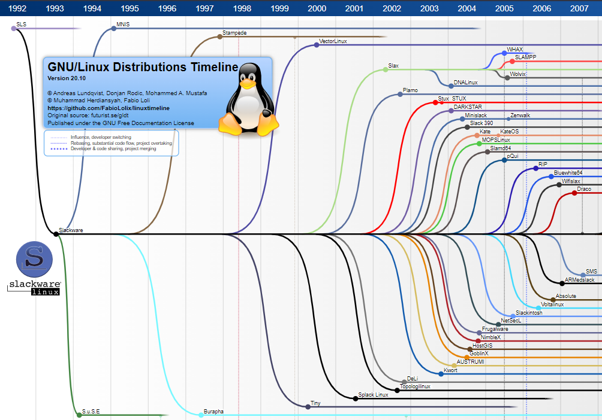

# Linux Distributions

## What is Linux?

- Linux is an open source Operating System (O.S.)
  - Can be downloaded for free
  - Wide variety of distributions
- An OS manages resources such as CPU time, memory, storage space, etc.
- Linux is, *at its most basic*, just the Kernel of the OS
  - the always running core at the lowest level of the operating system

## What is a Linux Distribution?

- A **Linux *distro*** is the Linux kernel combined with all the software necessary for an OS, like:
  - desktop environment (GUI)
  - applications
  - package managers
  - philosophy and goals of the distro developers
- Other operating systems are similar to Linux (e.g. Mac OS)

> 📌 Check the [Linux Distributions Timeline](https://upload.wikimedia.org/wikipedia/commons/1/1b/Linux_Distribution_Timeline.svg) for more in depth information.

### Popular Distributions

- **[Debian](https://www.debian.org/)** - a Free Operating System.
- **[Ubuntu](https://ubuntu.com/)** - Debian-based modern distro with updated free software for the widest audience and platforms. Ubuntu [Flavors](https://ubuntu.com/desktop/flavours) offer different desktop environments and specific intended use cases.
- **[Linux Mint](https://linuxmint.com/)** - derivative of Ubuntu and Debian, "doing less to do better" and "works Out of The Box" philosophy.
- [**Fedora**](https://getfedora.org/) - derivative of Red Hat Linux, for personal use, workstations, servers, IoT and plenty of "[spins](https://spins.fedoraproject.org/)" and "[labs](https://labs.fedoraproject.org/)", versions of Fedora with different software bundles.
- [**Kali**](https://www.kali.org/) - Debian-based distro, geared towards various Information Security tasks (Penetration Testing, Security Research, Computer Forensics, Reverse Engineering).
- [**ParrotOS**](https://www.parrotsec.org/) - Debian-based distro designed for Information & Cyber Security operations (Red Team and Blue Team), provides "Hacking tools at your fingertips".
- [**Suse**](https://www.suse.com/) - one of the oldest Enterprise-quality Linux distributions, with a secure foundation for a broad range of datacenter and cloud environments and industries.
- **[Arch Linux](https://archlinux.org/)** - a general purpose, lightweight and flexible distribution.

> 📌 Check ready-to-use Linux guest operating systems from [**OSBoxes**](https://www.osboxes.org/)

------

