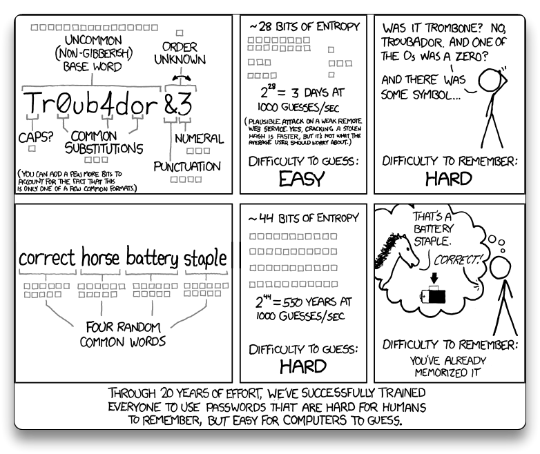

# Bash Scripting Basics, Control Structures, Loops

> 📌 [Bash Shell Scripting - Wikibooks](https://en.wikibooks.org/wiki/Bash_Shell_Scripting)

## Basics

- **BASH shell scripts** are essentially a series of bash commands that are stored in a file that can be executed by running the script.

### hello-world.sh

```bash
#!/bin/bash

# This is a comment
echo "Hello world"
```

- **`#!/bin/bash`** - the first line says the script should be run using bash
  - **`#!`** = *shebang*
- **`#`** = *pound/hash* - used for comments
- There are a few ways to execute the script:

```bash
bash hello-world.sh
	Hello world
# bash is the executable program

# To start the script without "bash" command, the script must be executable
chmod +x hello-world.sh
./hello-world.sh
	Hello world
```

### executing-commands-example.sh

```bash
#!/bin/bash

# ************************************
# Executing commands example

# Execute whoami command
user=$(whoami)

# Execute hostname command
hostname=$(hostname)

# Execute print working directory (pwd) command
directory=$(pwd)

# Display information
echo "User=[$user] Host=[$hostname] Working dir=[$directory]"

# Display contents of directory
echo "Contents:"
ls
```

```bash
bash executing-commands-example.sh 
    User=[user] Host=[UbuntuVM] Working dir=[/home/user/scripts/linux101]
    Contents:
    case-example.sh			   comparison-examples.sh	  generate-passord.sh	hello-world.sh	loop-examples.sh
    command-line-arguments-example.sh  executing-commands-example.sh  generate-password.sh	if-examples.sh	process-information.sh
```

## Control Structures

- Conditionals allow the script to take different actions depending on some sort of state, referred to as **`if-then`** rules.

### if-examples.sh

- ***if statements***.
  - The expression inside the brackets `[[ ... ]]` is evaluated and used to determine if the conditional code is executed.
  - If the expression evaluates to TRUE, the block (the code inside the IF statement) is executed.
  - If the expression evaluates to FALSE, BASH skips over all of the conditional code and starts execute after the "fi" keyword.
- ***else statements***
  - Code inside the **`else`** block is executed if the test returns FALSE.
- ***elif statements*** (else-if)
  - If the first test in the if statement fails, the **`elif`** statement will be evaluated.
  - elif statements will be tested from top down.
  - the code block associated with the first TRUE evaluated test will be executed and the rest of the conditional will be skipped.

```bash
#!/bin/bash

# ************************************
# If examples

# Test to see if /etc is a directory
if [[ -d /etc/ ]]; then
        echo /etc/ is indeed a directory
fi

# Check to see if a file exists
if [[ -e sample.txt ]]; then
        echo The file sample.txt exists
else
        echo The file sample.txt does NOT exist
fi

# Check a variable's value
TEST_VAR="test"
if [[ $TEST_VAR == "test" ]]; then
        echo TEST_VAR has a value of "test"
elif [[ $TEST_VAR == "again" ]]; then
        echo TEST_VAR has a value of "again"
else
        echo TEST_VAR has an unknown value
fi
```

```bash
bash if-examples.sh 
    /etc/ is indeed a directory
    The file sample.txt does NOT exist
    TEST_VAR has a value of test
```

### comparison-examples.sh

- Examples of performing numerical and string comparisons.

```bash
#!/bin/bash

# ************************************
# Numerical comparison examples

# Create some variables
x=1
echo x=["$x"]
y=2
echo y=["$y"]
z=2
echo z=["$z"]


# Perform some comparisons
# Numeric: Not equals
if [[ "$x" -ne "$y" ]]; then
	echo ["$x"] ne ["$y"]
fi

# Numeric: Equals
if [[ "$y" -eq "$z" ]]; then
	echo ["$y"] eq ["$z"]
fi

# Numeric: Greater than
if [[ "$y" -gt "$x" ]]; then
	echo ["$y"] gt ["$x"]
fi

# Numeric: Greater than or equal to
if [[ "$y" -ge "$z" ]]; then
	echo ["$y"] ge ["$z"]
fi

# Numeric: Less than
if [[ "$x" -lt "$y" ]]; then
	echo ["$x"] lt ["$y"]
fi

# Numeric: Less than or equal to
if [[ "$y" -le "$z" ]]; then
	echo ["$y"] le ["$z"]
fi

# ************************************
# String comparison examples

# Create some variables
a="A"
echo a=["$a"]
b="B"
echo b=["$b"]
anotherA="A"
echo anotherA=["$anotherA"]

# Perform some comparisons
# String: Equals
if [[ "$a" == "$anotherA" ]]; then
	echo ["$a"] "==" ["$anotherA"]
fi

# String: Not equals
if [[ "$a" != "$b" ]]; then
	echo ["$a"] "!=" ["$b"]
fi

# String: Less than
if [[ "$a" < "$b" ]]; then
	echo ["$a"] "<" ["$b"]
fi

# String: Greater than
if [[ "$b" > "$a" ]]; then
	echo ["$b"] ">" ["$a"]
fi
```

```bash
bash comparison-examples.sh 
    x=[1]
    y=[2]
    z=[2]
    [1] ne [2]
    [2] eq [2]
    [2] gt [1]
    [2] ge [2]
    [1] lt [2]
    [2] le [2]
    a=[A]
    b=[B]
    anotherA=[A]
    [A] == [A]
    [A] != [B]
    [A] < [B]
    [B] > [A]
```

### case-example.sh

- A ***`case` statement*** is essentially an `if` statement with multiple `elif` statements.
  - it uses a command line argument - **`$1`**

```bash
#!/bin/bash

# ************************************
# Case example

# Switch off of the first command line argument
case $1 in
[1-3])
	message="Argument is between 1 and 3 inclusive"
	;;
[4-6])
	message="Argument is between 4 and 6 inclusive"
	;;
[7-9])
	message="Argument is between 7 and 9 inclusive"
	;;
1[0-9])
	message="Argument is between 10 and 19 inclusive"
	;;
*)
	message="I don't understand the argument or it is missing"
	;;
esac

# Print out a message describing the result
echo $message
```

```bash
bash case-example.sh 6
    Argument is between 4 and 6 inclusive
bash case-example.sh 22
	I don't understand the argument or it is missing
```

## Loops

- Loops allow to write code once and execute it multiple times.

### **Definite loops**

- know the number of loops (times it is executed) before the loop ever starts.
- most common: **`for`** loop

### **Indefinite loops**

- unknown number of loops until the end (it depends on the user input for example).
- most common: **`while`** loop

### **Infinite loops**

- loops that never end (whether by design or accident), *!= indefinite loops*

### loop-examples.sh

```bash
#!/bin/bash

# ************************************
# For loop examples

echo -----------------------------------
echo For loops

# Iterate through the numbers 1 through 5 and print them out
echo Print out a hard-coded sequence
for i in 1 2 3 4 5; do
    echo Index=[$i]
done

# Same as above, but generate the sequence
echo Print out a generated sequence
for i in {1..5}; do
    echo Index=[$i]
done

# Same as above, but use a more conventional format
#   NOTE: Double parenthesis are used since we are doing arithmetic
echo Print out a generated sequence using the 3-expression format
for(( i=1; i<=5; i++ ))
do
    echo Index=[$i]
done

# Print out the last line of each shell script in the current directory
echo Print out the last line of each shell script
for FILE in *.sh
do
    echo =====================================
    echo File=[$FILE]
    tail -n 1 $FILE
done

echo ''

# ************************************
# While loop example

echo -----------------------------------
echo While loop

# Countdown to blastoff
echo Executing a while loop to countdown to blastoff
counter=5
while [[ $counter -gt 0 ]]; do
    echo Countdown [$counter]
    counter=$(($counter - 1))
done
echo Blastoff
```

```bash
bash loop-examples.sh 
    -----------------------------------
    For loops
    Print out a hard-coded sequence
    Index=[1]
    Index=[2]
    Index=[3]
    Index=[4]
    Index=[5]
    Print out a generated sequence
    Index=[1]
    Index=[2]
    Index=[3]
    Index=[4]
    Index=[5]
    Print out a generated sequence using the 3-expression format
    Index=[1]
    Index=[2]
    Index=[3]
    Index=[4]
    Index=[5]
    Print out the last line of each shell script
    =====================================
    File=[case-example.sh]
    echo $message
    =====================================
    File=[command-line-arguments-example.sh]
    fi
    =====================================
    File=[comparison-examples.sh]
    fi
    =====================================
    File=[executing-commands-example.sh]
    ls
    =====================================
    File=[generate-passord.sh]
    echo $password
    =====================================
    File=[generate-password.sh]

    =====================================
    File=[hello-world.sh]
    echo "Hello world"
    =====================================
    File=[if-examples.sh]
    fi
    =====================================
    File=[loop-examples.sh]
    echo Blastoff
    =====================================
    File=[process-information.sh]
    echo Child process exit status $?

    -----------------------------------
    While loop
    Executing a while loop to countdown to blastoff
    Countdown [5]
    Countdown [4]
    Countdown [3]
    Countdown [2]
    Countdown [1]
    Blastoff
```

## Examples

### command-line-arguments-example.sh

- Variables usage - `$#`, `$*`

```bash
#!/bin/bash

# ******************************************************************************
# Processing command line arguments

# What is the name of the executed script?
echo Name of script [$0]

# How many were provided?
echo Command line argument count [$#]

# Iterate through each argument
for arg in $@; do
	echo Argument [$arg]
done

# Display all the arguments as a string
echo All arguments [$*]

# Use parenthesis for arguments with numbers 10 or larger
if [ "${12}" != "" ]; then
	echo Argument 12 is [${12}]
	echo Argument 12 is NOT [$12]
fi
```

```bash
bash command-line-arguments-example.sh one Two 3 4th 999
    Name of script [command-line-arguments-example.sh]
    Command line argument count [5]
    Argument [one]
    Argument [Two]
    Argument [3]
    Argument [4th]
    Argument [999]
    All arguments [one Two 3 4th 999]
```

### generate-password.sh

- This script generates a password by combining a specified number of words.
- Each word is capitalized and separated by a separator character provided as a command line argument.



```bash
#!/bin/bash

# Grab the command line arguments
passwd_word_count=$1
separator=$2

# Start with a blank password
password=''

# Get the total number of words in the word list
total_word_count=`wc -l wordlist.txt | awk '{print $1;}'`


# Build the password using the specified number of words
for (( i=1; i<=$passwd_word_count; i++ ))
do
    # Generate a random number using OpenSSL to be cryptographically secure
    rand_num_hex=`openssl rand -hex 4`
    rand_num_dec=$((16#$rand_num_hex))

    # Use the random number as an index into the word list
    word_index=$(($rand_num_dec % $total_word_count))
    random_word=`awk -v idx="$word_index" '{if (NR==idx) print $1}' wordlist.txt`

    # Capitalize the word
    random_word_upper=`echo ${random_word^}`

    # Insert a separator if this isn't the first word in the password
    if [[ ${#password} -gt 0 ]]; then
        password=$password$separator$random_word_upper
    else
        password=$random_word_upper
    fi

done

# Display the password
echo $password
```

```bash
bash generate-password.sh 6 '-'
	Rinse-Triage-Seizing-Vocation-Atlas-Narrow
bash generate-password.sh 4 '**'
	Probing**Cricket**Autopilot**Immodest
bash generate-password.sh 8 '!-!'
	Movable!-!Chimp!-!Abreast!-!Why!-!Shell!-!Dipped!-!Unlimited!-!Calamity
```

------

