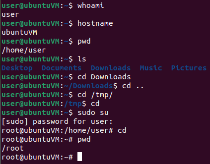

# Introduction to Command Line

## Command Prompt

- First item in the prompt is a line representing the **user name**, followed by the "**`@`**" sign, the computer **host name**, a colon "**`:`**", the current working directory and the "**`$`**" sign.

```bash
user@ubuntuVM:~$
# current_user @ host_name : current_working_directory $
# user = current_user
# ubuntuVM = hostname
# ~ = user's home directory
# $ = logged in as a normal user

root@ubuntuVM:/home/user#
# # = logged in as the root user
```

### whoami

- **`whoami`** - Returns the user name of the current user

```bash
user@ubuntuVM:~$ whoami
	user
```

- Note **Linux is case-sensitive**, so the commands are too.

### hostname

- **`hostname`** - Returns the name of the current host

```bash
user@ubuntuVM:~$ hostname
	ubuntuVM
```

### pwd

- **`pwd`** - Print working directory

```bash
user@ubuntuVM:~$ pwd
	/home/user

# ~ is shorthand for the home directory
```

### ls

- **`ls`** - List the contents of a directory

```bash
user@ubuntuVM:~$ ls
	Desktop  Documents  Downloads  Music  Pictures  Public  snap  Templates  Videos
```

### cd

- **`cd`** - Change working directory

```bash
user@ubuntuVM:~$ cd Downloads
user@ubuntuVM:~/Downloads$
# the current working directory changed

user@ubuntuVM:~/Downloads$ cd ..
# to go back to the parrent directory
user@ubuntuVM:~$
```

> 📌 Use only **`cd`** to go back to the current user's home directory

```bash
user@ubuntuVM:~$ cd /tmp/
user@ubuntuVM:/tmp$ cd
user@ubuntuVM:~$
```



### alias

- **`alias`** - list bash aliases

```bash
alias
    alias alert='notify-send --urgency=low -i "$([ $? = 0 ] && echo terminal || echo error)" "$(history|tail -n1|sed -e '\''s/^\s*[0-9]\+\s*//;s/[;&|]\s*alert$//'\'')"'
    alias egrep='egrep --color=auto'
    alias fgrep='fgrep --color=auto'
    alias grep='grep --color=auto'
    alias l='ls -CF'
    alias la='ls -A'
    alias ll='ls -alF'
    alias ls='ls --color=auto'
```

------

