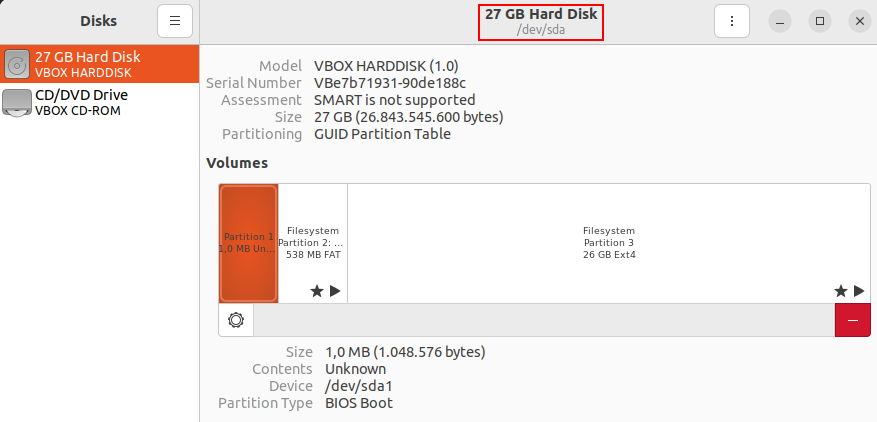
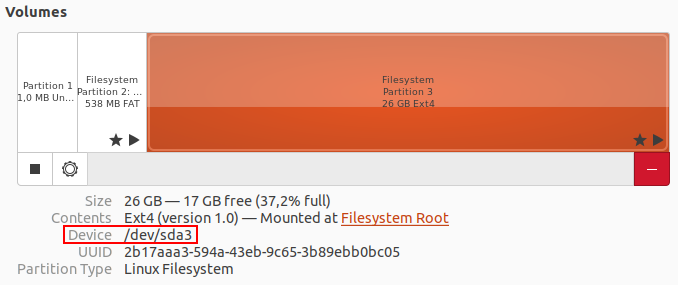
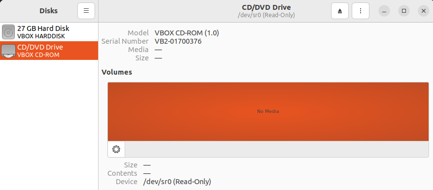

# Devices, Partitions and Mounting

## Mounted Devices

- All the active storages devices in Linux are part of the single file system starting at **`/`**.





- The hard drive is identified by **`/dev/sda`**:
  - **s** identifier indicates that it is a sata drive
  - **a** indicates that it is the first drive (/dev/sdb would the the second drive if present)
  - the drive is divided into different volumes/partitions, each with its own ID mounted at a different location in the file system
    - First partition is **`/dev/sda1`**
    - Second partition is **`/dev/sda2`**, mounted at /boot/efi
    - Third partition is **`/dev/sda3`**, mounted at filesystem root **/**
  - Every file or directory that isn't in one of the subdirectory mount points, resides on the /dev/sda3 partition since it is at the filesystem root.



- The virtual dvd drive is identified by the read-only **`/dev/sr0`**

## Mounting Configuration

```bash
cat /etc/fstab

	# /etc/fstab: static file system information.
	#
	# Use 'blkid' to print the universally unique identifier for a
	# device; this may be used with UUID= as a more robust way to name devices
	# that works even if disks are added and removed. See fstab(5).
	#
	# <file system> <mount point>   <type>  <options>       <dump>  <pass>
	# / was on /dev/sda3 during installation
	UUID=2b17aaa3-594a-43eb-9c65-3b89ebb0bc05 /               ext4    errors=remount-ro 0       1
	# /boot/efi was on /dev/sda2 during installation
	UUID=4704-6965  /boot/efi       vfat    umask=0077      0       1
	/swapfile                                 none            swap    sw              0       0
```

- Each partition has a unique identifier **`UUID`** that the system uses.

### mount

- **`mount`** - command used to mount partitions, or shows the current mounted devices

```bash
mount

	sysfs on /sys type sysfs (rw,nosuid,nodev,noexec,relatime)
	proc on /proc type proc (rw,nosuid,nodev,noexec,relatime)
	udev on /dev type devtmpfs (rw,nosuid,relatime,size=1975416k,nr_inodes=493854,mode=755,inode64)
	devpts on /dev/pts type devpts (rw,nosuid,noexec,relatime,gid=5,mode=620,ptmxmode=000)
	tmpfs on /run type tmpfs (rw,nosuid,nodev,noexec,relatime,size=402020k,mode=755,inode64)
	/dev/sda3 on / type ext4 (rw,relatime,errors=remount-ro)
	securityfs on /sys/kernel/security type securityfs (rw,nosuid,nodev,noexec,relatime)
	tmpfs on /dev/shm type tmpfs (rw,nosuid,nodev,inode64)
	tmpfs on /run/lock type tmpfs (rw,nosuid,nodev,noexec,relatime,size=5120k,inode64)
	cgroup2 on /sys/fs/cgroup type cgroup2 (rw,nosuid,nodev,noexec,relatime,nsdelegate,memory_recursiveprot)
	pstore on /sys/fs/pstore type pstore (rw,nosuid,nodev,noexec,relatime)
	bpf on /sys/fs/bpf type bpf (rw,nosuid,nodev,noexec,relatime,mode=700)
	systemd-1 on /proc/sys/fs/binfmt_misc type autofs (rw,relatime,fd=29,pgrp=1,timeout=0,minproto=5,maxproto=5,direct,pipe_ino=15742)
	tracefs on /sys/kernel/tracing type tracefs (rw,nosuid,nodev,noexec,relatime)
	debugfs on /sys/kernel/debug type debugfs (rw,nosuid,nodev,noexec,relatime)
	mqueue on /dev/mqueue type mqueue (rw,nosuid,nodev,noexec,relatime)
	hugetlbfs on /dev/hugepages type hugetlbfs (rw,relatime,pagesize=2M)
	fusectl on /sys/fs/fuse/connections type fusectl (rw,nosuid,nodev,noexec,relatime)
	configfs on /sys/kernel/config type configfs (rw,nosuid,nodev,noexec,relatime)
	none on /run/credentials/systemd-sysusers.service type ramfs (ro,nosuid,nodev,noexec,relatime,mode=700)
	[...]
```

### df

- **`df`** - displays the disk file system space usage of all the mounted partitions

```bash
df -h
# Print sizes in a human-readable format
	Filesystem      Size  Used Avail Use% Mounted on
	tmpfs           393M  1,6M  392M   1% /run
	/dev/sda3        24G  8,6G   15G  38% /
	tmpfs           2,0G     0  2,0G   0% /dev/shm
	tmpfs           5,0M  4,0K  5,0M   1% /run/lock
	/dev/sda2       512M  5,3M  507M   2% /boot/efi
	tmpfs           393M  2,4M  391M   1% /run/user/1000
```

### du

- **`du`** - display the disk usage of given files or directories
- It can be combined with other commands with pipes.

```bash
du -sh ~
# Summarize the total disk usage of the directory and print in a human-readable format
	148M	/home/user
```

------

