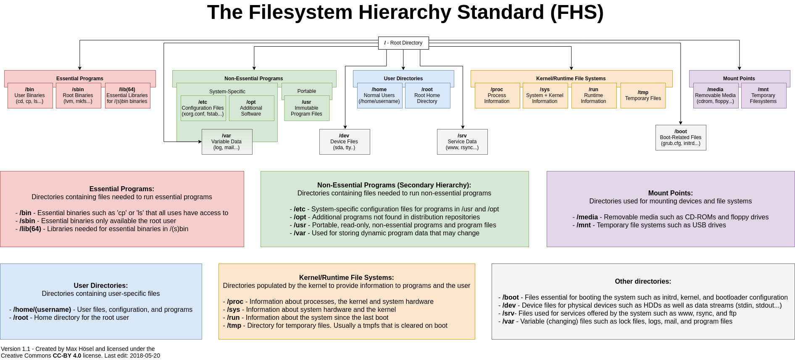

# Linux Filesystem Hierarchy Standard

> 📌 [FHS - Filesystem Hierarchy Standard](https://refspecs.linuxfoundation.org/FHS_3.0/fhs/index.html)



- Most Linux distribution follow the **[Filesystem Hierarchy Standard](https://en.wikipedia.org/wiki/Filesystem_Hierarchy_Standard)** as a reference for the layout of the Unix system.

```bash
# Show the standard with the command:
man hier
```

- All files and directories appear under the primary hierarchy root and entire file system root directory **`/`**.

**`/bin`** - stores important executable programs (binaries).

**`/boot`** - boot loader files used to boot the system (kernel, initrd).

**`/dev`** - device files for physical devices (mouse, hdds, standard in/out, standard error).

**`/etc`** - local system-wide configuration files for programs.

**`/home`** - personal directories of all users.

**`/lib`** - essential shared libraries for binaries to run

**`/media`** - mount point for removable media.

**`/mnt`** - mount point for temporary file systems.

**`/opt`** - additional software not found in the distribution repositories, custom utilities and packages, accessible to everyone.

**`/proc`** - information about running processes, the kernel and system hardware.

**`/root`** - home directory for the root user.

**`/sbin`** - essential binaries available only to the root user.

**`/tmp`** - temporary files used by the system, usually cleared on boot, not for important storage.

**`/usr`** - contains important subdirectories, read-only data programs.

**`/var`** - contains dynamic program data (logs, spool), troubleshooting log files.

------

