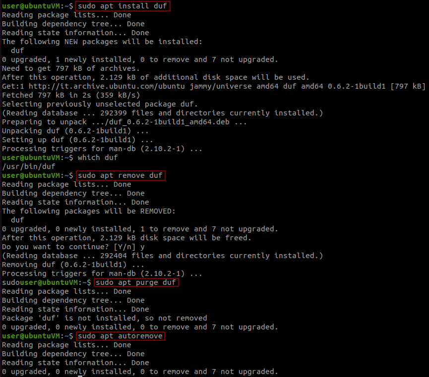

# Package Management

- Modern Linux distributions primarly use a Software Manager, a centralized system, automating installing, updating, configuring and uninstalling software.
- The package manager stores the program's executable, libraries and configuration into a single archive, called a **package**.
- Two prevelant format standards are `.deb` (for Debian distros) and `.rpm` (for RedHat distros).
- On desktop invironments there is a GUI package management system.
- Programs depend on third party libraries. Those dependencies are handled by the package manager automatically.

## Debian

> 📌 [Debian package management manual](https://www.debian.org/doc/manuals/debian-reference/ch02.en.html)

- There are many package management tools, but two of them are primarly used.

### dpkg

- **`dpkg`** - low level tool

```bash
dpkg -i package_name.deb
```

### apt

- **`apt`** - *commandline package manager*. It provides commands for searching, managing, querying information about packages.

```bash
sudo apt update
# update list of available packages

sudo apt upgrade
# upgrade packages and O.S. (download and installation)

sudo apt search package_name
# search for package if present

sudo apt search duf
    Sorting... Done
    Full Text Search... Done
    duf/jammy 0.6.2-1build1 amd64
      Disk Usage/Free Utility
sudo apt show duf
# Show "duf" package information
# Packages can be in transitional status

sudo apt install package_name
# install the package, the use needs to be root

sudo apt remove package_name
# remove the package, NOT the dependencies/config files

sudo apt purge package_name
# remove the package including all configuration files

sudo apt autoremove
# Remove unused packages/dependencies

sudo apt update && sudo apt upgrade -y && sudo apt autoremove -y
# One line to update packages, O.S. and clean unneeded depencencies
```



## Red Hat

> 📌 [Red Hat package management manual](https://access.redhat.com/documentation/en-us/red_hat_enterprise_linux/8/html/configuring_basic_system_settings/managing-software-packages_configuring-basic-system-settings)

### rpm

- **`rpm`** - low level tool

```bash
rpm -ivh package_name.rpm
```

### yum

- **`yum`** - packaging system used by RedHat distros

```bash
sudo yum update
# Combination of update + upgrade of apt command

yum search package_name
yum info package_name
sudo yum install package_name
sudo yum remove package_name

sudo tail /var/log/yum.log
# view yum history
```

## Manual Installing

- Some software do not have a package for the used distribution. The alternative is to download the source code of the programs and compile it.
- First thing, install the tools necessary to build the software:

```bash
sudo apt update
sudo apt install build-essential automake checkinstall libz-dev libssl-dev libcurl4-gnutls-dev libexpat1-dev gettext cmake gcc curl
```

- Install **`git`** manually ([git download page](https://git-scm.com/download/linux)):

```bash
wget https://mirrors.edge.kernel.org/pub/software/scm/git/git-2.38.0.tar.gz
# Download the tarball and build from source

tar xfz git-2.38.0.tar.gz
# x for extract, f for file, z filter the archive through gzip
cd git-2.38.0/

# Configure the build environment:
less INSTALL
# for Git installation info

./configure
# creates a Makefile, used by the make utility to build and install the sw

make
# compiles the code, the process will take a while

sudo make install
# installs the compiled software
```

### checkinstall

- Instead of `sudo make install`, **`checkinstall`** tool can be used.
- It keeps track of all files installed by a "make install", creates rpm/deb package with those files and adds it to the installed packages database.

```bash
sudo apt update && sudo apt install checkinstall

cd git-2.38.0/
sudo make; sudo checkinstall
# installs the software and creates .deb file
**********************************************************************
Done. The new package has been installed and saved to
/home/user/git-2.38.0/git_2.38.0-1_amd64.deb
You can remove it from your system anytime using: 
     dpkg -r git
**********************************************************************

sudo dpkg -r package_name
# Remove package_name
```

------

