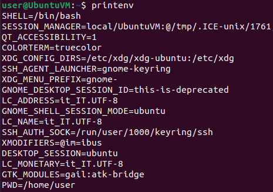
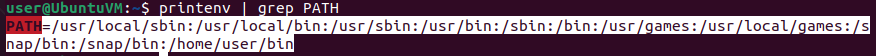
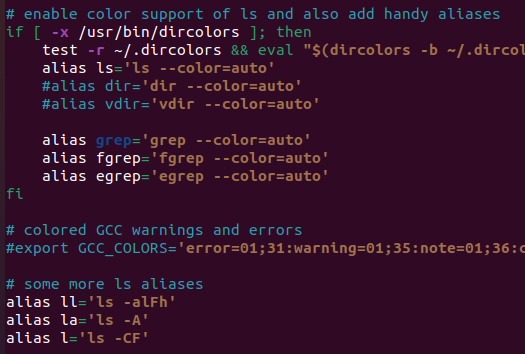

# Environment Variables & Startup Files

# Environment Variables

- The shell stores information in the environment variables.
- Each shell has its own values for these variables.

### printenv

```bash
printenv
# Prints name and value pairs for all the environment variables
# VARIABLE_NAME=VALUE

printenv | grep PATH
```





- **`SHELL`** - user's shell is bash
- **`PWD`** - current working directory
- **`HOME`** - home directory for the current user
- **`PATH`** - list of the directories searched in order, to find commands to be executed.
  - Current working directory can be put first in this path, easier to execute current working directory programs but can be used for attacks.

There are two types of environment variables: **global** and **local**.

## Global

- **Global** variables can be accessed by anything executed in that shell = `Environment Variables`

### export / unset

```bash
# Create a global variable
export COUNT_GLOBAL=33
echo $COUNT_GLOBAL
	33

# Unset a variable
unset COUNT_GLOBAL
```

## Local

- **Local** variables are valid only for the current shell (and not for sub-shells) = `Shell Variables`

```bash
# Create a shell variable
COUNT_LOCAL=42
echo $COUNT_LOCAL
	42
# $ is used to tell the shell that it is a variable

# Change shell (create sub-shell) and check the variable doesn't exist
bash
echo $COUNT_LOCAL
```

# Startup files

- When starting a new bash shell, the shell is configured using startup files.
- Interactive non-login shell - the type of shell opened by the Terminal

```bash
nano .bashrc
# There are various configurations for the shell and commands aliases
# Aliases can be added at the bottom of this file
```

- `alias name='COMMAND_VALUE'` - the alias uses the entire command enclosed in single quotes



- After adding an alias, a new shell must be created to make the alias work, or use the **`source .bashrc`** command in the same shell.

```bash
source .bashrc
# Re-runs all the commands in the .bashrc file in the current shell
```

- Using a shell other than bash, the startup file name will be different.

------

