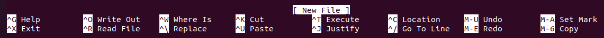
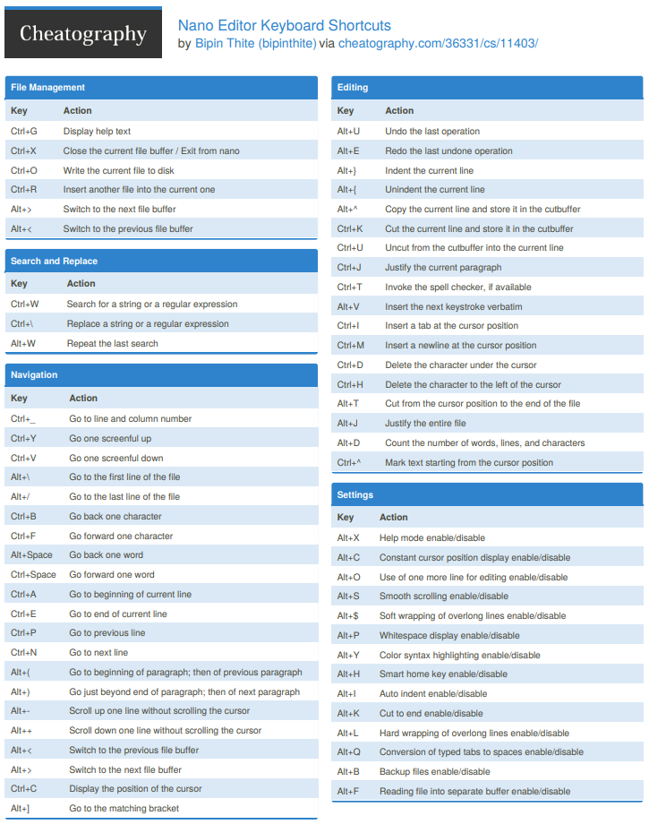
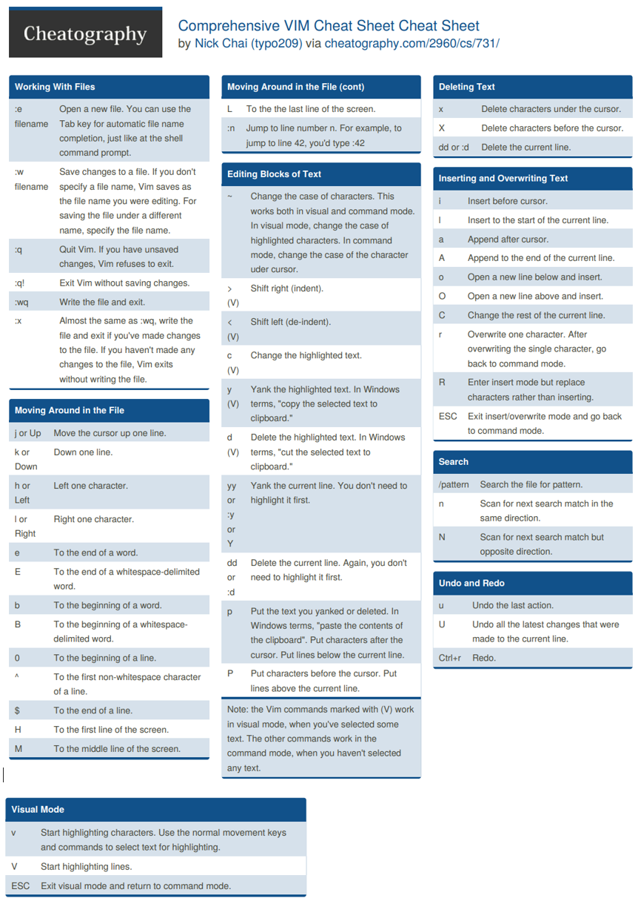

# Text Editors and Converters

- There is a difference between text files in Windows, MacOS and Linux.
  - The end of the line in text files is a different character for each O.S - the `line terminator`.
    - Win - **`\n\r`**
    - MacOS - **`\r`** (control)
    - Linux - **`\n`** (line feed)

## Commands

### file

- **`file`** - determine file type

```bash
# Check the line terminators
file sample_win.txt sample_mac.txt sample_unix.txt
    sample_win.txt: ASCII text, with CRLF line terminators
    sample_mac.txt: ASCII text, with CR line terminators
    sample_unix.txt: ASCII text
```

- Converting files with dos2unix/unix2dos tools:

### dos2unix

- **`dos2unix`** / **`unix2dos`**

```bash
sudo apt install dos2unix

# Convert unix file to dos new file
unix2dos -n sample_unix.txt temp.txt
    unix2dos: converting file sample_unix.txt to file temp.txt in DOS format...
file temp.txt
	temp.txt: ASCII text, with CRLF line terminators

unix2dos -c mac sample_unix.txt
	unix2dos: converting file sample_unix.txt to Mac format...
file sample_unix.txt
    sample_unix.txt: ASCII text, with CR line terminators

# Convert dos file to unix file
dos2unix sample_dos.txt
	dos2unix: converting file sample_dos.txt to Unix format...
file sample_dos.txt
	sample_dos.txt: ASCII text

```

## Editors

### nano

- **`nano`** - small editor
  - pening multiple files, scrolling per line, undo/redo, syntax coloring,  line  numbering, and soft-wrapping overlong lines.

```bash
nano example.txt

# Shortcuts are deisplayed at the bottom of the screen
# ^ = press CTRL + specified short key
# M- = press ALT + specified short key
```



- Press `CTRL+G` to enter the Help menu
- Press `ALT+X` to disable Help mode
- Scroll with `PgUp` and `PgDown` keys
- Press `CTRL+C` to find the cursor location
- Undo a change  with `ALT+U`
- `ALT+A` start a selection at the current cursor location and move the cursor
- `ALT+6` to copy the selected text
- `CTRL+U` to paste the copied text
- `CTRL+W` to search content - `ALT+W`/`ALT+Q` to keep searching for the same content
- `CTRL+O` to save file
- `CTRL+X` to exit file



### vim

- **`vim`** - Vi IMproved text editor

> 📌 Check the [VimHelp manual](https://vimhelp.org/) for more advanced Vim functionalities.

|         WHAT         | PREPEND |       EXAMPLE       |
| :------------------: | :-----: | :-----------------: |
| Normal mode command  |         |      `:help x`      |
| Visual mode command  |  `v_`   |     `:help v_u`     |
| Insert mode command  |  `i_`   |   `:help i_<Esc>`   |
| Command-line command |   `:`   |    `:help :quit`    |
| Command-line editing |  `c_`   |   `:help c_<Del>`   |
| Vim command argument |   `-`   |     `:help -r`      |
|        Option        |   `'`   | `:help 'textwidth'` |
|  Regular expression  |   `/`   |     `:help /[`      |

```bash
vim example.txt
# Vim opens in the command mode
```

- Press **`i`** for insert mode
- Press `ESC` key to exit insert mode
- Exit vim with **`:q`**
- Exit without save with **`:q!`**
- Save and exit with **`:wq`**
- Search with `/text_to_search`
  - `n`/`N`to scroll through searching



------

