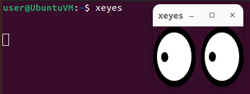
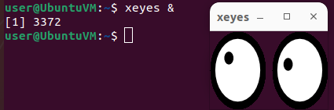
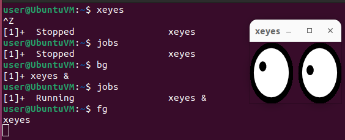
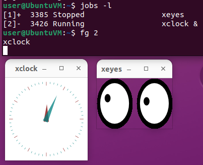

# Foreground and Background Processes

- Usually when running a command in the command shell, the user has to wait for the process to finish before he can do anything else.
- The command is being run as a **foreground process**.
  - Only one foreground process can be running in a shell at a time.

- A user can have more **background processes** running at the same time.
- Start a process in the background with **`&`**

- Currently running processes can be moved from the foreground to the background and viceversa.
  - **`CTRL+Z`** - suspend/pause the process
  - **`jobs`** - list the active jobs
  - **`bg`** - move the process to the background
  - **`fg`** - move the process back to the foreground

- **`+`** = fg/bg commands operate on the + process
  - use the job number to fg/bg that process

### jobs

- **`jobs`** - list all the active jobs

### fg / bg

- **`fg`** - move jobs to the foreground
- **`bg`** - move jobs to the background

------

