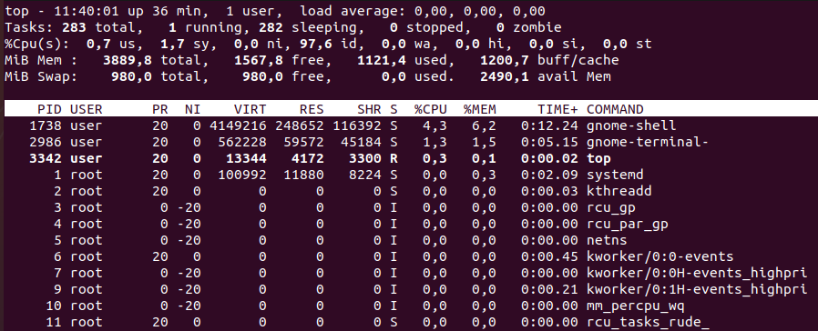

# Process Information

- Managing processes can be useful for troubleshooting running programs on the operating system.

## Commands

### ps

- **`ps`** - display current running processes
  - 3 types of options (UNIX, BSD, GNU) - pick a format and stick with it.

```bash
ps
    PID TTY          TIME CMD
   3131 pts/1    00:00:00 bash
   3157 pts/1    00:00:00 ps

# Options:
1   UNIX options, which may be grouped and must be preceded by a dash.
2   BSD options, which may be grouped and must not be used with a dash.
3   GNU long options, which are preceded by two dashes.

# Display all the processes for users using BSD syntax
ps ax | less -S

# Display all the processes for users using UNIX syntax
ps -e | less -S

ps aux
    USER         PID %CPU %MEM    VSZ   RSS TTY      STAT START   TIME COMMAND
    root           1  0.2  0.2 100992 11880 ?        Ss   11:03   0:02 /sbin/init splash
    root           2  0.0  0.0      0     0 ?        S    11:03   0:00 [kthreadd]
    root           3  0.0  0.0      0     0 ?        I<   11:03   0:00 [rcu_gp]
    [...]

ps -ef
    UID          PID    PPID  C STIME TTY          TIME CMD
    root           1       0  0 11:03 ?        00:00:02 /sbin/init splash
    root           2       0  0 11:03 ?        00:00:00 [kthreadd]
    root           3       2  0 11:03 ?        00:00:00 [rcu_gp]

    user        3131    2986  0 11:10 pts/1    00:00:00 bash
    root        3238       2  0 11:18 ?        00:00:00 [kworker/1:0-events]
    root        3239       2  0 11:19 ?        00:00:00 [kworker/u256:0-events_unbound]
    user        3240    3131  0 11:21 pts/1    00:00:00 ps -ef
    [...]
# USER = user ID of the process (same premissions as the user)
# PID = process ID (unique for every process)
# PPID = parrent PID - PID of the parrent process that created this process
# C = process utilization percentage
# STIME = start time of the process
# TTY = terminal use of the process (no associated terminal if ?)
# TIME = amount of CPU time used by the process
# CMD = command that started the process

# Display every process running as root
ps -U root -u root u

# Check examples on the manual page
man ps

# Show process hierarchy
ps -eH | less -S
```

### pstree

- **`pstree`** - display a tree of processes (hierarchy easier to read)

```bash
pstree
    systemd─┬─ModemManager───2*[{ModemManager}]
            ├─NetworkManager───2*[{NetworkManager}]
            ├─VGAuthService
            ├─accounts-daemon───2*[{accounts-daemon}]
            ├─acpid
            ├─avahi-daemon───avahi-daemon
            ├─bluetoothd
            ├─colord───2*[{colord}]
            ├─cron
            ├─cups-browsed───2*[{cups-browsed}]
            ├─cupsd
            ├─dbus-daemon
            ├─fwupd───4*[{fwupd}]
            ├─gdm3─┬─gdm-session-wor─┬─gdm-wayland-ses─┬─gnome-session-b───2*[{gnome-session-b}]
            │      │                 │                 └─2*[{gdm-wayland-ses}]
            │      │                 └─2*[{gdm-session-wor}]
            │      └─2*[{gdm3}]
```

### top

- **`top`** - display a dynamic real-time view of Linux running processes
  - display system summary information too
  - user configurable

```bash
top
# Process are ordered by most CPU usage to least
```



> 📌 Check **`htop`** [command](https://www.geeksforgeeks.org/htop-command-in-linux-with-examples/) too.

------

