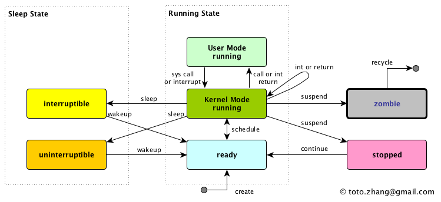

# Managing Processes

- A Linux process can be in one of a few states.
  - **running** = the CPU is executing a process
    - **`CTRL+Z`** to stop the process from running
    - Linux sends a STOP signal to the process and the process enters the stopped state
  - **sleeping** = the process sleeps when it is waiting on a resource
  - **zombie** = the remains of processes that weren't properly cleaned up when they died
    - when a process dies, its parent process gets some information from the deceased process and then cleans everything up
    - a zombie process doesn't respond to the normal signals used to shut it down
- The processes change their state in response to **SIGNALS**.



## Commands

### kill

- **`kill`** - send a signal to a process
  - the default signal for kill is **TERM**

```bash
kill -l
     1) SIGHUP	 2) SIGINT	 3) SIGQUIT	 4) SIGILL	 5) SIGTRAP
     6) SIGABRT	 7) SIGBUS	 8) SIGFPE	 9) SIGKILL	10) SIGUSR1
    11) SIGSEGV	12) SIGUSR2	13) SIGPIPE	14) SIGALRM	15) SIGTERM
    16) SIGSTKFLT	17) SIGCHLD	18) SIGCONT	19) SIGSTOP	20) SIGTSTP
    21) SIGTTIN	22) SIGTTOU	23) SIGURG	24) SIGXCPU	25) SIGXFSZ
    26) SIGVTALRM	27) SIGPROF	28) SIGWINCH	29) SIGIO	30) SIGPWR
    31) SIGSYS	34) SIGRTMIN	35) SIGRTMIN+1	36) SIGRTMIN+2	37) SIGRTMIN+3
    38) SIGRTMIN+4	39) SIGRTMIN+5	40) SIGRTMIN+6	41) SIGRTMIN+7	42) SIGRTMIN+8
    43) SIGRTMIN+9	44) SIGRTMIN+10	45) SIGRTMIN+11	46) SIGRTMIN+12	47) SIGRTMIN+13
    48) SIGRTMIN+14	49) SIGRTMIN+15	50) SIGRTMAX-14	51) SIGRTMAX-13	52) SIGRTMAX-12
    53) SIGRTMAX-11	54) SIGRTMAX-10	55) SIGRTMAX-9	56) SIGRTMAX-8	57) SIGRTMAX-7
    58) SIGRTMAX-6	59) SIGRTMAX-5	60) SIGRTMAX-4	61) SIGRTMAX-3	62) SIGRTMAX-2
    63) SIGRTMAX-1	64) SIGRTMAX

# 1) SIGHUP: reload a process (without restarting the process)
# 19) SIGSTOP: it is sent to a foreground process to stop it from running (CTRL+Z)
# 15) SIGTERM: default sent signal whe no signal is specified
# 9) SIGKILL: force the process to shutdown if other sent signals are ignored (last resort, no cleaning up)

# To send a signal to a process, its process ID must be known
xeyes &
    [1] 5660
ps -ef | grep xeyes
    user        5660    4609  0 09:41 pts/0    00:00:00 xeyes
    user        5666    4609  0 09:41 pts/0    00:00:00 grep --color=auto xeyes
kill 5660
# Process terminated

# Force kill a process with the 9) SIGKILL signal
kill -9 5668
# It can leave local/temporary files hiding on the file system
```

### pkill

- **`pkill`** - look up, signal, or wait for processes based on name and other attributes
  - It kills every process containing that name or attribute, pay attention!

```bash
pkill xeyes
    [1]-  Terminated              xeyes
    [2]+  Terminated              xeyes
# A SIGTERM is sent to both processes
```

### sleep

- **`sleep`** - delay for a specified amount of time
  - used for delays into bash scripting

```bash
sleep 5
# pause for 5 seconds
```

------

