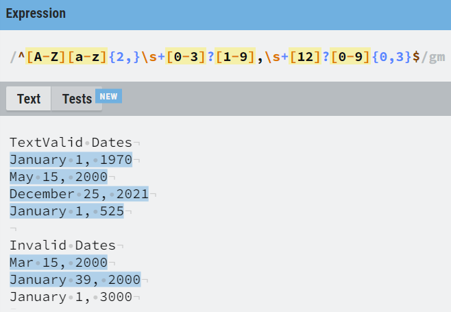
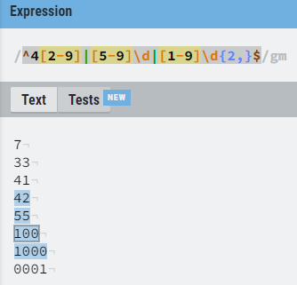
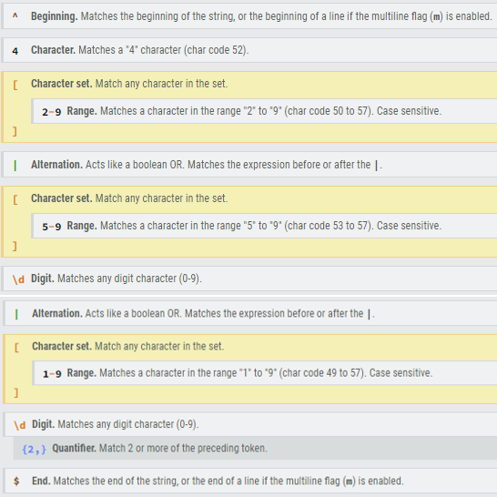
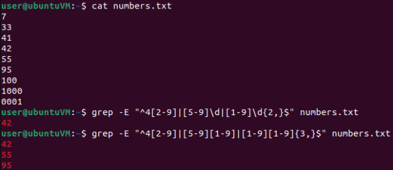
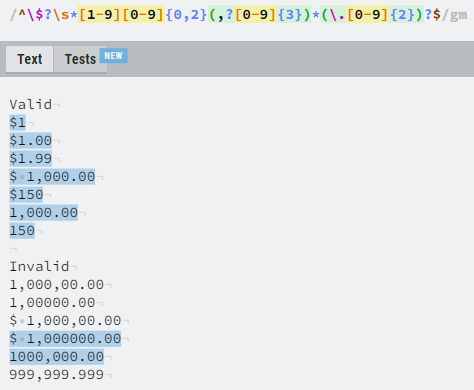
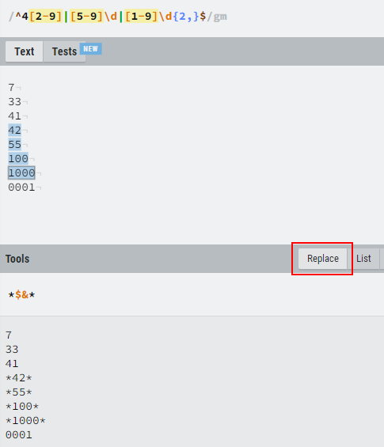
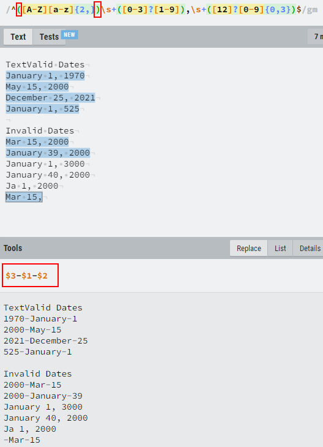

# Regular Expressions, Searching, Replacing, Building

## What is a Regular Expression

- A regular expression (**`regex`**) is a pattern that matches a set of strings, consisting of operators, constructs literal characters and meta-characters.

> 📌 **grep** command supports tree regex syntaxes. Check some basics usage [here](https://linuxize.com/post/regular-expressions-in-grep/).

- Regular expressions are powerful, used in areas like search engines, programming languages and text processing applications.

### Examples

- Check [how to find or validate an Email Address](https://www.regular-expressions.info/email.html) - [RFC 5322](https://www.ietf.org/rfc/rfc5322.txt) Official Standard
- More examples here [emailregex.com](https://emailregex.com/)

```bash
# Find all email addresses in a file using grep
grep -E -o "\b[A-Za-z0-9._%+-]+@[A-Za-z0-9.-]+\.[A-Za-z]{2,6}\b" filename.txt

# Python
r"(^[a-zA-Z0-9_.+-]+@[a-zA-Z0-9-]+\.[a-zA-Z0-9-.]+$)"

# Javascript
/^(([^<>()\[\]\\.,;:\s@"]+(\.[^<>()\[\]\\.,;:\s@"]+)*)|(".+"))@((\[[0-9]{1,3}\.[0-9]{1,3}\.[0-9]{1,3}\.[0-9]{1,3}])|(([a-zA-Z\-0-9]+\.)+[a-zA-Z]{2,}))$/

#MySQL
SELECT * FROM `users` WHERE `email` NOT REGEXP '^[A-Z0-9._%-]+@[A-Z0-9.-]+\.[A-Z]{2,4}$';
```

## Searching with RegEx

- There a 4 primary components into a regular expression:
  - character classes
  - quantifiers and alternation
  - anchors
  - roots and anchors

### [Date Search](https://regexr.com/66ogg)

```javascript
^[A-Z][a-z]{2,}\s+[0-3]?[1-9],\s+[12]?[0-9]{0,3}$
/*
^ = ANCHOR - match the beginning of the string or line (with the multiline flag m)
[A-Z][a-z] = CHARACTER CLASSES - range matching upper/lower case letters
{2,} = QUANTIFIER - match 2 or more of the preceding token
\s = whitespace
+ = QUANTIFIER - match 1 or more of the preceding whitespace
* = QUANTIFIER - match 0 or more of the preceding token
? = QUANTIFIER - optional, match 0 or 1 of the preceding token
| = QUANTIFIER - alternation, match 1 token or another
$ = ANCHOR - match the end of the string or line (with the multiline flag m)
*/
```



### [Number >= 42  Search](https://regexr.com/66ogj)

```javascript
^4[2-9]|[5-9]\d|[1-9]\d{2,}$
/*
\d = match any digit character (0-9) = [0-9]
*/
```





```bash
grep -E "^4[2-9]|[5-9]\d|[1-9]\d{2,}$" numbers.txt
	42
# grep (posix) doesn't have the \d shortcut for digits

grep -E "^4[2-9]|[5-9][1-9]|[1-9][1-9]{3,}$" numbers.txt
    42
    55
    95
```



### [Dollar $ Search](https://regexr.com/66ogm)

```javascript
^\$?\s*[1-9][0-9]{0,2}(,?[0-9]{3})*(\.[0-9]{2})?$

/*
\$ = ESCAPED CHAR - match a "$" character
*/
```



## Replacing with RegEx

- Replacing text with regular expressions varies between implementations.
  - Examples with the regexr site tool:





## Tips on Building RegEx

- Regular expressions are very powerful but are not appropriate for every problem.
- Regular expressions are greedy (**they'll match as much as they can**).
  - Add and **`?`** after **`*`** or **`+`** too make the match lazy (match the minimum possible)
- **Don't write an entire regex all at once.**
  - Build a piece - test it - repeat
  - Use multiple, simpler, smaller expressions
- Test with **valid** and **invalid** data - ensure the regex matches only what you want it to match.
- Add comments using **`x`** modifier.

------

