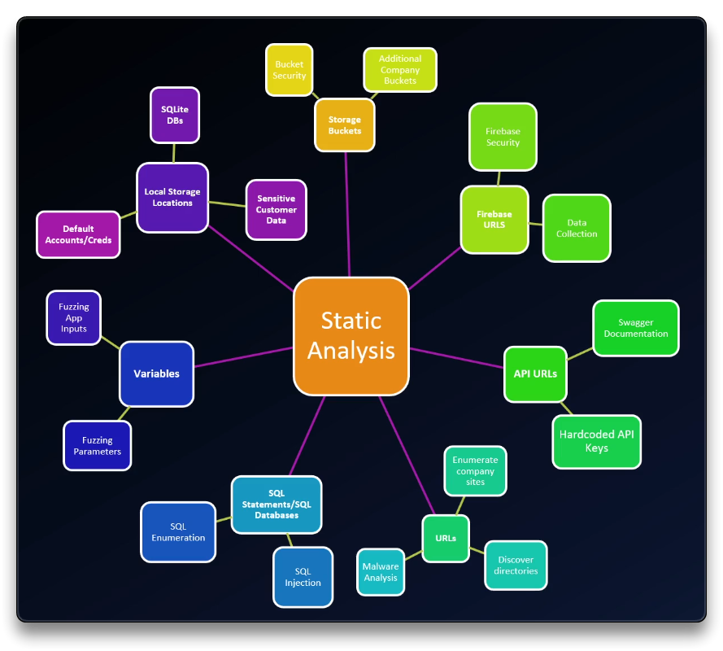

# 1. Introduction & Mobile Pentesting

## Intro

**The Penetration Testing Process**

- Reconnaissance Active/Passive
- Scanning/Enumeration
- Exploitation
- Privilege Escalation / Maintaining Access / Lateral, Vertical movement
- Covering the tracks
- Reporting

**The Mobile Application Penetration Testing Process**

- Reconnaissance
- Static Analysis
- Dynamic Analysis
- Reporting

## Mobile Penetration Testing

### Reconnaissance

- Info about the company Mobile Apps, releases, reports, code
- Target app on the [Play Store](https://play.google.com/store) (Android) and [App Store](https://www.apple.com/app-store/) (iOS) for reviews, developers, versions, patches, company info, etc

### Static Analysis

Read app's code manually and via automated tools. Look for:

- security misconfigurations
- hardcoded strings
- user's information, email, username, passwords
- URL - recon, enumerate, new exploitation path via API gateways
- Cloud resources and storage buckets
- Local Storage locations
- etc

### Dynamic Analysis

Run the application and manipulate it by:

- intercepting traffic with proxies
- dump (RAM) memory and check for stored secrets
- break **SSL Pinning**
- check for runtime created files on local storage

Check the [OWASP MASTG](https://mas.owasp.org/MASTG/) for various mobile security tests. Some attacks can result in OWASP Top Ten related attack vectors (SQL injection, XSS, IDOR) on the full website.

### Reporting

Executive summary and detailed technical analysis of specific vulnerabilities, including criticality assessment, scoring, steps for reproduction, and mentions of positive security implementations.

------

