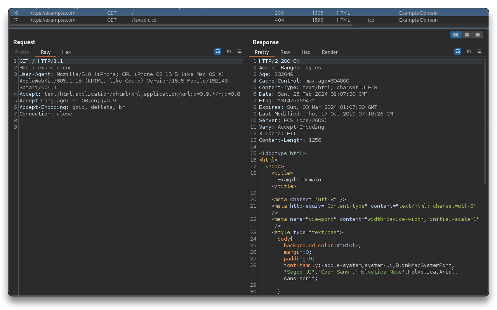

# 10. iOS Dynamic Analysis

## BurpSuite

> 🔗 [Configuring an iOS device to work with Burp Suite](https://portswigger.net/burp/documentation/desktop/mobile/config-ios-device)

Install and configure `Burpsuite` following the same steps [here](../5-android-dynamic/README.md#burpsuite).

- Configure the device to use the proxy
  - **Settings > Wi-Fi > Info button > Configure Proxy**
  - Use `Manual` to set the Proxy to the host IP running BurpSuite  (`vboxnet` LAN or Bridged LAN IP) and port `8082`
- [Install the BurpSuite CA certificate](https://portswigger.net/burp/documentation/desktop/mobile/config-ios-device) on the iOS device
  - Open `http://burpsuite:8082` on Safari
  - Select `CA Certificate` and click `Allow` to confirm the config profile download
  - **Settings > General > VPN & Device Management > Downloaded Profile**
    - Install the `PortSwigger CA`
  - **Settings > General > About > Certificate Trust Settings**
    - Activate the toggle switch to **enable full trust for root certificates**
- On Safari navigate to `https://example.com` and check for the connection request inside BurpSuite
  - Depending on the tested mobile application, traffic can be intercepted 



---

## Proxyman for iOS

> 🔗 [Proxyman for iOS](https://docs.proxyman.io/proxyman-ios/vpn-and-proxyman-certificate)
>
> - Capture iOS network traffic (HTTP/HTTPS) without a Macbook
> - Standalone app, works independently from Proxyman for macOS
> - View HTTP/HTTPS Requests and Responses in plain text
> - FaceID and Passcode for data protection
> - Debugging tools like Map Local, Breakpoint, Block List, SSL Proxying List,No Caching
> - Share logs to Proxyman for macOS
> - other features
>
> 🔗 [Atlantis for iOS](https://docs.proxyman.io/atlantis/atlantis-for-ios) - only for network inspectors
>
> - Automatically intercept all HTTP/HTTPS Traffic
> - Intercept WebSocket from iOS devices
> - Support iOS Physical Devices and Simulators
> - No need to configure HTTP Proxy or install/trust any Certificate
> - Review traffic logs from Proxyman for macOS
> - Categorize logs by app and devices

- Install `Proxyman for MacOS` on a Mac device and follow the iOS Setup Guide to configure the proxy

---

## SSL Pinning iOS

>  🔗 [SSL Kill Switch 2](https://github.com/nabla-c0d3/ssl-kill-switch2/issues/98) - (Old) tool to disable SSL certificate validation - including certificate pinning - within iOS and macOS applications.
>
> 🔗 [Objection](https://github.com/sensepost/objection)

- On a jailbroken device, `Objection` can be used to disable SSL Pinning and see HTTPS traffic using a proxy

```bash
# MacOS
curl https://bootstrap.pypa.io/get-pip.py -o get-pip.py
python3 get-pip.py
pip3 install --upgrade setuptools --break-system-packages
pip3 install objection --break-system-packages
pipx ensurepath
```

```bash
objection -g <AppName> explore -s "ios sslpinning disable"
```

---

## Jailbreaking

> ❗ Use Jailbreaking with caution! Jailbreaking is legal in the US but may have legal implications in other countries.
>
> 🔗 [iOS CFW Guide](https://ios.cfw.guide/)

[**Jailbreaking**](https://support.apple.com/guide/iphone/unauthorized-modification-of-ios-iph9385bb26a/ios) is the process of unlocking an iOS device to customize its functionality beyond Apple's restrictions, enabling the installation of custom apps and tweaks for a personalized user experience.

- iOS prioritizes security and reliability with built-in protections against malware, viruses, but jailbreaking can compromise these safeguards, leading to security risks, instability, and reduced battery life
- Jailbreaking iOS is necessary to conduct full iOS penetration testing
- [Types of jailbreak](https://ios.cfw.guide/types-of-jailbreak/)

> 📌 Follow my [iOS Jailbreak Guide](https://blog.syselement.com/home/pentesting-everything/mobile/labs/ios-jailbreak) and make sure you always check for updated commands/guides before step into jailbreaking.
>
> - A good resource website is [iOS CFW Guide - Get Started](https://ios.cfw.guide/get-started/)
> - Different devices will require different steps and tools to jailbreak an iOS!

------

