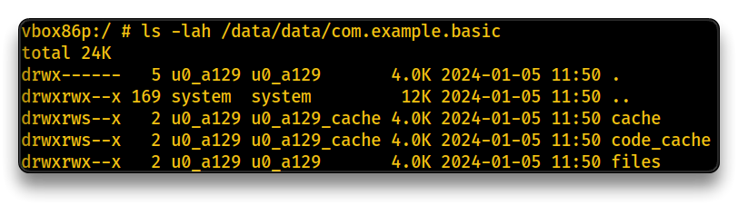
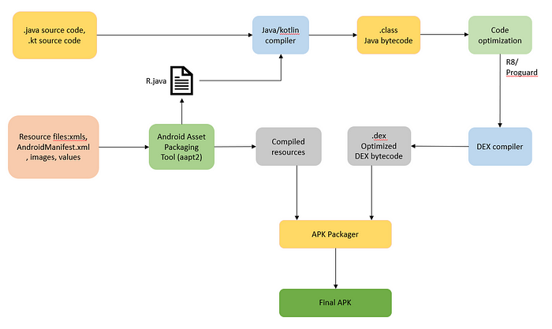
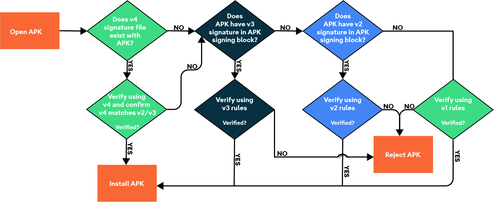

# 2. Android Security

## Android Architecture

**[Android](https://source.android.com/docs/) is based on the Linux O.S.**

- Linux file permission model (e.g. `drwxr-xr-x`) - [Chmod Calculator](https://chmod-calculator.com/)

**Virtual Machine**

- Dalvik - original runtime VM, not used anymore
- Android Runtime (**ART**) - modern runtime for executing app's bytecode into the device, within the app's own sandbox and isolated file system with a unique user

**Android Identity and Access Management**

User - owner of the application directory

- `UID` 10000 to 999999 - username e.g. `u0_a129` (with UID 10129)
- Various app's directories
  - `/data/app/com.example.basic` - generic app data
  - `/data/data/com.example.basic` - runtime storage of data
  - `/mnt/sdcard/Android/data/com.example.basic` - external stored data for runtime

- **root** (system level) user is necessary to access every application directory

Apps can communicate with each other either through granted permissions or, more commonly, by utilizing an exposed **Content Provider / Broadcast Receiver** (`e.g.` *Open with* option).

- **Profiles** (work BYOD, personal, etc) - access system level functions, but can have isolated app's data, clipboard, contacts, etc
- **Primary User** - first created user, removed only by factory reset
- **Secondary User** - additional users
- **Guest User** - guest access to the phone
- **Kid Mode** - specific account for kids

[**Android Architecture**](https://mas.owasp.org/MASTG/Android/0x05a-Platform-Overview/#android-architecture)

### Kernel

Android relies on a *modified Linux Kernel* with additional features, with key components such as the managed runtime (`ART`/`Dalvik`) for applications and `Bionic`, Android’s equivalent of `glibc` (GNU C library)

- Support for various CPU types
- Apps run on specific Android Runtime/API version (`minSDKVersion`) - Check for Android API Levels - [https://apilevels.com/](https://apilevels.com/)
  - Lower SDK/Android level can have more security vulnerabilities
  - The higher the SDK/API level, the better/more secure
- Physical components are controlled by drivers

### Hardware Abstraction Layer (HAL)

HAL is an interface between the operating system and hardware components, providing a standardized way for the OS to communicate with various manufacturer and type of hardware components.

- HAL types: Automotive, iOT, Gaming peripherals, etc

###  Native C vs Android Runtime

`C` and `C++` is the device's native language.

- no VM required
- Webkit, Libc, OpenMAX AL / OpenGL ES / Media (UI APIs)

`Java` / [`Kotlin`](https://developer.android.com/kotlin) are preferred over Native C, due to their portability and compatibility across various devices.

### Java API Framework

A collection of predefined classes and methods provided by Java for building applications, offering a standardized set of functionalities.

- **Content Providers** - for data sharing to other apps via a specific directory
- **View System** - App's UI
- **Managers** - Notifications, Package management, Telephony, Location, Activity, etc

### System Application Layer

The layer of software that includes essential system applications and services, Google and vendor specific pre-installed applications.

## Signing Process

Android apps can be decompiled (*reverse-engineered*), rebuilt, re-signed and re-run.

DEX Bytecode ➡️ SMALI ➡️ Decompiled JAVA

- Tools for reverse engineering Android apps - [`apktool`](https://apktool.org/), [`jadx` / `jadx-gui`](https://github.com/skylot/jadx)

[Android application **signing**](https://developer.android.com/studio/publish/app-signing) involves the use of *cryptographic signatures*, including additional features like Google Play Signing, to verify the authenticity and integrity of an Android app.

- Signing Tools - [`keytool`](https://docs.oracle.com/javase/10/tools/keytool.htm#JSWOR-GUID-5990A2E4-78E3-47B7-AE75-6D1826259549) (Generate a private key), [`jarsigner`](https://docs.oracle.com/javase/8/docs/technotes/tools/windows/jarsigner.html) (apk signing), [`zipalign`](https://developer.android.com/tools/zipalign) (zip & optimize apk).

> 📌 Android Applications need to be signed to run on Android devices.

------

