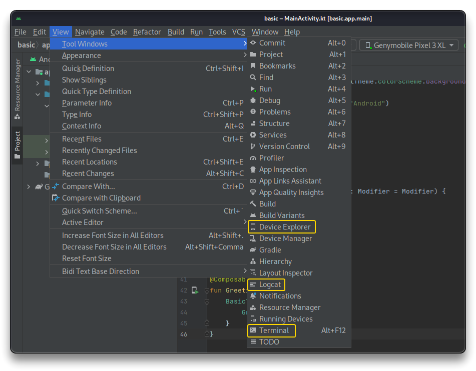
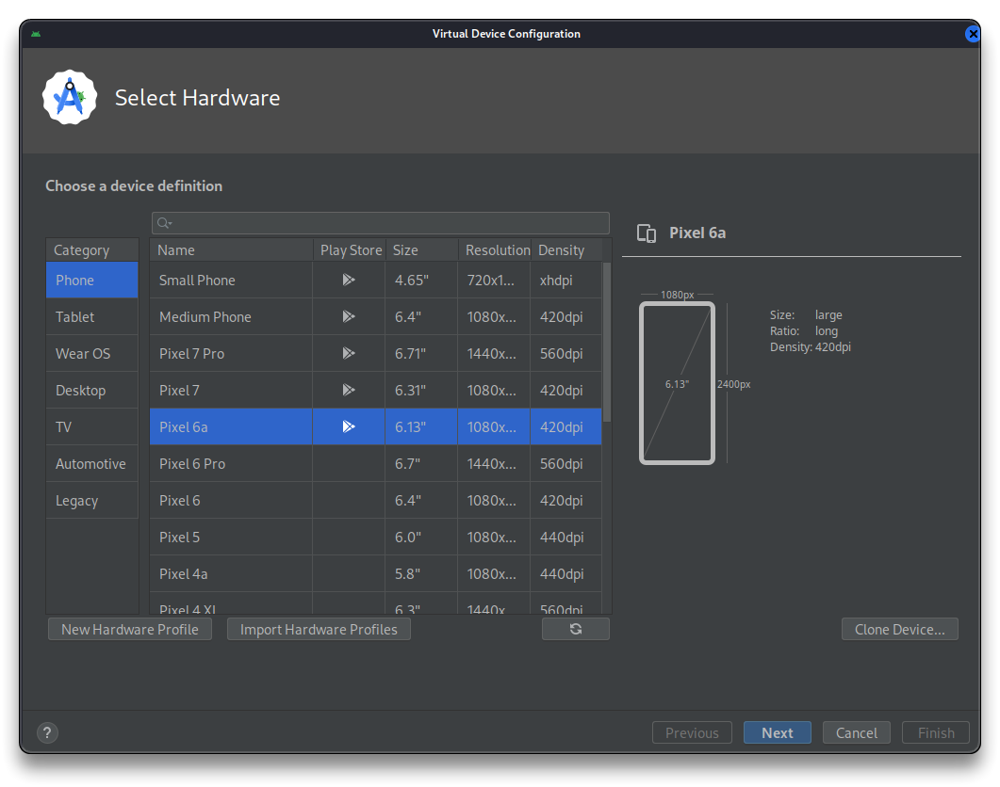
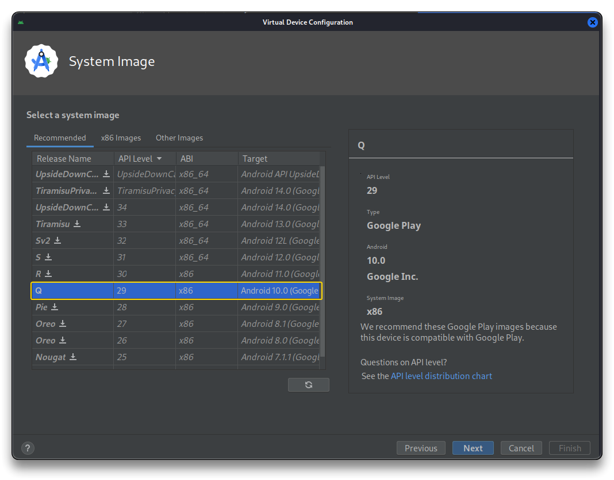
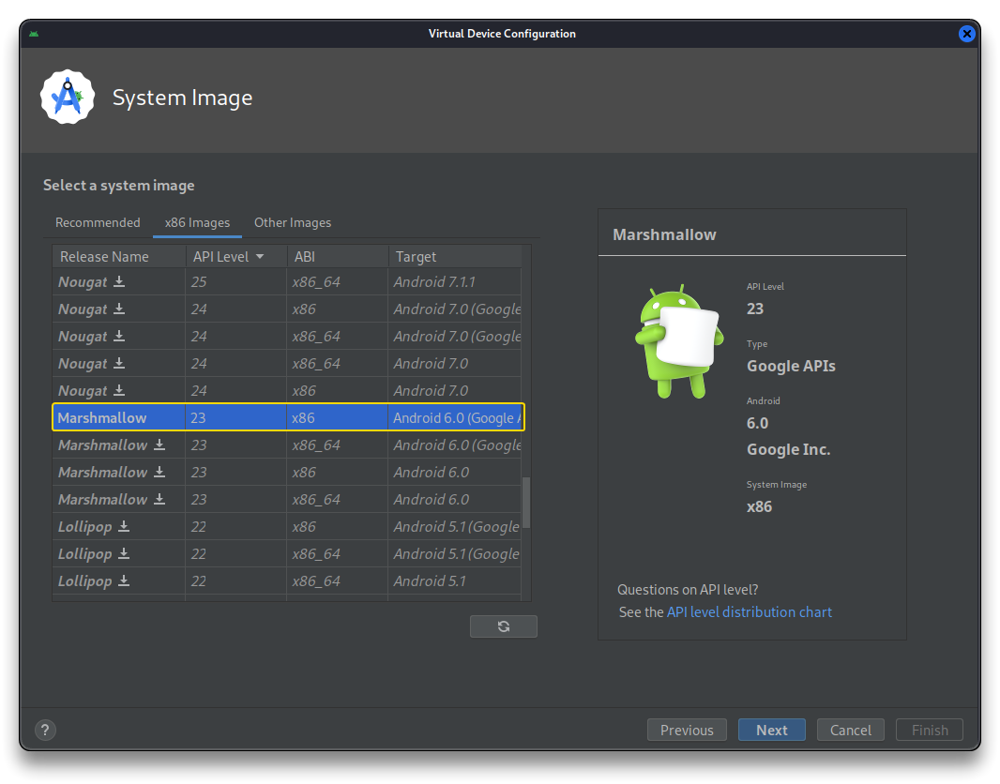

# 3. Android Lab Setup

## Kali Linux

- Install a Kali Linux virtual machine using VirtualBox or VMware
  - `e.g.` here [Kali VM Installation - VMware - syselement](https://blog.syselement.com/home/operating-systems/linux/distros/kali-vm)

> 🔗 **TOOLS**
>
> - [pimpmykali](https://github.com/Dewalt-arch/pimpmykali)
> - [adb](https://developer.android.com/tools/adb)
> - [apktool](https://apktool.org/)
> - [jadx](https://github.com/skylot/jadx)
> - [Android Studio](https://developer.android.com/studio)
> - [Genymotion](https://www.genymotion.com/)

### MAPT Course Setup

```bash
cd
mkdir repo
cd ~/repo
git clone https://github.com/Dewalt-arch/pimpmykali
cd pimpmykali
sudo ./pimpmykali.sh
# Select Option A for MAPT course tools

sudo apt update && sudo apt upgrade -y && sudo apt autoremove -y

sudo apt install adb default-jdk jadx jarsigner

# Apktool
# make sure to get the latest apktool_*.jar link for the following wget
sudo wget https://bitbucket.org/iBotPeaches/apktool/downloads/apktool_2.9.2.jar -O /usr/local/bin/apktool.jar
sudo wget https://raw.githubusercontent.com/iBotPeaches/Apktool/master/scripts/linux/apktool -O /usr/local/bin/apktool
sudo chmod +x /usr/local/bin/apktool*

#Path-apk
cd ~/repo
git clone https://github.com/NickstaDB/patch-apk.git

# Android Studio #
sudo dpkg --add-architecture i386

sudo apt update && sudo apt install -y libc6:i386 libncurses5:i386 libstdc++6:i386 lib32z1 libbz2-1.0:i386

sudo wget https://redirector.gvt1.com/edgedl/android/studio/ide-zips/2023.1.1.26/android-studio-2023.1.1.26-linux.tar.gz -O /tmp/android-studio.tar.gz

sudo tar xvfz /tmp/android-studio.tar.gz -C /opt
sudo chmod +x /opt/android-studio/bin/*.sh
sudo rm -f /tmp/android-studio.tar.gz

## Run with:
cd /opt/android-studio/bin
./studio.sh
## Proceed with the Setup Wizard selecting all the available components to install
## Open a New project and go to Tools > Create Command-line Launcher & Create Desktop Entry

# Genymotion #
sudo apt install -y adb virtualbox virtualbox-dkms virtualbox-ext-pack
sudo wget https://dl.genymotion.com/releases/genymotion-3.6.0/genymotion-3.6.0-linux_x64.bin -O /tmp/genymotion.bin

sudo chmod +x genymotion.bin
sudo ./genymotion.bin

cd /opt/genymobile/genymotion
./genymotion
```

```bash
# zipalign error fix
sudo rm /usr/bin/zipalign
sudo ln -s ~/Android/Sdk/build-tools/*/zipalign /usr/bin/zipalign
# or manual download & install zipalign
# sudo apt remove zipalign
# sudo wget http://ftp.us.debian.org/debian/pool/main/a/android-platform-build/zipalign_8.1.0+r23-2_amd64.deb -O /tmp/zipalign.deb
# sudo dpkg -i /tmp/zipalign.deb
```


### Additional Personal Setup

```bash
# my script with additional tools

local packages=(
        # Add software here
        aapt adb android-sdk-platform-tools apksigner apktool apt-transport-https aptitude bettercap 
        btop burpsuite cifs-utils coreutils curl dbeaver duf exa flameshot firefox-esr flatpak fonts-firacode
        fonts-noto-color-emoji htop ideviceinstaller imagemagick jadx kate
        keepassxc libimobiledevice-utils libimobiledevice6 libusbmuxd-tools locate lolcat net-tools
        npm openssl python3 python3-pip python3-venv pipx pidcat qpdfview sqlite3 sqlitebrowser
        sshpass terminator tree ugrep virt-manager vlc wget wkhtmltopdf zaproxy zipalign
    )
sudo apt update && sudo apt install -y -o Debug::pkgProblemResolver=yes "${packages[@]}"
```

- Use [`scrcpy`](https://github.com/Genymobile/scrcpy) (*screen copy*) to mirror Android devices connected via USB or LAN.

```bash
# Scrcopy
cd /opt
sudo apt install -y ffmpeg libsdl2-2.0-0 adb wget \
	gcc git pkg-config meson ninja-build libsdl2-dev \
	libavcodec-dev libavdevice-dev libavformat-dev libavutil-dev \
	libswresample-dev libusb-1.0-0 libusb-1.0-0-dev
sudo git clone https://github.com/Genymobile/scrcpy
cd scrcpy
sudo ./install_release.sh

## Usage
# scrcpy
# scrcpy --no-audio
# scrcpy --no-audio --record=file.mkv
```


---

## [Android Studio](https://developer.android.com/studio)

> Android Studio is recommended for a Windows host machine, while Genymotion is a suitable alternative within the Kali VM due to Android Studio's instability.

- Uncheck `Launch in .. tool window` in the Emulator Settings.




Use the Android Studio Device Manager to create 2 new Android Virtual Devices (**AVD**)

- one with the `Q` Release (**Android 10.0**/API Level 29) Google Play image
- one with the `x86 Marshmallow` Release (**Android 6.0**/API Level 23)







**Other Emulating Tools**

> 🔗 [Genymotion](https://www.genymotion.com/)
>
> 🔗 [Xamarin (.NET)](https://dotnet.microsoft.com/en-us/apps/xamarin)

---

## Physical Device Setup

### Developer Options / USB Debugging

- [Developer Options](https://developer.android.com/studio/debug/dev-options) enabled on your device. To do this:
  - Go to **Settings** > **About phone**.
  - Tap on the **Build number** several times to enable `Developer Options`.
  - Enter **System** > **Developer options**.
  - Set the following options:
    - Enable `OEM Unlocking`
    - Disable `Automatic system updates`
    - Enable `USB debugging`
    - Enable `Wireless debugging`
    - Enable `Disable adb authorization timeout`
    - Enable `Stay awake (while charging)` (if wanted)

> 📌 I will use a physical Android Sony device for this course. To enable automatic USB connection to the Kali VM, I've added a line to the `kali.vmx` VM config file, obtaining the `vid` and `pid` values from the vmware.log file.
>
> ```bash
> usb.autoConnect.device0 = "vid:0fce pid:31f4 autoclean:1"
> ```
>
> 🔗 Follow my [Android Rooting Guide](https://blog.syselement.com/home/pentesting-everything/mobile/labs/android-rooting) if necessary (root on a physical Google Pixel).

---

## ADB

Access `ADB` shell from a VM/Networked Device.

- Android Device Emulator is running on the HOST machine

```bash
# Start adb on host machine
adb -a nodaemon server

# if port is already in use, kill the process first
taskkill /f /t /im adb.exe # Windows
adb kill-server	# Linux

# Connect to the emulator via LAN
adb -H <host_machine_IP> -P 5037 shell
```

---

## MobSF

```bash
sudo mkdir -p ~/docker/mobsf

chown 9901:9901 ~/docker/mobsf

docker run -it --rm --name mobsf -p 8000:8000 -v ~/docker/mobsf:/home/mobsf/.MobSF opensecurity/mobile-security-framework-mobsf:latest

# Set the above command as "mobsf" bash/zsh alias
```

---

## Frida & Objection

```bash
# Frida with pipx
# Install pipx to manage frida-tools in its own VirtualEnv
sudo apt update
sudo apt install -y python3 python3-pip python3-venv pipx
# sudo rm -rf ~/.local/pipx
python3 -m pipx ensurepath
pipx install frida-tools
pipx upgrade frida-tools

# Restart zsh terminal
```

```bash
# Objection
sudo apt update
sudo apt install -y python3 python3-pip python3-venv pipx
python3 -m pipx ensurepath
pipx install objection
pipx upgrade objection
pip install typing-extensions --upgrade

# Restart zsh terminal
```

------

## Tools Update

```bash
pipx upgrade frida-tools
pipx upgrade objection
pipx upgrade-all
```

- [Apktool](https://apktool.org/docs/install#linux)

---

