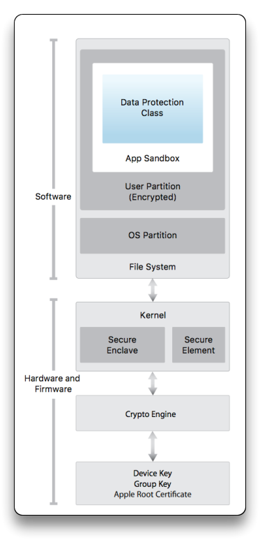

# 7. iOS Security

iOS devices have limitations compared to Android and include a hardware security component. Jailbreaking may be required to install third-party apps (sideloading).

## iOS Architecture

[Apple iOS Security](https://support.apple.com/guide/security/welcome/web) is based on a hardware and a software layer, and iOS **is based on the Linux O.S**.

- All apps are signed by Apple (with a developer profile) - Free developer account allows Sideloading.
- 2 partitions on the file system (user and O.S. partitions) - the user can only see user's file
- Each iOS device has a device and a group key, created during manufacturing
  - iOS utilizes secure boot chain, Touch ID/Face ID, and the Secure Enclave for hardware-based encryption and key management.

[**iOS Architecture**](https://mas.owasp.org/MASTG/iOS/0x06a-Platform-Overview/#ios-security-architecture)

Most iOS Applications are based on native [Objective C](https://developer.apple.com/library/archive/documentation/Cocoa/Conceptual/ProgrammingWithObjectiveC/Introduction/Introduction.html#//apple_ref/doc/uid/TP40011210-CH1-SW1), and [Swift](https://developer.apple.com/swift/resources/).

- Developed in [Xcode](https://developer.apple.com/xcode/) environment
- `.iPA` format - signed bundle of folders and assets
- Unzipping .iPA results into a `/Payload` folder
  - `Application.app`
  - `iTunesMetadata.plist`
  - `Info.plist`
  - various unique `.json`, assets, resources

------

