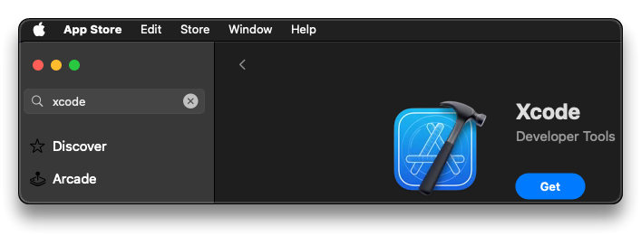
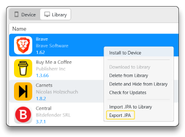

# 8. iOS Lab Setup

> ❗ A MacOS device is required for the lab setup and pentesting, while whenever feasible, both static and dynamic analyses in the course will be conducted using the [Kali VM](../3-android-lab/README.md).

- Open Mac App Store and install [Xcode](https://developer.apple.com/documentation/xcode)



- With the Xcode project, source code can be analyzed
  - Xcode Simulator can be used to run the app
- Create an [Apple Developer](https://developer.apple.com/programs/) account and **configure it in Xcode Accounts to manage certificates for app signing**
- Tools such as [AnyTrans](https://www.imobie.com/anytrans/) or [iMazing](https://imazing.com/) (suggested) can be used to pull apps from the App Store and export `.ipa` apps



Homebrew is necessary to install some MacOS based tools

- **Install [Homebrew](https://brew.sh/) in Linux**

```bash
sudo apt install -y build-essential procps curl file git

/bin/bash -c "$(curl -fsSL https://raw.githubusercontent.com/Homebrew/install/HEAD/install.sh)"

test -d ~/.linuxbrew && eval "$(~/.linuxbrew/bin/brew shellenv)"
test -d /home/linuxbrew/.linuxbrew && eval "$(/home/linuxbrew/.linuxbrew/bin/brew shellenv)"
echo "eval \"\$($(brew --prefix)/bin/brew shellenv)\"" >> ~/.zshrc
```

-	[IPATool](https://github.com/majd/ipatool) - *Command-line tool that allows searching and downloading app packages (known as ipa files) from the iOS App Store*

```bash
brew tap majd/repo
brew install ipatool

ipatool auth login -e <appleid_email>
ipatool search <Keyword>
ipatool download --bundle-identifier <bundleIDFromSearchCommand>
# .ipa is downloaded
```

- Paid emulator tools
  - [Corellium Virtual Hardware](https://www.corellium.com/)
  - [Appetize.io](https://appetize.io/)

------

