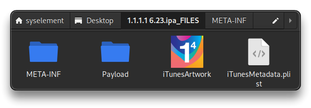
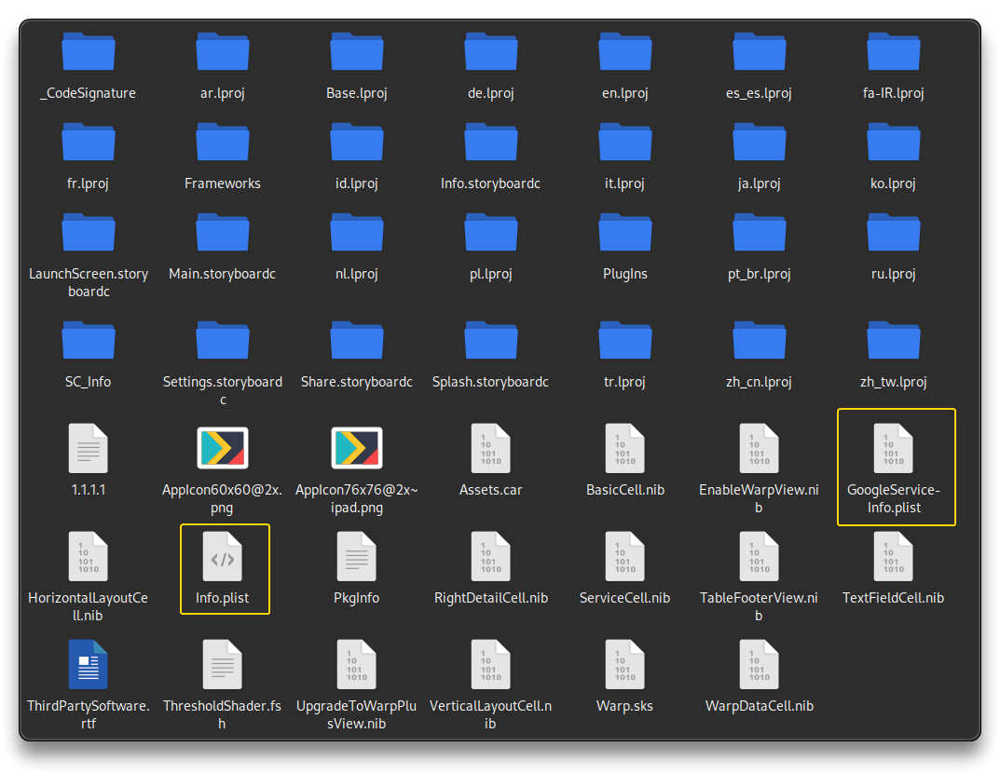
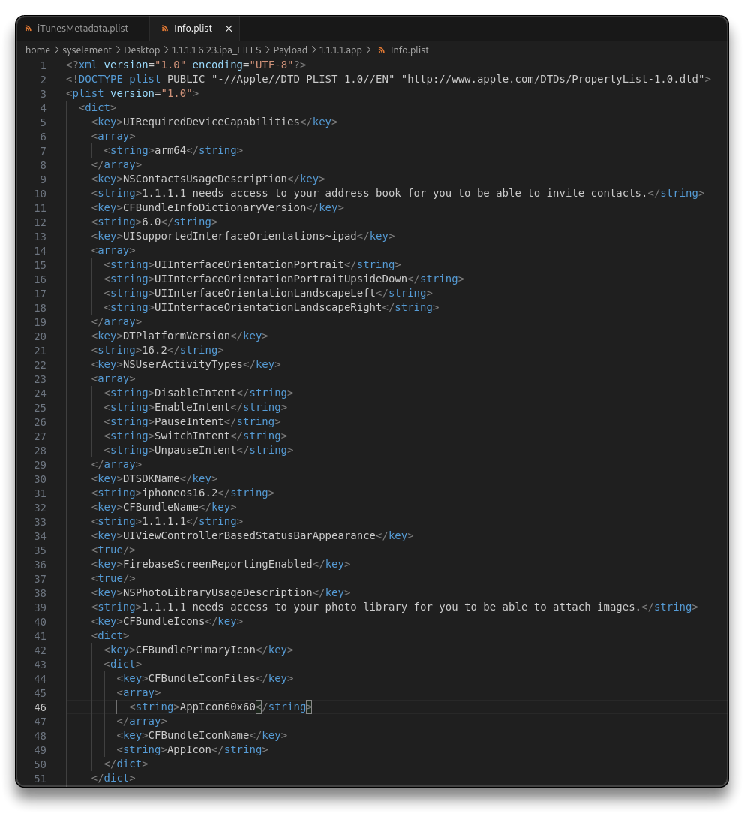
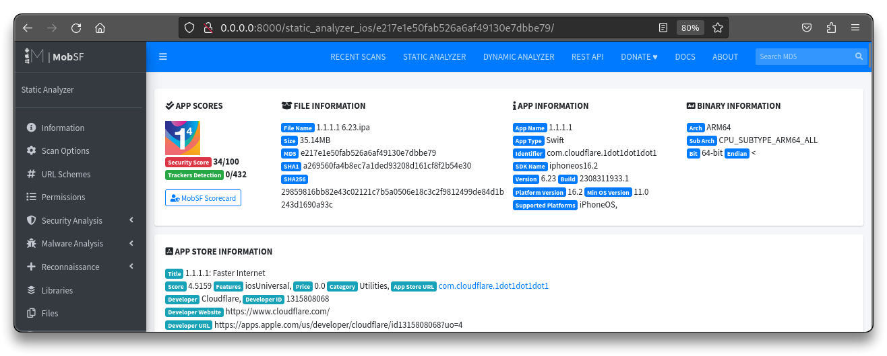
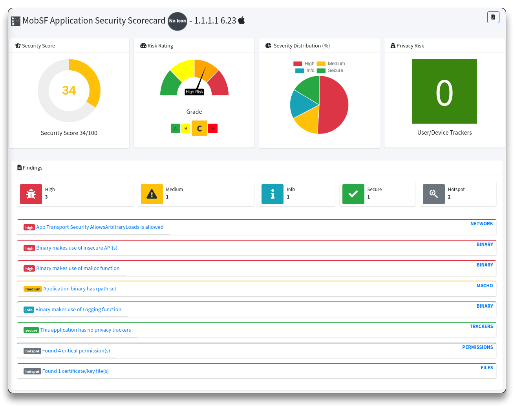
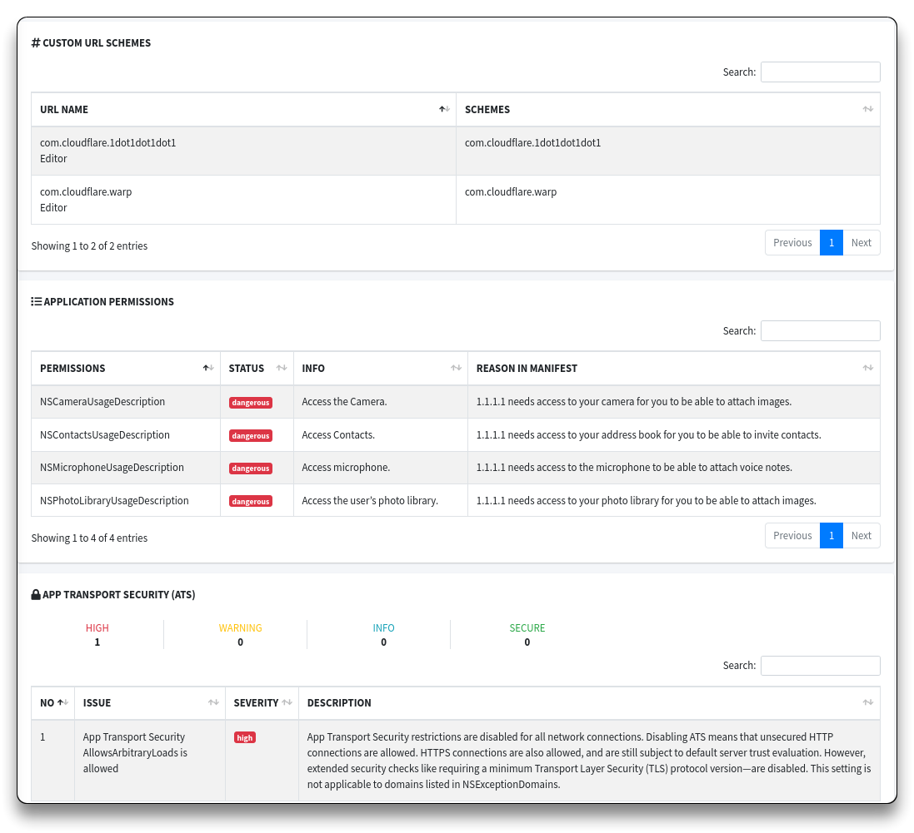
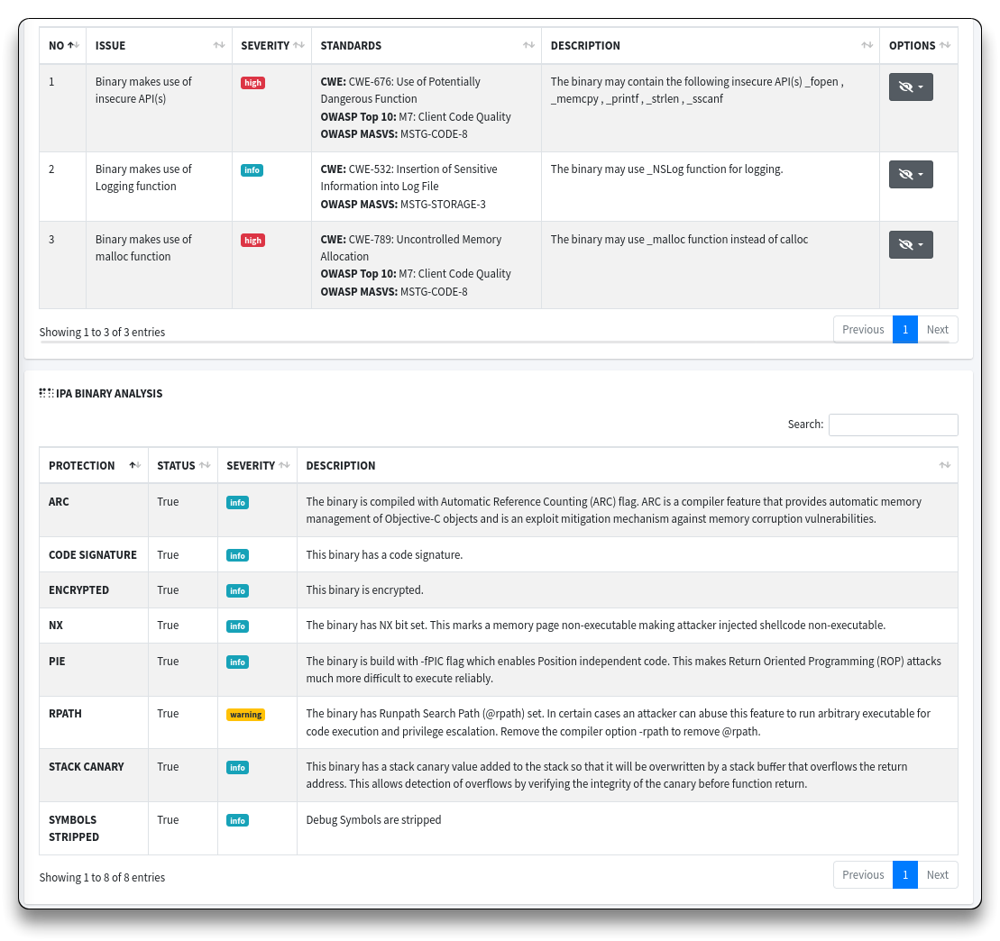
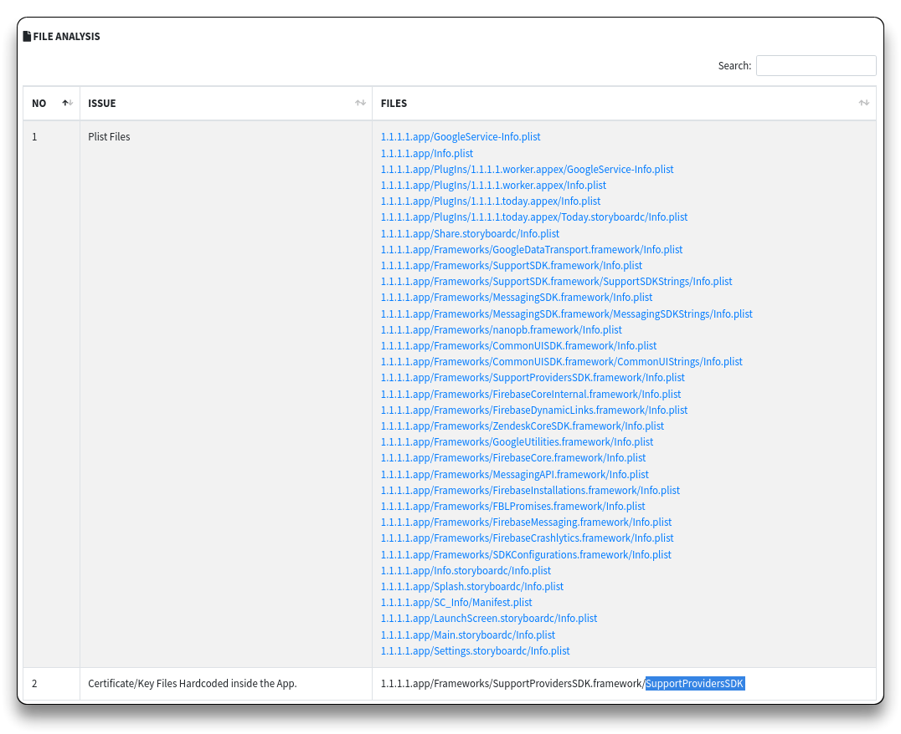

# 9. iOS Static Analysis

> ❗ Always refer to a HackerOne Bug Bounty program to find valid targets
>
> 🔗 [HackerOne iOS programs](https://hackerone.com/opportunities/all/search?asset_types=APPLE_STORE_APP_ID%2CTESTFLIGHT%2COTHER_IPA&ordering=Newest+programs)
>
> - 🧪  `e.g.` - [1.1.1.1 - com.cloudflare.1dot1dot1dot1](https://hackerone.com/cloudflare) Cloudflare iOS is in scope

- Unzip an `.ipa` file and check the various files inside it
  - Inside the `Payload` folder check for `plist` files, `Framekworks` folder for app's source code, other `json` files on different folders
  - Check for hardcoded strings in the files.

- Run MobSF and import the `.ipa` file into it for local static analysis
  - Check the sections, look for different files, strings and look through interesting information about the app

------

