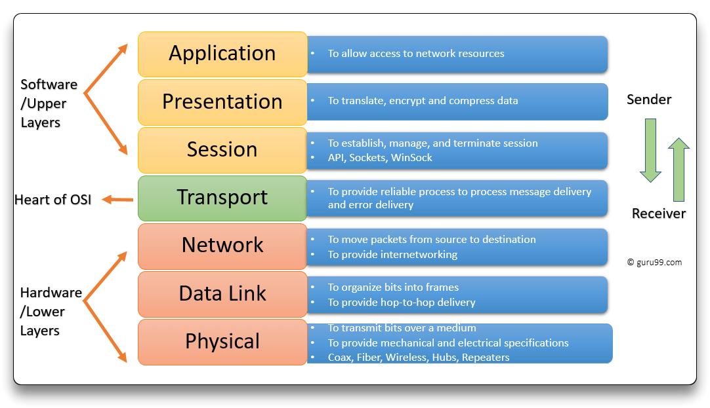
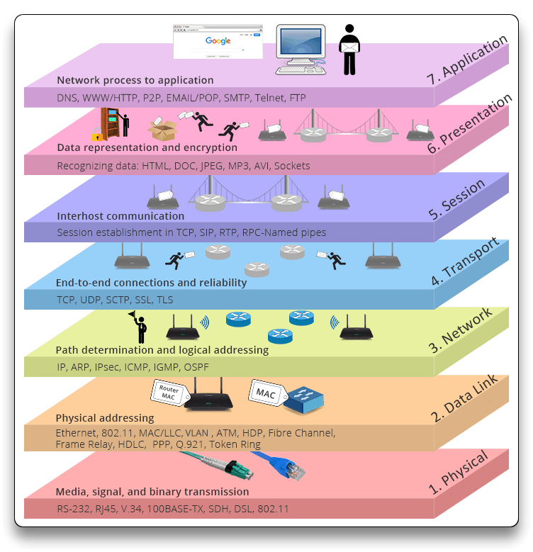
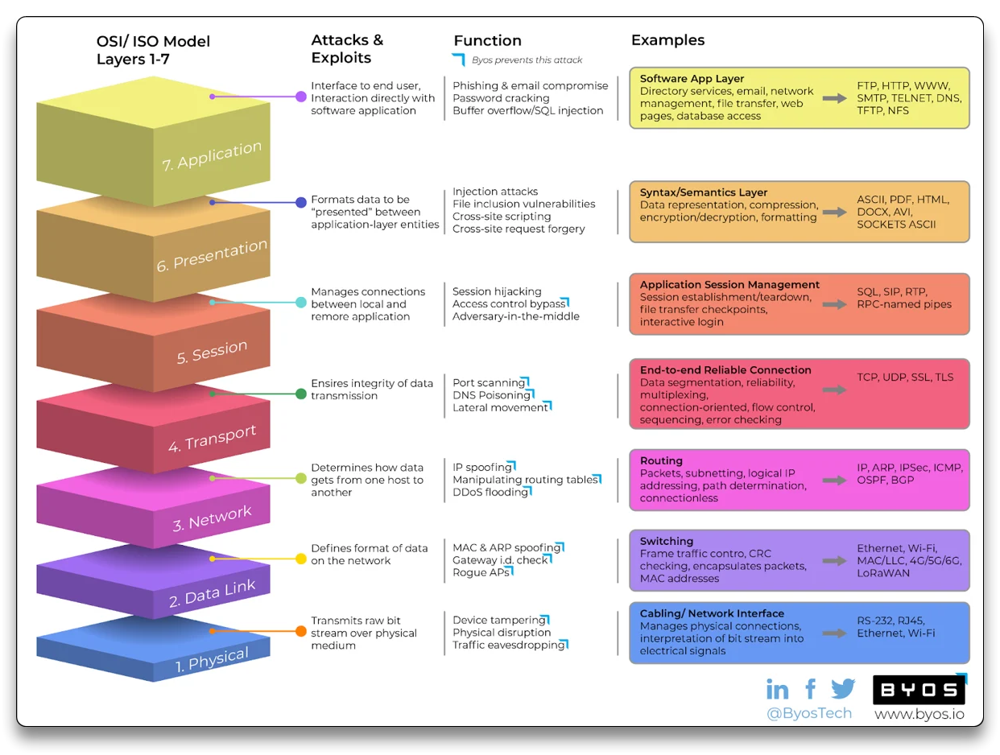
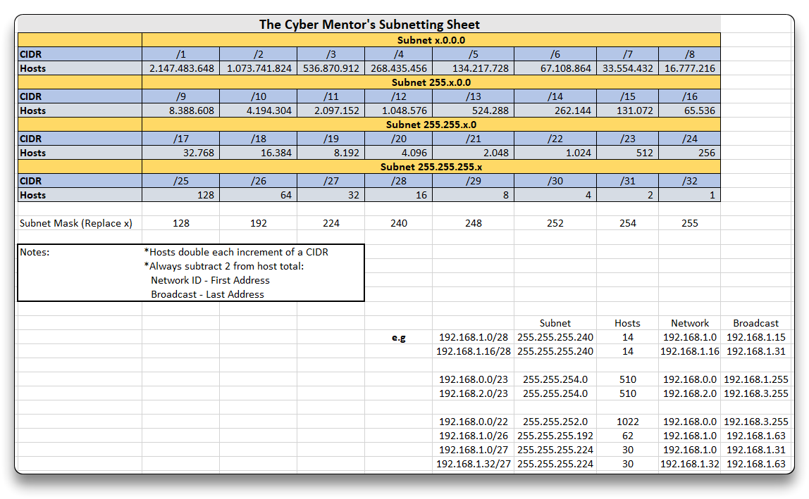

# 1. Introduction & Networking

---

## Intro

**Ethical hackers** are *allowed and hired* to try to hack into an organization by assessing its security posture.

### Network Assessments

- **External** Pentest - hacking/assessing from outside of the organization's network
  - OSINT (Open-Source Intelligence) - organization's users, web login pages, emails, etc
  - Vulnerability scanning from the Internet
  - Pentest takes 32-40 hours on average and 8-16 hours for report writing
- **Internal** Pentest - assessing from the inside of the organization's network
  - Active Directory attacks
  - Pentest takes 32-40 hours on average (longer if bigger scope ) and 8-16 hours for report writing
- **Web Application** Pentest - assessing the web application security
  - Web-based attacks & [OWASP](https://owasp.org/) guidelines
  - Pentest takes a minimum of 32-40 hours and 8-16 hours for report writing
- **Wireless** Pentest - assessing the wireless network security
  - Guest, WPA2-PSK, WPA2 Enterprise - pentesting with external Wireless adapters
  - Takes 4-8 hours per SSID and 2-4 for report writing
- **Physical** & Social Engineering Pentest - assessing an organization's physical security
  - On site badges cloning, social engineering, picking locks, etc - depends on the client's goal
  - Phishing, Vishing, Smishing campaigns
  - Lasts 16-40 hours and 4-8 for report writing
- Mobile Pentesting, IoT  Pentesting, Red Team Engagements (weeks, months), Purple Team Engagements, Car Hacking, etc

⬇️

### Report

- Good technical skills, report writing, communication and presentation skills
- Report withing a week
  - Executive Summary - a non-technical report
  - Technical findings section - for the technicians
  - Recommendations for remediation - clear to both executives and tech staff

⬇️

### Debrief

- The client (both technical and executive staff) is taken through the report findings.
- Client can ask questions and address any concerns
- Release the final report

------

## Networking

> 🔗 [Networking Fundalmentals - Practical Networking Youtube](https://www.youtube.com/playlist?list=PLIFyRwBY_4bRLmKfP1KnZA6rZbRHtxmXi)

```bash
ifconfig
ipconfig /all
```

➡️ **Layer 3**

**IP** (Internet Protocol) addresses - identify/locate devices on a network, on the layer 3 OSI model.

- **IPv4 Address**: `192.168.1.50` - decimal notation

  - 4 octets of 8 bits = 32bits = 4bytes

  - Total IPv4 addresses
    $$
    2^{32} = 4.294.967.296
    $$

- **IPv6 Address**: `fe80::ab4c:8503:3248:9993%6` - hexadecimal notation

  - 8 groups of 4 hex digits = 128bits
  - Total IPv4 addresses
    $$
    2^{128} = 3.4×10^{38}
    $$

➡️ **Layer 2**

**MAC** (Media Access Control) access is a unique identifier/hardware address given to NICs (network interface controllers). Used at the layer 2 OSI model (data link).

- **MAC Address**: `00:50:56:C0:00:01` - hexadecimal notation
  - 6 pairs of hex digits = 48 bits
  - First 3 pairs = NIC manufacturer
  - local network

➡️ **Layer 4**

**TCP** (Transmission Control Protocol)

- Connection oriented, high reliability, guaranteed delivery
- [3 Way Handshake](https://www.guru99.com/tcp-3-way-handshake.html): `SYN` ➡️ `SYN ACK` ➡️ `ACK` = Connection established

**UDP** (User Datagram Protocol)

- Connectionless, lightweight, no acknowledgement/reliability, real-time apps

### **Common TCP Ports**

| TCP Ports |                           Service                            |
| :-------: | :----------------------------------------------------------: |
| 21 / 990  | **FTP** (File Transfer Protocol) / **FTPS** (FTP over SSL/TLS) |
|    22     |                    **SSH** (Secure Shell)                    |
|    23     |                          **Telnet**                          |
|    25     |           **SMTP** (Simple Mail Transfer Protocol)           |
|    53     |                 **DNS** (Domain Name System)                 |
| 80 / 443  | **HTTP** / **HTTPS** (Hypertext Transfer Protocol over SSL)  |
|    110    |               **POP3** (Post Office Protocol)                |
|    123    |               **NTP** (Network Time Protocol)                |
| 139 / 445 |     **NetBIOS** / **SMB, Samba** (Server Message Block)      |
|    143    |         **IMAP** (Internet Message Access Protocol)          |
|    389    |       **LDAP** (Lightweight Directory Access Protocol)       |
| 1433-1434 |                     Microsoft Sql Server                     |
|   3306    |                          **MySQL**                           |
|   3389    |                  **RDP** (Terminal Server)                   |

### **Common UDP Ports**

| UDP Ports |                     Service                      |
| :-------: | :----------------------------------------------: |
|    53     |           **DNS** (Domain Name System)           |
|  67 / 68  |  **DHCP** (Dynamic Host Configuration Protocol)  |
|    69     |    **TFTP** (Trivial File Transfer Protocol)     |
|    161    |  **SNMP** (Simple Network Management Protocol)   |
|    389    | **LDAP** (Lightweight Directory Access Protocol) |

### **OSI Model**

> 🔗 [guru99 - OSI Model Layers](https://www.guru99.com/layers-of-osi-model.html)
>
> 🔗 [SMB University - Cisco Networking Fundamentals](https://www.cisco.com/c/dam/global/fi_fi/assets/docs/SMB_University_120307_Networking_Fundamentals.pdf)

➡️ **OSI** (Open Systems Interconnection) model is a conceptual framework that offers a 7 layers structured method for communication system functions and network protocols.



***P**lease* ➡️ 1. Physical

- data cables

***D**o* ➡️ 2. Data Link

- Switching, MAC

***N**ot* ➡️ 3. Network

- IPs, Routing

***T**hrow* ➡️ 4. Transport

- TCP/UDP

***S**ausage* ➡️ 5. Session

- Session management

***P**izza* ➡️ 6. Presentation

- Media files

***A**way* ➡️ 7. Application

- HTTP, SMTP, apps





### Subnetting

> 🔗 [Subnetting Mastery - Practical Networking Youtube](https://www.youtube.com/playlist?list=PLIFyRwBY_4bQUE4IB5c4VPRyDoLgOdExE)
>
> 🔗 [Subnet Guide - TCM](https://drive.google.com/file/d/1ETKH31-E7G-7ntEOlWGZcDZWuukmeHFe/view)

Subnetting consists of dividing a network into multiple subnetworks/subnets.

- Subnet - own range of IP addresses
- **NAT** (Network Address Translation) prevents from running out of IPv4 addresses

**CIDR** (Classless Inter-Domain Routing) notation

- `192.168.1.0/24` - `/xx` is the network prefix length (network portion bits number)

  - 24 bits = network portion (*turned on bits*)

  - (remaining) 8 bits = host portion

  - Total hosts
    $$
    (2^{8} = 256)-2=254
    $$
    
  - Subnet Mask = `255.255.255.0`
  
- Network ID - First Address `192.168.1.0`

- Broadcast - Last Address `192.168.1.255`

> 🔗 [Subnet Calculator - vultr.com](https://www.vultr.com/resources/subnet-calculator/)
>
> 🔗 [Subnet Calculator - mxtoolbox.com](https://mxtoolbox.com/subnetcalculator.aspx)
>
> 🔗 [CIDR to IPv4 Conversion](https://www.ipaddressguide.com/cidr)



------

