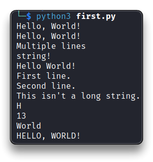
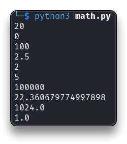
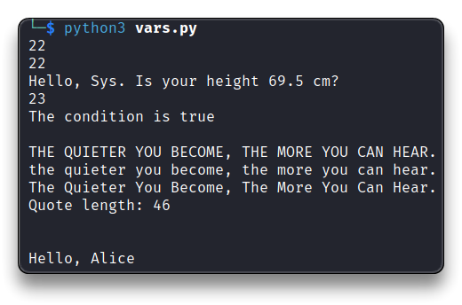
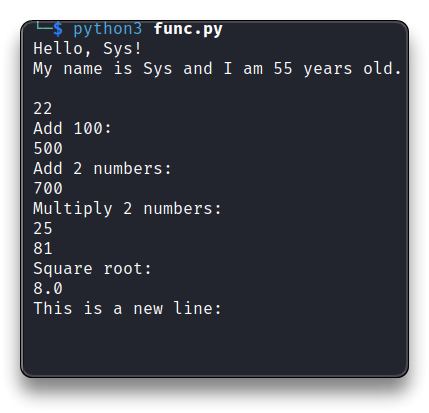
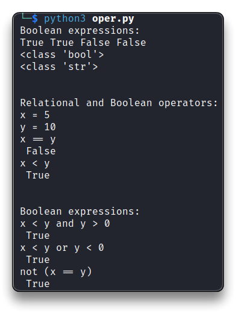
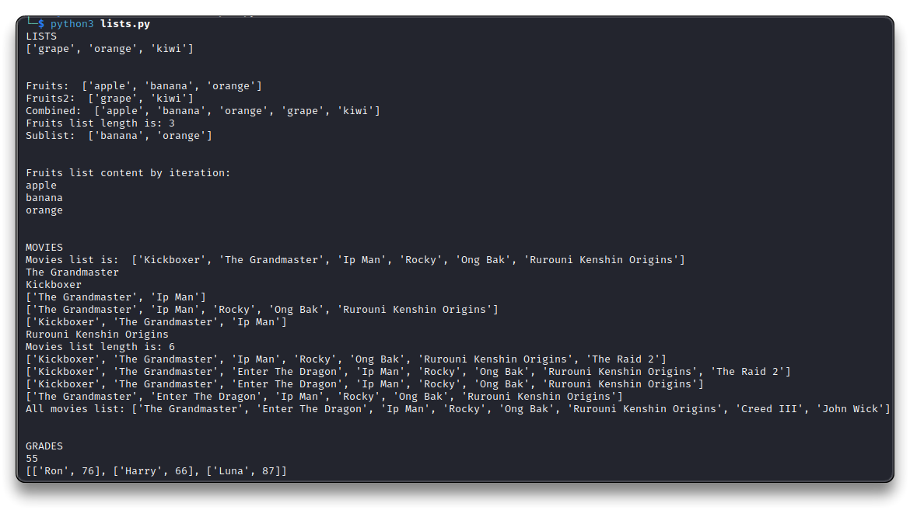
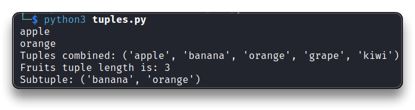

# Intro to Python


> 🔗 [Python Docs](https://docs.python.org/3/)
>
> 🔗 [The Python Standard Library](https://docs.python.org/3/library/index.html)
>
> 🔗 [Python Cheatsheet](https://www.pythoncheatsheet.org/)
>
> 🔗 [Python Tutorial - W3Schools](https://www.w3schools.com/python/default.asp)

```bash
mkdir ~/tcm/peh/python
nano first.py
# or with Sublime installed
subl first.py
```

- Example of Python script
  - **`#!/bin/python3`** - first line
  - Use **`#`** for comments

```python
#!/bin/python3

# Print string <--- this is a comment
print("Hello, world!")
```

```bash
# eventually make the script runnable
chmod +x first.py
# it must containg "#!/bin/python3" as first line, to run it with
./first.py

# Or run it with python3
python3 first.py
```

## [Strings](https://docs.python.org/3/tutorial/introduction.html#strings)

```python
#!/bin/python3

# Print string
print("Hello, World!") 	 # Single quotes
print('Hello, World!')	 # Double quotes
print("""Multiple lines
string!""")				 # Triple quotes = Multiple lines
print("Hello "+"World!") # Concatenate strings
print("First line.\nSecond line.")	  # New line
print('This isn\'t a long string.')   # \' to escape the single quote..or use double quotes

# Creation
my_string = "Hello, World!"

# Accessing individual characters by indexing
print(my_string[0])
# output = 'H'

# Concatenation
greeting = 'Hello' + ' ' + 'World!'

# Length of the string
print(len(my_string))

# Slicing
# Extract a substring from a string using slicing, specifying the start and end indices.
substring = my_string[7:12]
print(substring)
# output = 'World'

# Methods to manipulate and transform strings
print(my_string.upper())
# output = 'HELLO, WORLD!'
```



## [Math](https://docs.python.org/3/library/math.html?highlight=math#module-math)

```bash
nano math.py
```

```python
#!/bin/python3
import math # Module with various math functions and constants

# Operators
print(10 + 10)  # Addition
print(10 - 10)  # Subtraction
print(10 * 10)  # Multiplication
print(25 / 10)  # Division with remainder - float
print(25 // 10) # No remainder division - returns the quotient as an integer
print(25 % 10)  # Modulo - returns the remainder of division
print(10 ** 5)  # Exponentiation

# Using math functions
print(math.sqrt(500))  # Square root
print(math.pow(2, 10)) # Raise a to power of b
print(math.sin(math.pi/2)) # Calculate sine of pi/2 (in radians)
```



## [Variables](https://www.w3schools.com/python/python_variables.asp) & Methods

```bash
nano vars.py
```

➡️ A **variable** is a dynamic container for storing data values.

➡️ A **method** (or **function**) is a block of code which runs when called and performs specific operations. It can have return values, perform actions, accept parameters, etc.

```python
#!/bin/python3

# Variables assignment with different data types
age = 22		# integer
height = 69.5 	# float
name = "Sys"	# string
is_true = True	# boolean

# Variable usage
print(int(age))
print(int(22.7))
print("Hello, " + name + ". Is your height " + str(height) + " cm?")
age += 1	# Add 1 to age variable
print(age)
if is_true:
    print("The condition is true \n")	# is_true boolean is "True"

# Built-in method
quote = "The quieter you become, the more you can hear."
print(quote.upper())  # upper-case method
print(quote.lower())  # lower-case method
print(quote.title())  # title-case method
length = len(quote) # Count characters
print("Quote length:", length)
print('\n')
```



## [Functions](https://www.w3schools.com/python/python_functions.asp)

```bash
nano func.py
```

➡️ A **function** is a reusable block of code that performs a specific task.

- defined with the `def` keyword
  - **`def function_name():`**
- accepts parameters

❗ **[Indentation](https://www.w3schools.com/python/gloss_python_indentation.asp) is very important in Python**, since it's used to indicate a **block of code**.

```python
#!/bin/python3

# Function with parameters
def greet(name):
    print("Hello, " + name + "!")
# Function call with an argument that is assigned to the "name" param
greet("Sys")

age = 22

# Function without parameters
def who_am_i():
    name = "Sys"    # Local variable
    age = 55        # Local variable
    print("My name is " + name + " and I am " + str(age) + " years old.\n")
who_am_i()
print(age)  # Not the function's "age" variable

# Parameters
print('Add 100:')
def add_one_hundred(num):
    print(num + 100)
add_one_hundred(400)    # Call function with an argument

print('Add 2 numbers:')
def add(x,y):
    print(x + y)
add(400,300)

print('Multiply 2 numbers:')
# Return statement
def multiply(x,y):
    return x * y    
multiply(5,5)   # Can be assigned to a variable or called
print(multiply(5,5))
result = multiply(9,9)
print(result)

print('Square root:')

def square_root(x):
    print(x ** .5)
square_root(64)

print('This is a new line:')
# New line function
def nl():
    print('\n')
nl()
```



## [Booleans](https://www.w3schools.com/python/python_booleans.asp) & [Operators](https://www.w3schools.com/python/python_operators.asp)

```bash
nano oper.py
```

➡️ **Boolean expressions** are expressions that evaluate to either `True` or `False`, used in conditional statements and logical operations.

➡️ **Relational operators** are used to compare values and create boolean expressions.

```python
#!/bin/python3

# Boolean expressions
print("Boolean expressions:")

bool1 = True
bool2 = 2*3 == 6	# == Check if two values are equal
bool3 = False
bool4 = 3*3 != 9	# != Check if two values are not equal

print(bool1,bool2,bool3,bool4)	# Output: True, True, False, False
print(type(bool1))	# Outputs the class 'bool'

bool5 = "True"
print(type(bool5))	# Outputs the class 'str'


# Relational and Boolean operators
print('\n')
print("Relational and Boolean operators:")
greater_than = 7 > 5		# greater_than = True
less_than = 5 < 7			# less_than = True
greater_than_equal_to = 7 >=7
less_than_equal_to = 7 <= 7
# All above statements are true

test_and = True and True 	#True
test_and2 = True and False  #False

test_or = True or True 		#True
test_or2 = True or False 	#True

test_not = not True 		#False

# Relational operators - Compare values
x = 5
y = 10
print("x =",x)
print("y =",y)
print("x == y")
print("",x == y)   # Output: False
print("x < y")
print("",x < y)    # Output: True


# Boolean expressions and Logical operators
print('\n')
print("Boolean expressions:")
print("x < y and y > 0")
print("",x < y and y > 0)	# Output: True - if both operands are True

print("x < y or y < 0")
print("",x < y or y < 0)	# Output: True - if at least one operand is True

print("not (x == y)")
print("",not (x == y))		# Output: True - negates the value of the operand
```



## [Conditional Statements](https://www.w3schools.com/python/python_conditions.asp)

```bash
nano conditions.py
```

➡️ **Conditional statements** allow the execution of different actions based on certain conditions. Logical math conditions can be used in **`if statements`** and **`loops`**.

```bash
#!/bin/python3

# Conditional Statements
def icecream(money):
	if money >= 3:
		return "Enjoy yourself an icecream!"
	else:
		return "No icecream for you!"

print(icecream(5))	# 5$ > 3 - if statement is true
print(icecream(1))	# 1$ < 3 - if statement is false

print('\n')

# Multiple conditions
def alcohol(age, money):	# Function with multiple parameters
	if (age >= 18) and (money >= 5):	# Conditional statement, relational operators (boolean)
		return "You're getting a Pina Colada!!!"
	elif (age >= 18) and  (money < 5):
		return "You need more money for a drink."
	elif (age < 18) and (money >= 5):
		return "You are too young kid!"
	else:
		return "Hey kid, you don't have money nor the age for an alcoholic drink."

print(" Age+Money ok:")
print(alcohol(18,5))
print(" Age ok, but no Money:")
print(alcohol(18,4))
print(" Money ok, but no Age:")
print(alcohol(16,6))
print(" No Age, No Money:")
print(alcohol(17,3))


print('\n')
print('IF-ELSE')
# "if - else" Statement
x = 5
if x > 0:
    print("x is positive")	# Executed if x > 0 is TRUE
else:
    print("x is not positive")	# Executed if x > 0 is FALSE

print('IF-ELIF-ELSE')
# Multiple Conditions "if - elif - else" Statement 
x = 0
if x > 0:
    print("x is positive")	# Executed if x > 0 is TRUE
elif x < 0:
    print("x is negative")	# Executed if x > 0 is FALSE and x < 0 is TRUE
else:
    print("x is zero")		# Executed if both conditions are FALSE 
```


## [Lists](https://www.w3schools.com/python/python_lists.asp)

```bash
nano lists.py
```

➡️ **Lists** are used to store multiple *items* in a single variable.

- `list = ["item1", "item2", "item3"]`
- **items** are ordered, changeable and indexed (first item index starts at `[0]`)

```python
#!/bin/python3

# LISTS
print("LISTS")
fruits = ["apple", "banana", "orange"]

# Mutable Lists
fruits[1] = "grape"     # Modifying an element
fruits.append("kiwi")   # Adding an element to the end
fruits.remove("apple")  # Removing an element
print(fruits)
print('\n')

# List Operations
fruits = ["apple", "banana", "orange"]
fruits2 = ["grape", "kiwi"]

print("Fruits: ",fruits)
print("Fruits2: ",fruits2)
combined = fruits + fruits2		# Concatenation
print("Combined: ",combined)	# Output: ["apple", "banana", "orange", "grape", "kiwi"]

# Length
print("Fruits list length is:",len(fruits))	# Output: 3 (elements in a list)

# Slicing
sublist = fruits[1:3]
print("Sublist: ",sublist)	# Output: ["banana", "orange"]

# List Iteration
print('\n')
print("Fruits list content by iteration:")
for fruit in fruits:
    print(fruit)	# Output: "apple", "banana", "orange"


# MOVIES
print('\n')
print("MOVIES")
movies = ["Kickboxer", "The Grandmaster", "Ip Man", "Rocky", "Ong Bak", "Rurouni Kenshin Origins"]
print("Movies list is: ",movies)
print(movies[1])	# Returns the second item
print(movies[0])	# Returns the first item
print(movies[1:3])	# Returns 2 items starting from index 1
print(movies[1:])	# Returns all items starting from index 1 to end of list
print(movies[:3])	# Returns everything before index 3
print(movies[-1])	# Returns last item

print("Movies list length is:",len(movies))

movies.append("The Raid 2")
print(movies)

movies.insert(2,"Enter The Dragon")
print(movies)

movies.pop() # Remove the last item
print(movies)

movies.pop(0) # Remove the first item
print(movies)

new_movies = ["Creed III", "John Wick"]
all_movies = movies + new_movies
print("All movies list:",all_movies)

# Two dimentional lists
print('\n')
print("GRADES")
grades = [["Ron", 55], ["Harry", 66], ["Luna", 87]]
rons_grade = grades[0][1]
print(rons_grade)
grades[0][1] = 76
print(grades)
```



## [Tuples](https://www.w3schools.com/python/python_tuples.asp)

```bash
nano tuples.py
```

➡️ **Tuples** are used to store multiple *items* in a single variable, similar to a list but immutable (cannot be modified once created).

- `tuple = ("item1", "item2", "item3")`
- items are ordered, indexed and unchangeable

```python
#!/bin/python3

# Tuples
fruits = ("apple", "banana", "orange")
print(fruits[0])
print(fruits[2])

#fruits[1] = "grape"     # TypeError: 'tuple' object does not support item assignment

# Tuple Operations
fruits = ("apple", "banana", "orange")
fruits2 = ("grape", "kiwi")

combined = fruits + fruits2
print("Tuples combined:",combined)

print("Fruits tuple length is:",len(fruits))

subtuple = fruits[1:3]
print("Subtuple:",subtuple)
```

