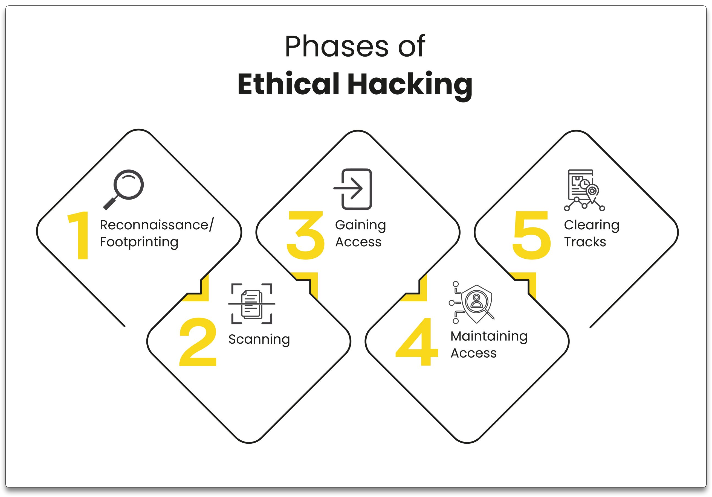

# 3. The Ethical Hacker Methodology

**Ethical hacking**, or **penetration testing**, identifies and addresses vulnerabilities in computer systems and networks through a structured process.

The five stages are:

1. **Reconnaissance**: Gathering information about the target using passive techniques like public searches, website browsing and DNS examination to understand the target and find potential entry points.
2. **Scanning**: Actively probing the target to discover open ports, services and vulnerabilities using tools like port scanners, network mappers and vulnerability scanners to identify exploitable weaknesses.
3. **Gaining Access**: Exploiting discovered vulnerabilities to gain unauthorized access using methods like password cracking, social engineering and software exploits.
4. **Maintaining Access**: Ensuring continued access by bypassing security, setting up backdoors and establishing persistent access to mimic a real attacker and assess potential impact.
5. **Covering Tracks**: Removing traces of activity by deleting logs, modifying files and restoring the system to its original state to remain undetected and to leave no evidence.

> Ethical hacking must always be **authorized**, legal and conducted with strict adherence to **ethical guidelines**, **confidentiality** and necessary **permissions** from system owners.
>
> ❗ **Use these techniques responsibly, ethically and with proper authorization for security testing!**

## Sections

1. Information Gathering
1. Scanning & Enumeration
1. Vulnerability Scanning with Nessus
1. Exploitation Basics

------

