# Scanning & Enumeration

## VMWare lab

> - 🔗 Free [VMWare Workstation Pro](https://blogs.vmware.com/workstation/2024/05/vmware-workstation-pro-now-available-free-for-personal-use.html)
> - 🔗 [VirtualBox](https://www.virtualbox.org/)
>
> Download the following [PEH Course VMs](https://drive.google.com/drive/folders/1z923e0icfJADbhgS0Qfaxuez-GJTWvjt) based on vulnerable VMs from [VulnHub](https://www.vulnhub.com/)

- Import `Kioptrix.ova`
  - set RAM to `256MB` or `512MB` 
  - set the VM Network Adapter to `NAT`, the same `NAT` network of the **Kali VM**
  - run the virtual machine, select `Do nothing` if asked and let it boot to the login screen

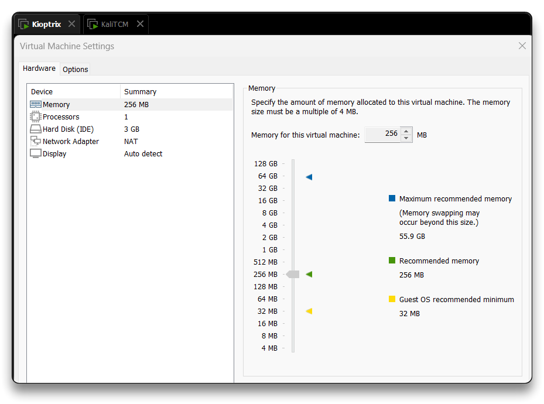

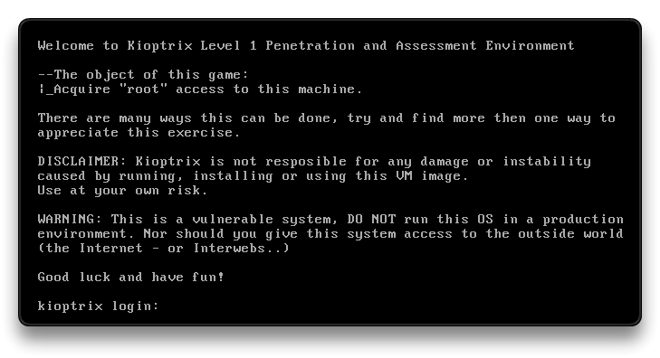

> 📌 kioptrix login user credentials are - `john`:`TwoCows2`

---

## Nmap scanning

From the **Kali VM**, find its network and user `netdiscover` to find the **Kioptrix VM** IP

- Tools for network discovery - `netdiscover`, `arp-scan`

```bash
# find Kali network
ip -br -c a
```

```bash
sudo netdiscover -r 192.168.31.0/24
# run it again if no IP found

# or use
sudo arp-scan -l
```

```bash
 Currently scanning: Finished!   |   Screen View: Unique Hosts

 3 Captured ARP Req/Rep packets, from 3 hosts.   Total size: 180
 _________________________________________________________________________
   IP            At MAC Address     Count     Len  MAC Vendor / Hostname  
 -------------------------------------------------------------------------
 192.168.31.1    00:50:56:c0:00:0a      1      60  VMware, Inc.
 192.168.31.2    00:50:56:eb:4d:44      1      60  VMware, Inc.
 192.168.31.130  00:0c:29:6c:b8:f7      1      60  VMware, Inc.
 192.168.31.254  00:50:56:fd:76:cd      1      60  VMware, Inc.
```

➡️ [`nmap`](https://nmap.org/) - utility for network discovery and security auditing

```bash
nmap --help
```

```bash
# Scan everything and all ports, Output to all file types
sudo nmap -T4 -p- -A 192.168.31.130 -oA kioptrix

# Stealth scanning everything and all ports
sudo nmap -sS -T4 -p- -A 192.168.31.130
```

- Look for open sports and what is running on those ports

```bash
# Results

Nmap scan report for 192.168.31.130
Host is up (0.00037s latency).
Not shown: 65529 closed tcp ports (reset)
PORT      STATE SERVICE     VERSION
22/tcp    open  ssh         OpenSSH 2.9p2 (protocol 1.99)
|_sshv1: Server supports SSHv1
| ssh-hostkey: 
|   1024 b8:74:6c:db:fd:8b:e6:66:e9:2a:2b:df:5e:6f:64:86 (RSA1)
|   1024 8f:8e:5b:81:ed:21:ab:c1:80:e1:57:a3:3c:85:c4:71 (DSA)
|_  1024 ed:4e:a9:4a:06:14:ff:15:14:ce:da:3a:80:db:e2:81 (RSA)
80/tcp    open  http        Apache httpd 1.3.20 ((Unix)  (Red-Hat/Linux) mod_ssl/2.8.4 OpenSSL/0.9.6b)
|_http-title: Test Page for the Apache Web Server on Red Hat Linux
|_http-server-header: Apache/1.3.20 (Unix)  (Red-Hat/Linux) mod_ssl/2.8.4 OpenSSL/0.9.6b
| http-methods: 
|_  Potentially risky methods: TRACE
111/tcp   open  rpcbind     2 (RPC #100000)
| rpcinfo: 
|   program version    port/proto  service
|   100000  2            111/tcp   rpcbind
|   100000  2            111/udp   rpcbind
|   100024  1          32768/tcp   status
|_  100024  1          32772/udp   status
139/tcp   open  netbios-ssn Samba smbd (workgroup: MYGROUP)
443/tcp   open  ssl/https   Apache/1.3.20 (Unix)  (Red-Hat/Linux) mod_ssl/2.8.4 OpenSSL/0.9.6b
|_ssl-date: 2024-07-04T03:26:28+00:00; +6h00m06s from scanner time.
|_http-server-header: Apache/1.3.20 (Unix)  (Red-Hat/Linux) mod_ssl/2.8.4 OpenSSL/0.9.6b
| sslv2: 
|   SSLv2 supported
|   ciphers: 
|     SSL2_DES_64_CBC_WITH_MD5
|     SSL2_RC4_128_EXPORT40_WITH_MD5
|     SSL2_RC2_128_CBC_WITH_MD5
|     SSL2_RC4_64_WITH_MD5
|     SSL2_DES_192_EDE3_CBC_WITH_MD5
|     SSL2_RC4_128_WITH_MD5
|_    SSL2_RC2_128_CBC_EXPORT40_WITH_MD5
| ssl-cert: Subject: commonName=localhost.localdomain/organizationName=SomeOrganization/stateOrProvinceName=SomeState/countryName=--
| Not valid before: 2009-09-26T09:32:06
|_Not valid after:  2010-09-26T09:32:06
|_http-title: 400 Bad Request
32768/tcp open  status      1 (RPC #100024)
MAC Address: 00:0C:29:6C:B8:F7 (VMware)
Device type: general purpose
Running: Linux 2.4.X
OS CPE: cpe:/o:linux:linux_kernel:2.4
OS details: Linux 2.4.9 - 2.4.18 (likely embedded)
Network Distance: 1 hop

Host script results:
|_smb2-time: Protocol negotiation failed (SMB2)
|_nbstat: NetBIOS name: KIOPTRIX, NetBIOS user: <unknown>, NetBIOS MAC: <unknown> (unknown)
|_clock-skew: 6h00m05s

TRACEROUTE
HOP RTT     ADDRESS
1   0.37 ms 192.168.31.130
```

Look at the open ports and get all the details down by taking notes:

- `22` - ssh - OpenSSH 2.9p2 (protocol 1.99)
- `80` - http - Apache httpd 1.3.20
- `111` - rpcbind
- `139` - netbios-ssn Samba smbd
- `443` - ssl/https - Apache/1.3.20 (Unix) (Red-Hat/Linux)
- OS details: `Linux 2.4.9` - 2.4.18 (likely embedded)

---

## Enumerating HTTP and HTTPS

> PORTS - `80`, `443`
>
> - Usually WebServers

- Navigate to the webpage at [http://192.168.31.130/](http://192.168.31.130/) and [https://192.168.31.130/](https://192.168.31.130/) (the IP will change based on the Kioptrix VM IP)

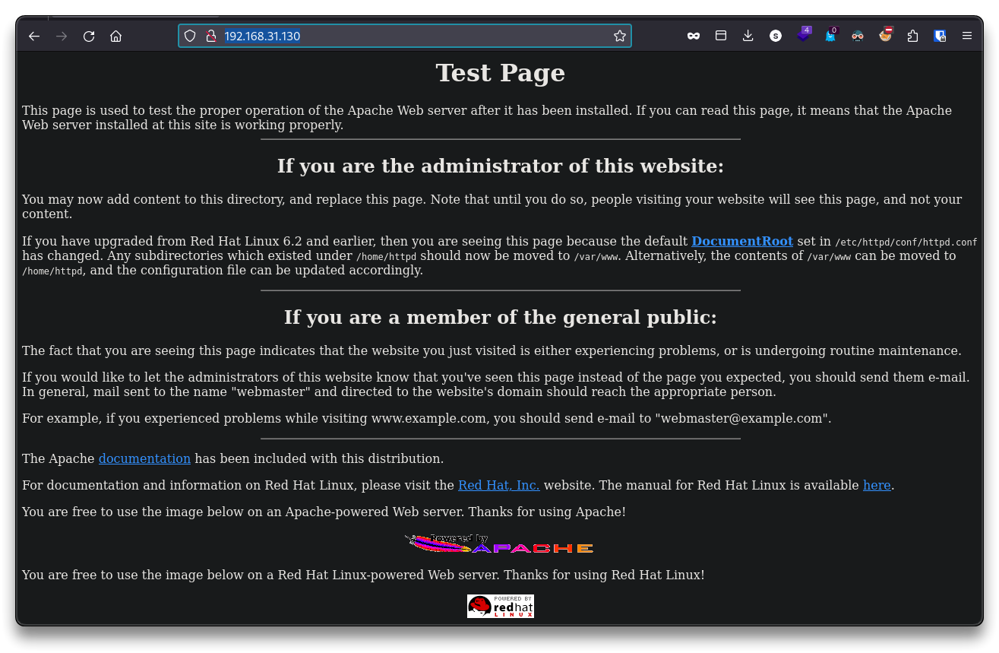

- Check webpage source code - [view-source:http://192.168.31.130/](view-source:http://192.168.31.130/) - and search for exposed data

**Architecture enumeration**

- runs Apache
- the VM (potentially) runs Red Hat Linux
- other web directories may be present (dir-busting)
- public default webpage - poor hygiene

**Information disclosure**

- Apache 1.3.20

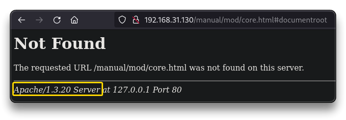

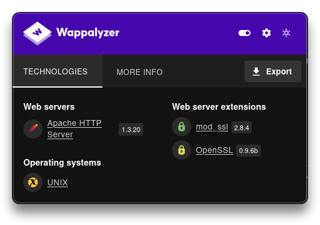

### nikto

➡️ [nikto](https://github.com/sullo/nikto) - web server scanner

```bash
nikto -h http://192.168.31.130
```

- Save the scan to a file

```bash
- Nikto v2.5.0
---------------------------------------------------------------------------
+ Target IP:          192.168.31.130
+ Target Hostname:    192.168.31.130
+ Target Port:        80
+ Start Time:         2024-07-07 17:01:46 (GMT2)
---------------------------------------------------------------------------
+ Server: Apache/1.3.20 (Unix)  (Red-Hat/Linux) mod_ssl/2.8.4 OpenSSL/0.9.6b
+ /: Server may leak inodes via ETags, header found with file /, inode: 34821, size: 2890, mtime: Thu Sep  6 05:12:46 2001. See: http://cve.mitre.org/cgi-bin/cvename.cgi?name=CVE-2003-1418
+ /: The anti-clickjacking X-Frame-Options header is not present. See: https://developer.mozilla.org/en-US/docs/Web/HTTP/Headers/X-Frame-Options
+ /: The X-Content-Type-Options header is not set. This could allow the user agent to render the content of the site in a different fashion to the MIME type. See: https://www.netsparker.com/web-vulnerability-scanner/vulnerabilities/missing-content-type-header/
+ Apache/1.3.20 appears to be outdated (current is at least Apache/2.4.54). Apache 2.2.34 is the EOL for the 2.x branch.
+ OpenSSL/0.9.6b appears to be outdated (current is at least 3.0.7). OpenSSL 1.1.1s is current for the 1.x branch and will be supported until Nov 11 2023.
+ mod_ssl/2.8.4 appears to be outdated (current is at least 2.9.6) (may depend on server version).
+ /: Apache is vulnerable to XSS via the Expect header. See: http://cve.mitre.org/cgi-bin/cvename.cgi?name=CVE-2006-3918
+ Apache/1.3.20 - Apache 1.x up 1.2.34 are vulnerable to a remote DoS and possible code execution.
+ Apache/1.3.20 - Apache 1.3 below 1.3.27 are vulnerable to a local buffer overflow which allows attackers to kill any process on the system.
+ Apache/1.3.20 - Apache 1.3 below 1.3.29 are vulnerable to overflows in mod_rewrite and mod_cgi.
+ mod_ssl/2.8.4 - mod_ssl 2.8.7 and lower are vulnerable to a remote buffer overflow which may allow a remote shell.
+ OPTIONS: Allowed HTTP Methods: GET, HEAD, OPTIONS, TRACE .
+ /: HTTP TRACE method is active which suggests the host is vulnerable to XST. See: https://owasp.org/www-community/attacks/Cross_Site_Tracing
+ ///etc/hosts: The server install allows reading of any system file by adding an extra '/' to the URL.
+ /usage/: Webalizer may be installed. Versions lower than 2.01-09 vulnerable to Cross Site Scripting (XSS). See: http://cve.mitre.org/cgi-bin/cvename.cgi?name=CVE-2001-0835
+ /manual/: Directory indexing found.
+ /manual/: Web server manual found.
+ /icons/: Directory indexing found.
+ /icons/README: Apache default file found. See: https://www.vntweb.co.uk/apache-restricting-access-to-iconsreadme/
+ /test.php: This might be interesting.
+ /wp-content/themes/twentyeleven/images/headers/server.php?filesrc=/etc/hosts: A PHP backdoor file manager was found.
+ /wordpress/wp-content/themes/twentyeleven/images/headers/server.php?filesrc=/etc/hosts: A PHP backdoor file manager was found.
+ /wp-includes/Requests/Utility/content-post.php?filesrc=/etc/hosts: A PHP backdoor file manager was found.
+ /wordpress/wp-includes/Requests/Utility/content-post.php?filesrc=/etc/hosts: A PHP backdoor file manager was found.
+ /wp-includes/js/tinymce/themes/modern/Meuhy.php?filesrc=/etc/hosts: A PHP backdoor file manager was found.
+ /wordpress/wp-includes/js/tinymce/themes/modern/Meuhy.php?filesrc=/etc/hosts: A PHP backdoor file manager was found.
+ /assets/mobirise/css/meta.php?filesrc=: A PHP backdoor file manager was found.
+ /login.cgi?cli=aa%20aa%27cat%20/etc/hosts: Some D-Link router remote command execution.
+ /shell?cat+/etc/hosts: A backdoor was identified.
+ /#wp-config.php#: #wp-config.php# file found. This file contains the credentials.
+ 8908 requests: 0 error(s) and 30 item(s) reported on remote host
+ End Time:           2024-07-07 17:05:49 (GMT2) (243 seconds)
---------------------------------------------------------------------------
+ 1 host(s) tested
```

### dirbuster

➡️ [dirbuster](https://www.kali.org/tools/dirbuster/) (GUI) - multi threaded java application designed to brute force directories and files names on web/application servers

- Look for any sort of interesting directory
- Check the [HTTP response codes](https://developer.mozilla.org/en-US/docs/Web/HTTP/Status)
- Dig and navigate to sub-pages and find disclosed information

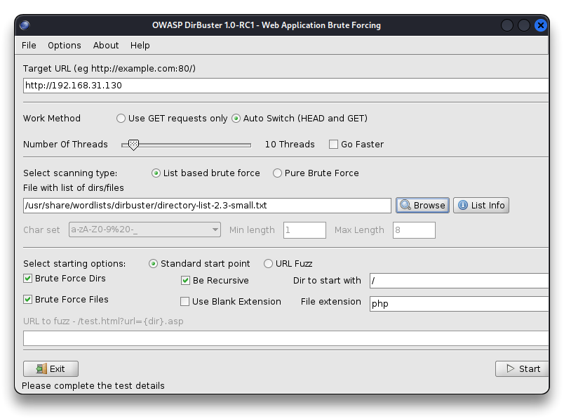

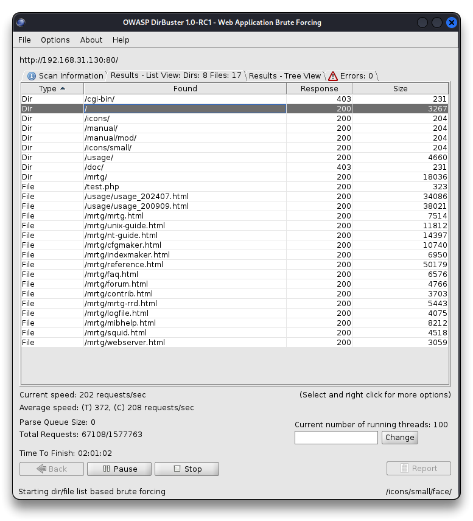

### burpsuite

➡️ [Burp Suite](https://portswigger.net/burp/communitydownload)

- Use BurpSuite to find disclosed information when navigating the found webpages
  - server header disclosed version information

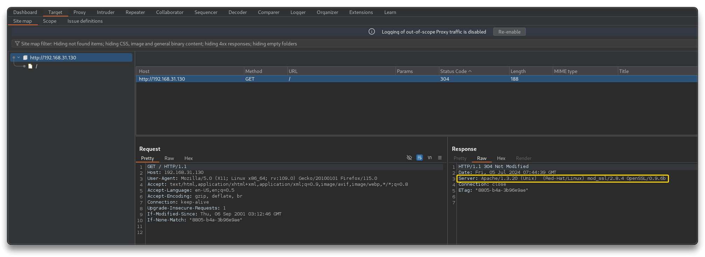

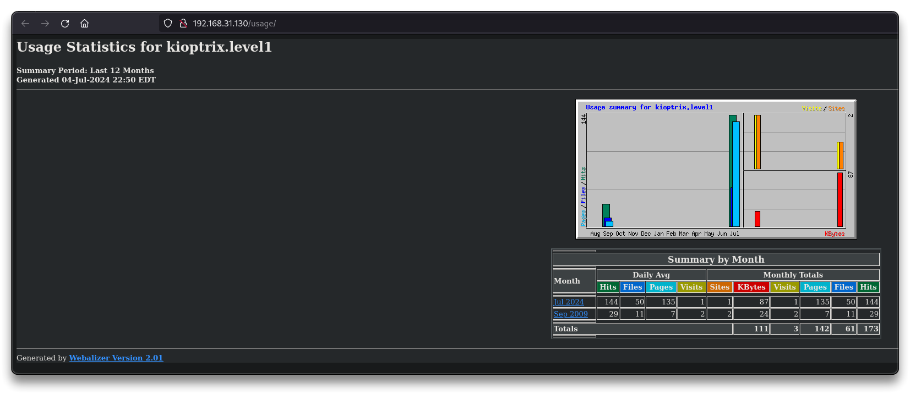

- [http://192.168.31.130/usage/](http://192.168.31.130/usage/)
  - Webalizer Version 2.01

---

## Enumerating SMB

- [How to Enumerate SMB with Enum4linux & Smbclient - Null Byte](https://null-byte.wonderhowto.com/how-to/enumerate-smb-with-enum4linux-smbclient-0198049/)

> PORT - `139`
>
> - Usually file servers
>
> Kioptrix nmap:
>
> - _smb2-time: Protocol negotiation failed (SMB2)

➡️ [Metasploit](https://docs.metasploit.com/)

```bash
msfconsole
search smb scanner

use auxiliary/scanner/smb/smb_version
info
options

# RHOSTS = Target
set RHOSTS 192.168.31.130
run

    [*] 192.168.31.130:139 - SMB Detected (versions:) (preferred dialect:) (signatures:optional)
    [*] 192.168.31.130:139 - Host could not be identified: Unix (Samba 2.2.1a)
    [*] 192.168.31.130: - Scanned 1 of 1 hosts (100% complete)
    [*] Auxiliary module execution completed
```

➡️ [smbclient](https://www.samba.org/samba/docs/current/man-html/smbclient.1.html)

> Quick fix for some errors
>
> ```bash
> sudo nano /etc/samba/smb.conf
> 
> # Add the following under [global]:
> 
> client min protocol = CORE
> client max protocol = SMB3
> ```
>
> 

```bash
smbclient -L \\\\192.168.31.130\\

# Shares
    IPC$ IPC IPC Service (Samba Server)
    ADMIN$ IPC IPC Service (Samba Server)
```

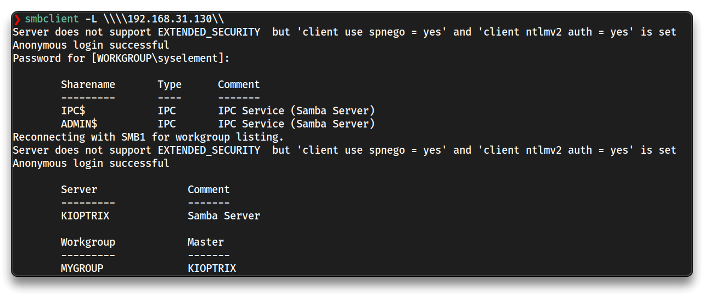

```bash
smbclient \\\\192.168.31.130\\ADMIN$
# needs password

smbclient \\\\192.168.31.130\\IPC$
# Anonymous login successful
```

---

## Enumerating SSH

> PORT - `22`
>
> - OpenSSH 2.9p2

- Attempt to connect to SSH via the port
- A login attempt on SSH is exploitation

```bash
ssh 192.168.31.130 
```

- If a banner is exposed, server version can be exposed

---

## Research potential vulnerabilities

📝 Always take good and concise **assessment notes** about the identified/exposed data and versions

- make them clean, screenshots with border, sections, etc

> `80`/`443` - `192.168.31.130` - <SCAN-TIME>
>
> - Default webpage - Apache, PHP
> - Information Disclosure - 404 page
> - Information Disclosure - server headers disclose version information
>
> `80`/tcp open http Apache httpd 1.3.20 ((Unix) (Red-Hat/Linux) mod_ssl/2.8.4 OpenSSL/0.9.6b)
>
> - mod_ssl/2.8.4 - mod_ssl 2.8.7 and lower are vulnerable to a remote buffer overflow which may allow a remote shell. [https://cve.mitre.org/cgi-bin/cvename.cgi?name=CVE-2002-0082](https://cve.mitre.org/cgi-bin/cvename.cgi?name=CVE-2002-0082)
> - Webalizer Version 2.01 - [http://192.168.31.130/usage/](http://192.168.31.130/usage/)
>
> `139`/tcp open netbios-ssn Samba smbd (workgroup: MYGROUP)
>
> - Unix (Samba 2.2.1a)
>
> `22`/tcp open ssh
>
> - OpenSSH 2.9p2

Search Google for vulnerabilities on the services versions, e.g. `<service> <version> exploit`

- 80/443 - Potentially vulnerable to
  - [Apache mod_ssl < 2.8.7 OpenSSL - 'OpenFuckV2.c' Remote Buffer Overflow (1)](https://www.exploit-db.com/exploits/764)
  - [OpenLuck](https://github.com/heltonWernik/OpenLuck) (this exploit works)
  - Apache httpd 1.3.20 - [CVEdetails](https://www.cvedetails.com/vulnerability-list/vendor_id-45/product_id-66/version_id-369927/Apache-Http-Server-1.3.20.html)
- 137 - Potentially vulnerable to
  - [Samba trans2open Overflow (Linux x86) - Rapid7](https://www.rapid7.com/db/modules/exploit/linux/samba/trans2open/)
  - [https://www.exploit-db.com/exploits/7](https://www.exploit-db.com/exploits/7)
  - [https://www.exploit-db.com/exploits/10](https://www.exploit-db.com/exploits/10)


➡️ [searchsploit](https://www.exploit-db.com/searchsploit) - command line search tool for Exploit-DB that also allows you to take a copy of [Exploit Database](https://www.exploit-db.com) with you

```bash
# Without network access

searchsploit Samba 2.2.1a

    Samba 2.2.0 < 2.2.8 (OSX) - trans2open Overflow (Metasploit) | osx/remote/9924.rb
    Samba < 2.2.8 (Linux/BSD) - Remote Code Execution | multiple/remote/10.c
    Samba < 3.0.20 - Remote Heap Overflow | linux/remote/7701.txt
    Samba < 3.6.2 (x86) - Denial of Service (PoC) | linux_x86/dos/36741.py

searchsploit mod ssl 2
```

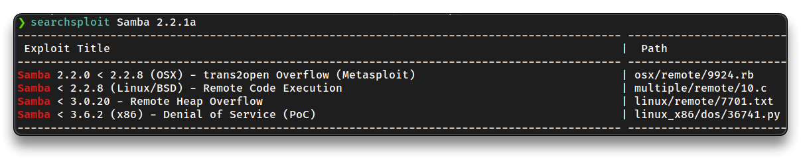

---

