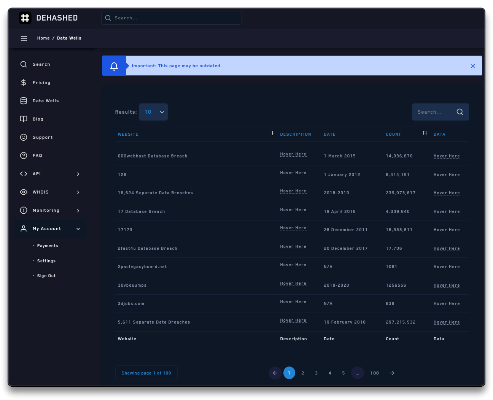
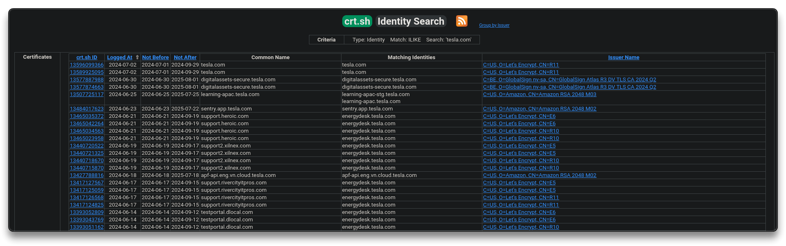
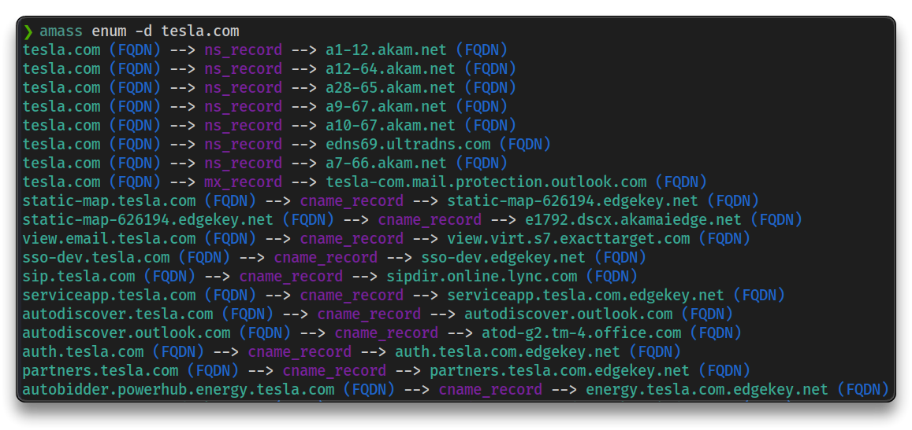
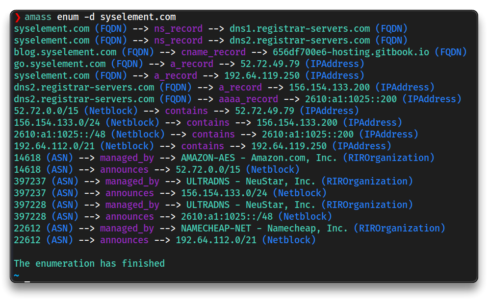
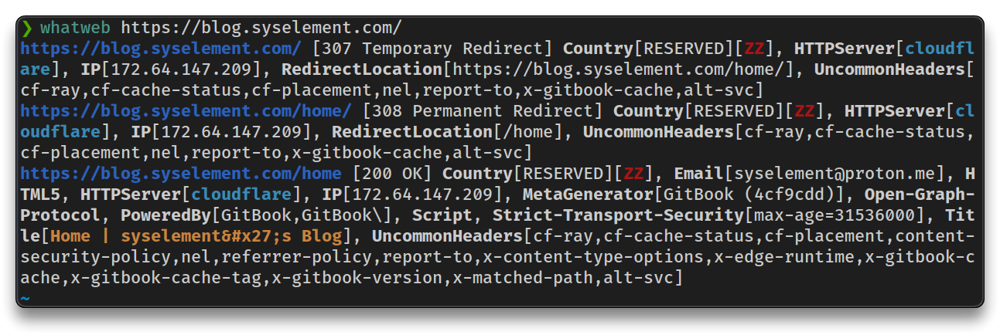

# Information Gathering

## Passive reconnaissance

➡️ **Physical** engagement / **Social** engineering

- **Location** information like
  - satellite images
  - drone recon
  - building layout (badge readers, security, fencing, etc)
- **Job** information
  - employees (name, job title, phone number, etc)
  - pictures (badge photos, desk photos, computer photos, etc)


➡️ Web / Host Assessment

- target validation
  - `whois`, `nslookup`, `dnsrecon`
- finding subdomains
  - Google, `dig`, `nmap`, `crt.sh`, etc
- fingerprinting
  - `nmap`, `wappalyzer`, `netcat`, etc
- data breaches
  - [HaveIBeenPwned](https://haveibeenpwned.com/), Breach-Parse, WeLeakInfo


### Target

> ❗ Always refer to a Bug Bounty program to find valid targets that can be legally tested
>
> 🔗 [Bugcrowd](https://bugcrowd.com/engagements)
>
> - 🧪  `e.g.` - [Tesla](https://bugcrowd.com/tesla)

- Read the **program details**, follow the terms and stay in scope
- Following test will be made on the `*.tesla.com` target

---

## Discovering email addresses

- The goal is discovering public email addresses and check if they really exist

➡️ [Hunter.io](https://hunter.io/domain-search) (free registration) - Find email addresses from any company name or website


➡️ [Phonebook.cz](https://phonebook.cz/) (free registration) - Phonebook lists all domains, email addresses, or URLs for the given input domain

➡️ [VoilaNorbert](https://www.voilanorbert.com/)

➡️ [Clearbit Connect](https://clearbit.com/resources/tools/connect) (Chrome extension)

➡️ [EmailHippo Email address verifiy](https://tools.emailhippo.com/) - Free email address verification tool

➡️ [Email-checker](https://email-checker.net/)

---

## Breached credentials

➡️ [HaveIBeenPwned](https://haveibeenpwned.com/) - Check if your email address is in a data breach

➡️ [breach-parse](https://github.com/hmaverickadams/breach-parse) - A tool for parsing breached passwords

- `BreachCompilation` password list (44GB) file comes from breached password dumps

```bash
breach-parse @tesla.com tesla.txt "~/Downloads/BreachCompilation/data"
```

**Credential stuffing** and **Password spraying** can be done using the results.


➡️ [DeHashed.com](https://dehashed.com/) (subscription) - public data search-engine

- Hashed passwords or other data can be found
- Collect all the data (email, username, IP, address, etc) with the goal to find patterns, that could be related to personal accounts too
- Investigation to tie the data to other accounts, etc
- Use tools to try to decrypt the hashed password, like [Hashes.com](https://hashes.com/en/decrypt/hash), Google, etc



---

## Hunting subdomains

Identify subdomains 

➡️ [Sublist3r](https://github.com/aboul3la/Sublist3r) (outdated) - enumerate subdomains of websites using OSINT

```bash
sudo apt install sublist3r
```

```bash
sublist3r -d tesla.com

sublist3r -d tesla.com -t 100 -v
```


➡️ [crt.sh](https://crt.sh/) - look for registered certificates and find subdomains or sub-subdomains



➡️ [amass](https://github.com/owasp-amass/amass) - in-depth attack surface mapping and asset discovery

```bash
sudo apt install amass
```

```bash
amass enum -d tesla.com

amass enum -d syselement.com
```





➡️ [httprobe](https://github.com/tomnomnom/httprobe) - take a list of domains and probe for working (alive) http and https servers

---

## Website technologies

➡️ [BuiltWith.com](https://builtwith.com/) - find out what websites are built with


➡️ [Wappalyzer.com](https://www.wappalyzer.com/) - via browser extension

- by visiting the webpage, interact with the browser extension to check the website technologies


➡️ [WhatWeb](https://github.com/urbanadventurer/WhatWeb/)

```bash
whatweb https://blog.syselement.com/
```



---

## Using Burpsuite

➡️ [Burp Suite](https://portswigger.net/burp/communitydownload)


---

## Google Fu

➡️ [Google.com](https://www.google.com/)

- [Google Search Syntax](https://www.google.com/search?client=firefox-b-e&q=google+search+syntax)
- [Google Search Operators: The Complete List (44 Advanced Operators)](https://ahrefs.com/blog/google-advanced-search-operators/)

```bash
site:tesla.com filetype:pdf
```

---

## Social Media

- [Linkedin](https://www.linkedin.com/), [Twiter (X)](https://x.com/) or other public websites can be used for some social media OSINT (Open-Source Intelligence).

---


