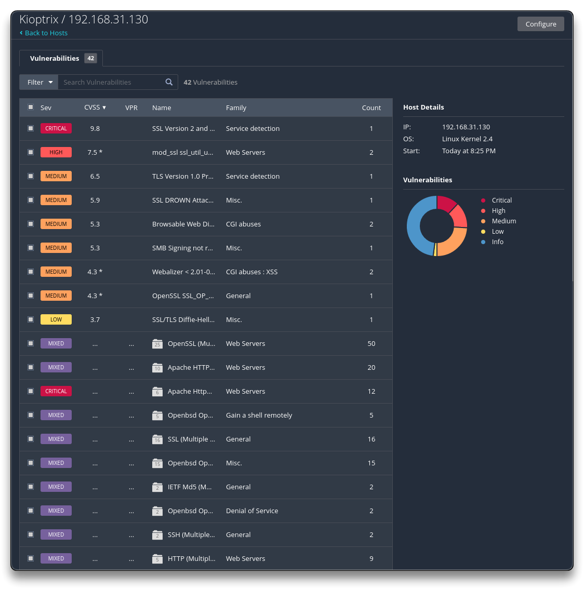
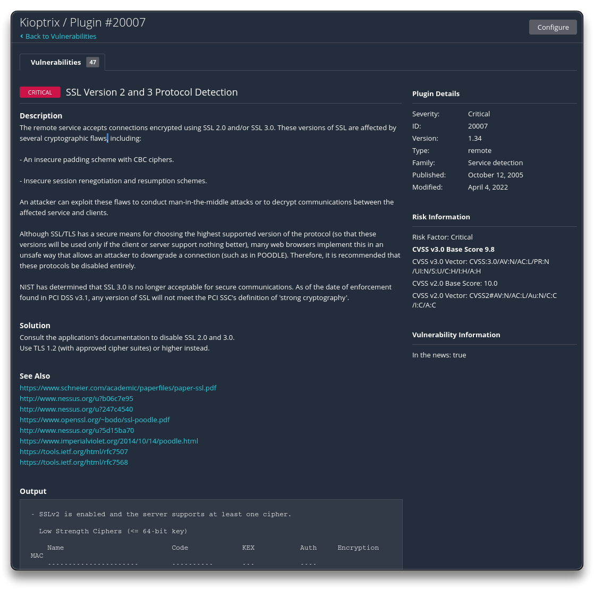

# Vulnerability Scanning with Nessus

## Nessus

➡️ [Nessus](https://www.tenable.com/products/nessus/nessus-essentials)

- [Download Nessus](https://www.tenable.com/downloads/nessus)

```bash
curl --request GET --url 'https://www.tenable.com/downloads/api/v2/pages/nessus/files/Nessus-10.7.4-ubuntu1404_amd64.deb' --output 'Nessus-10.7.4-ubuntu1404_amd64.deb'

sudo dpkg -i Nessus-10.7.4-ubuntu1404_amd64.deb

sudo systemctl start nessusd.service
```

- Open the browser and go to [https://localhost:8834](https://localhost:8834)
  - Follow my guide here to configure Nessus - [Nessus Essentials - syselement](https://blog.syselement.com/home/operating-systems/linux/tools/nessus)

- Set a new scan with
  - Kioptrix VM IP - `192.168.31.130`
  - Discovery - `Port scan (all ports)`
  - Assessment - `Scan for known web vulnerabilities`
  - Advanced settings if necessary





---

