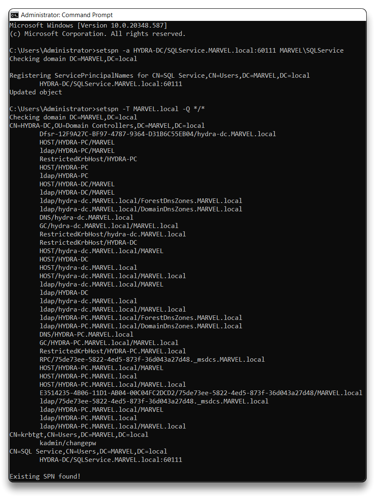

# Active Directory Lab

> **Lab Requirements**
>
> - 1 Windows Server
> - 2 Windows 10 Workstations
>   - 60 GB Disk space
>   - 16 GB RAM

- Proceed with installing a Windows Server 2022 VM and two Windows 10 VMs inside VMware
  - For each of them install the VMware tools

---

## Windows Server 2022

🔗 [Win Server 2022 Evaluation iso - direct link](https://software-static.download.prss.microsoft.com/sg/download/888969d5-f34g-4e03-ac9d-1f9786c66749/SERVER_EVAL_x64FRE_en-us.iso)

- Hostname - `HYDRA-DC`
- User (domain admin) - `administrator`:`P@$$w0rd!`
- **IP** - set a static IP
  - `Control Panel\Network and Internet\Network Connections`
  - IPv4 IP - `192.168.31.90` (in my lab)
- Add the following server roles
  - Active Directory Domain Services
  - Active Directory Certificate Services
- Domain - `MARVEL.local`
- **Active Directory Users and Computers**
  - Copy the `Administrator` user and create a second domain admin - `tstark`
  - Copy the `Administrator` user and create a service account - `SQLService`:`MYpassword123#`
  - Create new users
    - `fcastle`:`Password1`
    - `pparker`:`Password1`

- **File and Storage Services**
  - Create a new SMB Share Quick - `hackme`

- **Group Policy Management**
  - Create a new Enforced GPO - `Disable Windows Defender`
    - Computer Configuration -> Policies -> Administrative Templates -> Windows Components -> Microsoft Defender Antivirus - Enable `Turn off Microsoft Defender Antivirus`
  
- **SPN** - Register the Service Principal Name - SQLService

```bash
setspn -a HYDRA-DC/SQLService.MARVEL.local:60111 MARVEL\SQLService

# Query for SPN
setspn -T MARVEL.local -Q */*
```



---

## Windows 10

🔗 [Windows 10 Enterprise iso](https://www.microsoft.com/en-us/evalcenter/download-windows-10-enterprise)

- Hostname1 - `THEPUNISHER`
  - User - `frankcastle`:`Password1`
- Hostname2 - `SPIDERMAN`
  - User - `peterparker`:`Password1`
- **IP** - set the DNS to the DC IP - `192.168.31.90`
- Join both VMs to the `MARVEL.local` domain
  - Login using `MARVEL\administrator`:`P@$$w0rd!`
  - `Edit local users and groups`
    - Reset password and enable local `Administrator`:`Password1!`

    - Add the domain users to the Administrators group
      - `fcastle` for `THEPUNISHER` VM 
      - `fcastle` and `pparker` for `SPIDERMAN` VM

- Go to Network and turn on `Network discovery and file sharing`


`SPIDERMAN` - Logoff and login locally to `.\peterparker`

- **Map Network Drive **- `\\HYDRA-DC\hackme` , reconnect at sign-in, using different credentials

---

