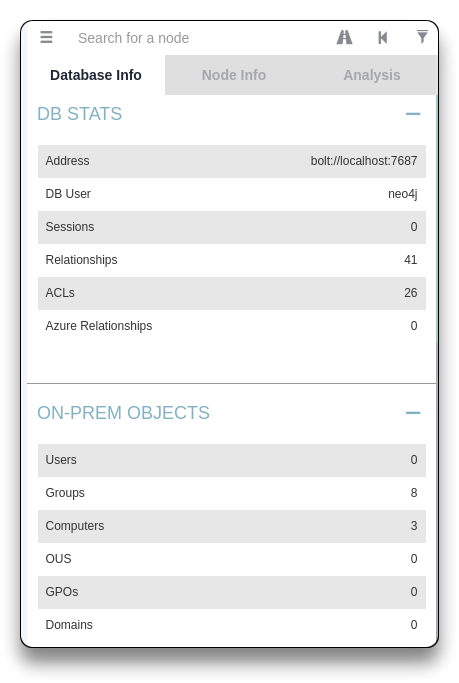
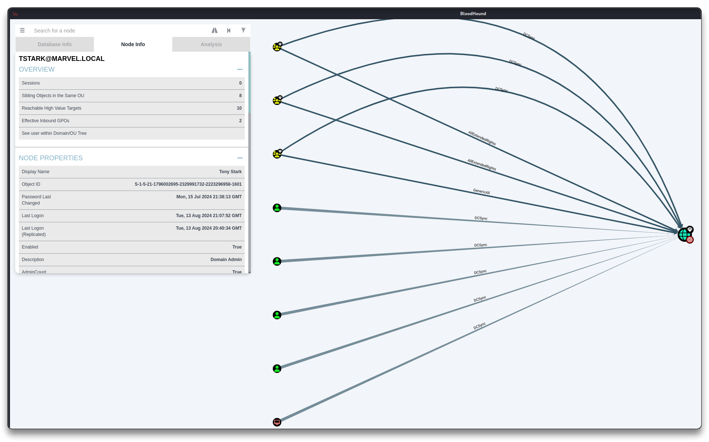
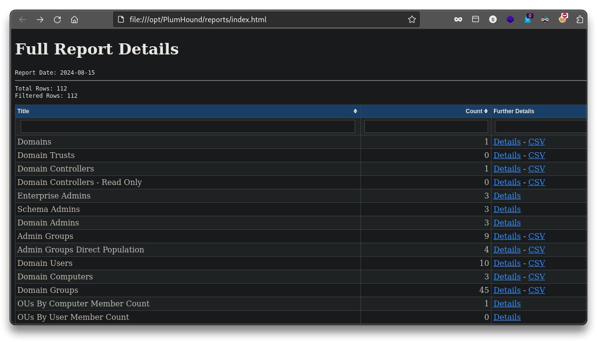
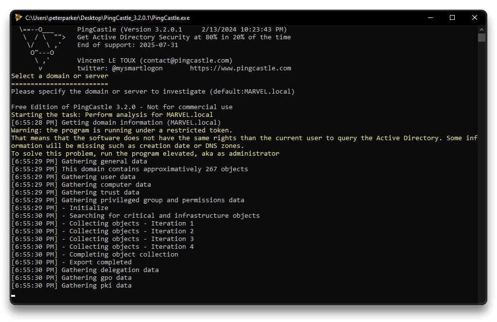
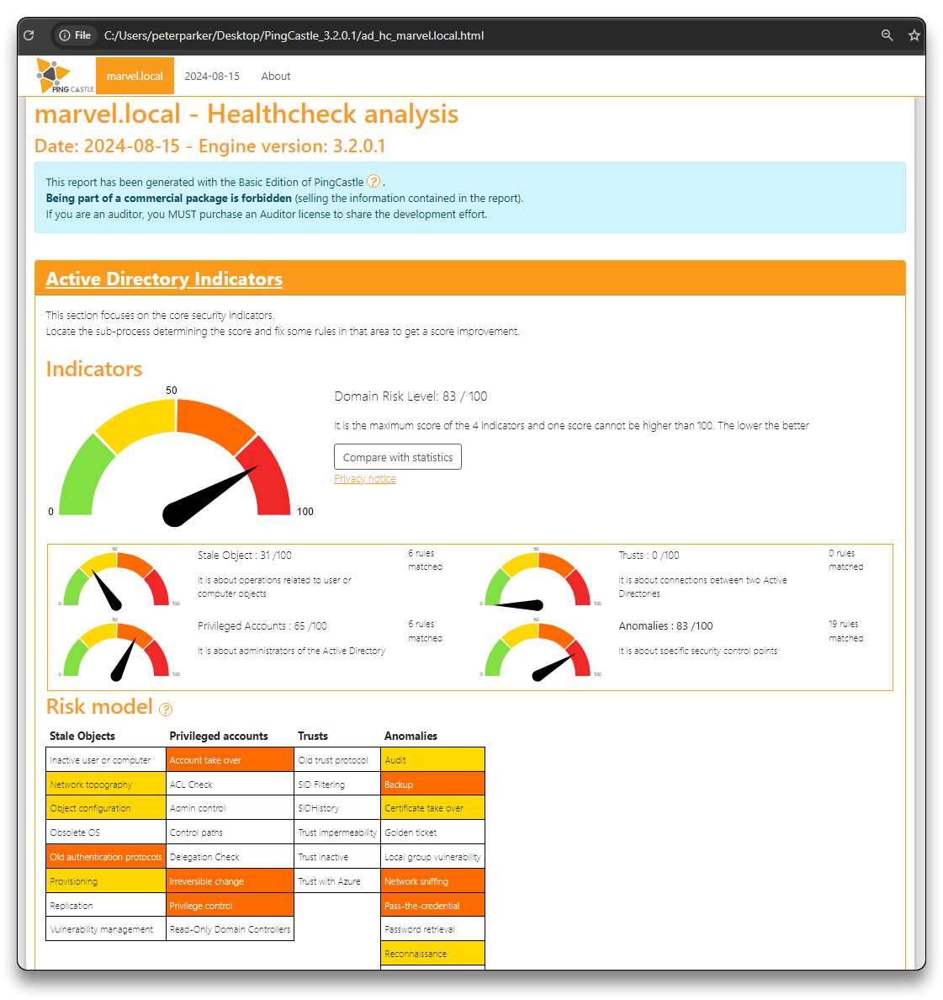
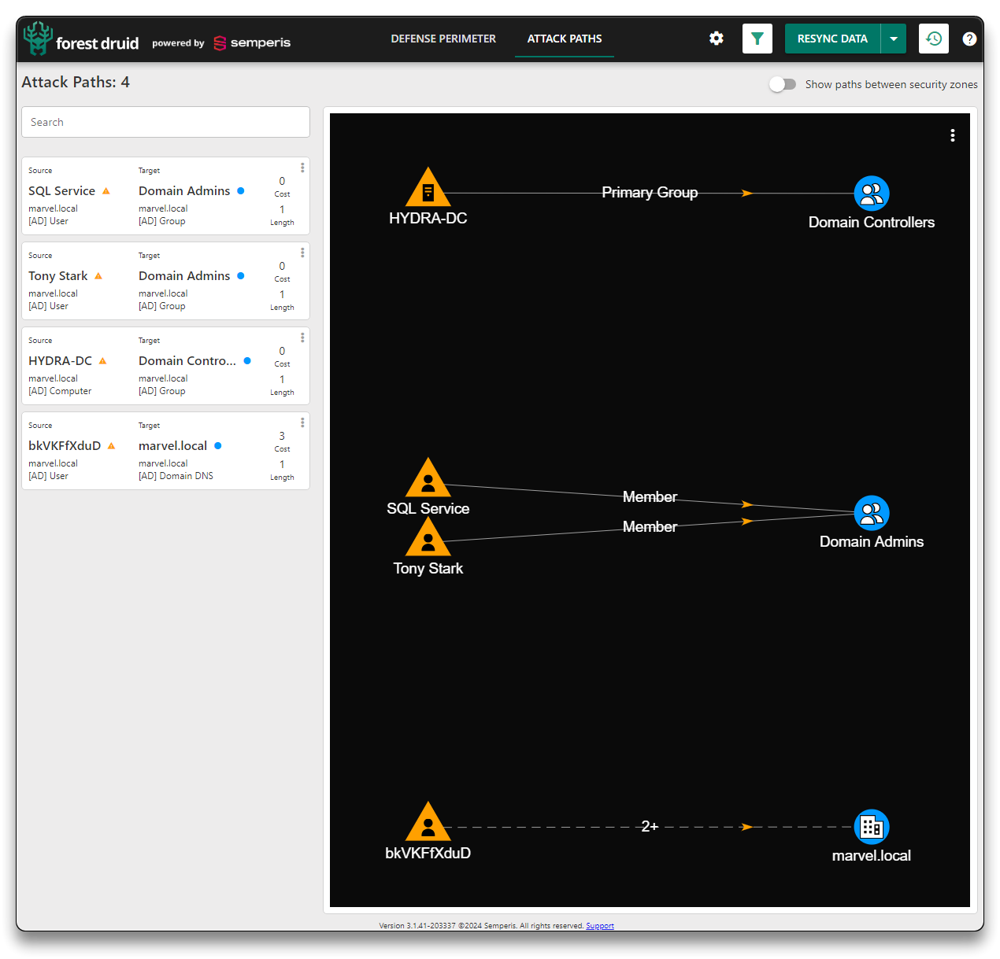
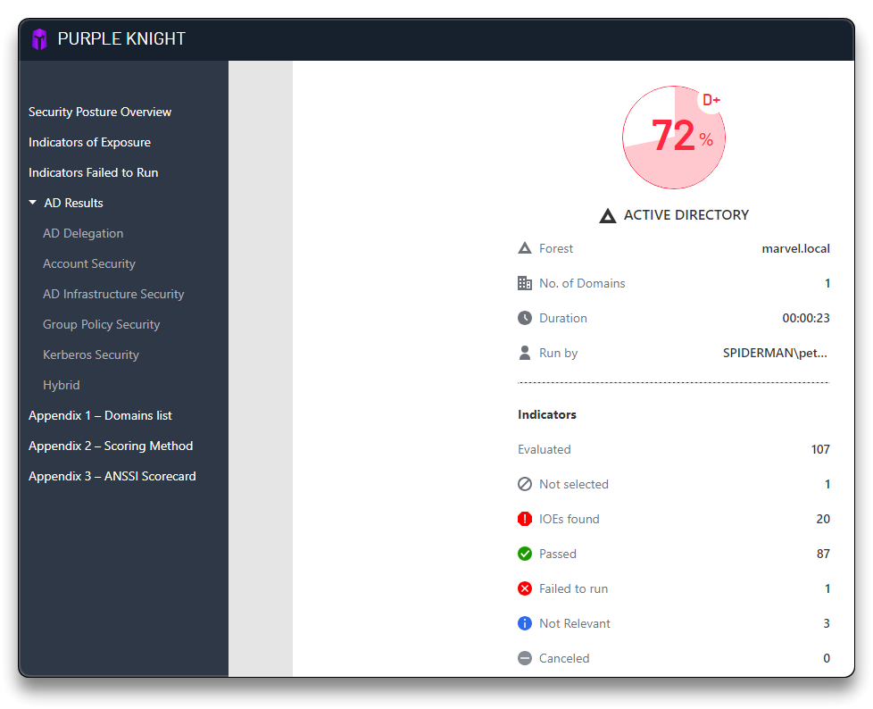

# AD - Post-Compromise Enumeration


## ldapdomaindump

➡️ [ldapdomaindump](https://github.com/dirkjanm/ldapdomaindump) - Active Directory information dumper via LDAP account

- value targets
- domain users
- other types of access
- descriptions
- Domain Admins, Enterprise Admins, Computers, etc

```bash
mkdir -p ~/tcm/peh/ad-attacks/marvel.local
cd ~/tcm/peh/ad-attacks/marvel.local

sudo pip install -U ldap3
sudo pip install pycryptodome

sudo ldapdomaindump ldaps://hydra-dc.MARVEL.local -u 'MARVEL\fcastle' -p Password1

# Dumped files
domain_computers.grep
domain_computers.html
domain_computers.json
domain_computers_by_os.html
domain_groups.grep
domain_groups.html
domain_groups.json
domain_policy.grep
domain_policy.html
domain_policy.json
domain_trusts.grep
domain_trusts.html
domain_trusts.json
domain_users.grep
domain_users.html
domain_users.json
domain_users_by_group.html
```

---

## BloodHound

➡️ [BloodHound](https://github.com/SpecterOps/BloodHound) - uses graph theory to reveal the hidden and often unintended relationships within an Active Directory or Azure environment

```bash
sudo pip3 install bloodhound

# or check Github repo for BloodHound Community Edition
# curl -L https://ghst.ly/getbhce | docker compose -f - up
```

```bash
sudo neo4j console
```

- Open the link [http://localhost:7474/](http://localhost:7474/) and setup with user `neo4j`:`neo4jbh`
- Run BloodHound and login with `neo4j` user
- Collect the data by using an ingestor

```bash
mkdir -p ~/tcm/peh/ad-attacks/bloodhound
cd ~/tcm/peh/ad-attacks/bloodhound

sudo bloodhound-python -d MARVEL.local -u fcastle -p Password1 -ns 192.168.31.90 -c all

# Result
INFO: Found AD domain: marvel.local
INFO: Getting TGT for user
INFO: Connecting to LDAP server: hydra-dc.marvel.local
INFO: Found 1 domains
INFO: Found 1 domains in the forest
INFO: Found 3 computers
INFO: Connecting to LDAP server: hydra-dc.marvel.local
INFO: Found 9 users
INFO: Found 52 groups
INFO: Found 3 gpos
INFO: Found 2 ous
INFO: Found 19 containers
INFO: Found 0 trusts
INFO: Starting computer enumeration with 10 workers
INFO: Querying computer: SPIDERMAN.MARVEL.local
INFO: Querying computer: THEPUNISHER.MARVEL.local
INFO: Querying computer: hydra-dc.MARVEL.local
INFO: Done in 00M 01S

# Files
20240815181256_computers.json
20240815181256_containers.json
20240815181256_domains.json
20240815181256_gpos.json
20240815181256_groups.json
20240815181256_ous.json
20240815181256_users.json
```

- Back to BloodHound interface, import all the `json` files via `Upload data`
  - Check interesting data via **Node Info** and **Analysis**





---

## PlumHound

➡️ [PlumHound](https://github.com/PlumHound/PlumHound) - BloodHoundAD report engine

```bash
cd /opt
sudo git clone https://github.com/PlumHound/PlumHound.git

cd /opt/PlumHound
sudo pip3 install -r requirements.txt
```

```bash
# Keep Neo4j Console and BloodHound started

sudo python3 PlumHound.py --easy -p neo4jbh

sudo python3 PlumHound.py -x tasks/default.tasks -p neo4jbh
	Completed Reports Archive: reports//Reports.zip
	Completed 114 of 114 tasks.
```

```bash
cd /opt/PlumHound/reports
firefox index.html
```



---

## PingCastle

➡️ [PingCastle](https://www.pingcastle.com/) - tool designed to assess quickly the Active Directory security level with a methodology based on risk assessment and a maturity framework

- Run it from `SPIDERMAN` VM for example
  - Run a **Healthcheck analysis**
  - Open the `ad_hc_marvel.local.html` file and check for the domain risk score and results





---

## Extra

### Forest Druid

➡️ [Forest Druid](https://www.semperis.com/forest-druid/resources/) - free attack path discovery tool, natively compatible with Active Directory, that helps cybersecurity defensive teams quickly prioritize high-risk misconfigurations that could represent opportunities for attackers to gain privileged domain access



### Purple Knight

➡️ [Purple Knight](https://www.semperis.com/purple-knight/resources/) - standalone utility that queries the Active Directory and Entra ID environment and performs a set of tests against many aspects of Active Directory’s security posture, including AD delegation, account security, AD infrastructure security, Group Policy security, and Kerberos security



---

