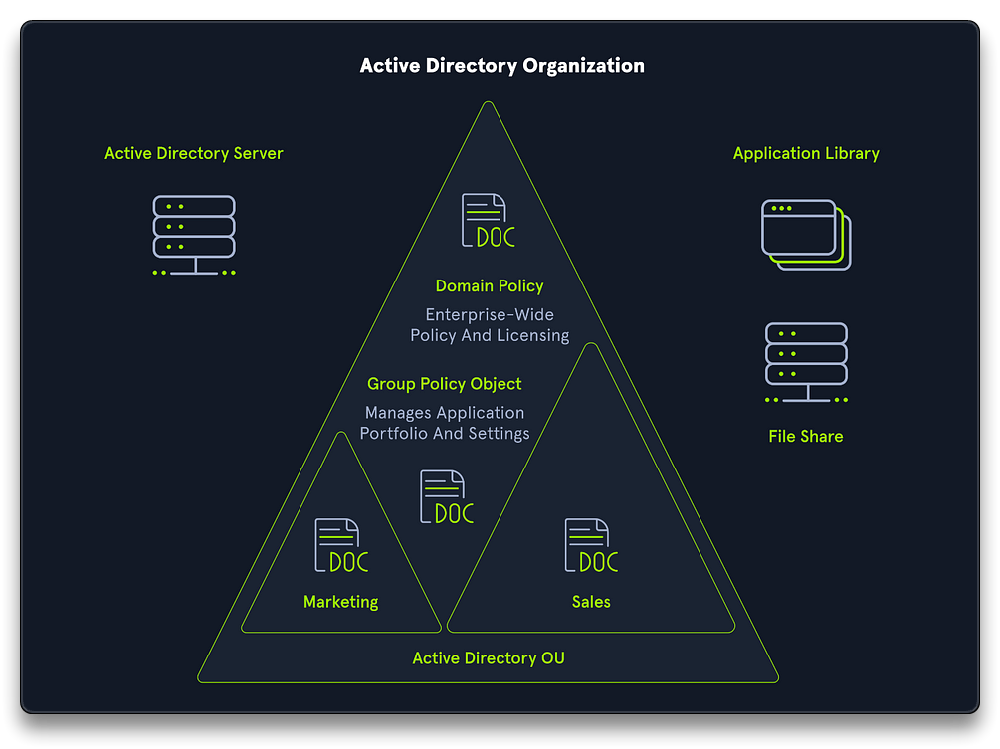

# 4. Active Directory

🪟 **Active Directory** (**AD**) is a directory service developed by Microsoft for Windows domain networks. It provides directory services for managing Windows-based computers on a network. AD stores information about objects such as users, groups, computers, and other resources, and provides authentication and authorization services.

---

## Physical components

- Data store
- Domain controllers
- Global catalog server
- Read-Only Domain Controller (RODC)

➡️ **Domain Controller** - a server with the [Active Directory Domain Services](https://learn.microsoft.com/en-us/windows-server/identity/ad-ds/get-started/virtual-dc/active-directory-domain-services-overview) (**AD DS**) server role, specifically promoted to a domain controller

- Host a copy of the AD DS directory store
- Provide authentication and authorization services
- Replicate updates to other domain controllers
- Allow administrative access to manage user accounts and network resources

➡️ **AD DS Data store** - database files and processes that store and manage directory information for users, services and apps

- Contains `Ntds.dit` file - very important file (contains password hashes, etc)
  - stored in the `%SystemRoot%\NTDS` folder on all domain controllers
  - accessible only through the domain controller processes and protocols

---

## Logical components

- Partitions
- Schema
- Domains
- Domain trees
- Forests
- Sites
- Organization units (OUs)

➡️ **AD DS Schema** - (like a rulebook) defines every type of object that can be stored in the directory, enforces object creation and configuration rules

- Class object - what objects can be created in the directory (user, computer, etc)
- Attribute object - information that can be attached to an object (display name, etc)

➡️ **Domains** - used to group and manage objects in an organization

- Administrative boundary for applying policies to groups of objects
- Replication boundary for replicating data between domain controllers
- Authentication and authorization boundary - to limit the scope of access to resources

➡️ **Trees** - a hierarchy of domains in AD DS, that can

- share a contiguous namespace with the parent domain
- can have additional child domains
- (by default) create a 2-way transitive trust with other domains

➡️ **Forests** - a collection of domain trees

- Forests share common
  - schema
  - configuration partition
  - global catalog to enable searching
- Enable trusts between all domains in the forest
- Share the **Enterprise Admins** and **Schema Admins** groups

➡️ **Organizational Units (OUs)** - AD containers that can contain users, groups, computers, other OUs

- Represent the organization hierarchically and logically
- Manage a collection of objects in a consistent way
- Delegate permissions to administer groups of objects
- Apply policies

➡️ **Trusts** - provide a mechanism for users to gain access to resources in another domain

- All domains in a forest trust all other domains in the forest
- Trusts can extend outside the forest

- **Directional** - the trust direction flows from trusting domain to the trusted domain
  - trusting domain -> trusted domain
- **Transitive** - the trust relationship is extended to include other trusted domains

➡️ **Objects**

- User - Enables network resource access for a user
- InetOrgPerson - Used for compatibility with other directory services
- Contacts - Used primarily to assign e-mail addresses to external users; no network access
- Groups - Used to simplify the administration of access control 
- Computers - Enable authentication and auditing of computer access to resources
- Printers - Simplify the process of locating and connecting to printers
- Shared folders - Enables users to search for shared folders based on preperties

---

## Sections

1. [Active Directory Lab](1-ad-lab.md)
1. [AD - Initial Attack Vectors](2-ad-init-vectors.md)
1. [AD - Post-Compromise Enumeration](3-ad-enum.md)
1. AD - Post-Compromise Attacks
1. AD - Additional Attacks
1. [AD - Case Studies](6-ad-casestudies.md)

---

